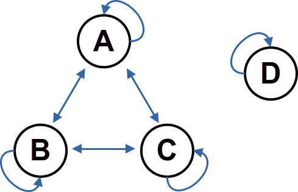

# Catene di Markov e Metropolis-Hastings

(Obiettivi della lezione: comprendere le catene di Markov come fondamento dei metodi Monte Carlo e il ruolo dell’algoritmo di Metropolis-Hastings nel campionamento da distribuzioni arbitrarie.)

---

Le catene di Markov costituiscono uno dei pilastri teorici della simulazione stocastica moderna.  
L’idea di base è rappresentare un sistema la cui evoluzione temporale dipende solo dallo stato corrente e non dalla storia passata.  
Tale proprietà — detta *markoviana* — consente una descrizione compatta dell’evoluzione probabilistica di sistemi complessi e rende possibile l’utilizzo di metodi Monte Carlo per stimare quantità di interesse.

Nel contesto della simulazione numerica, le catene di Markov sono particolarmente importanti perché permettono di **campionare distribuzioni di probabilità difficili da generare direttamente**.  
Ad esempio, in molti problemi di fisica statistica, chimica computazionale, o inferenza bayesiana, è necessario estrarre configurazioni secondo una distribuzione $\pi(x)$ nota solo fino a una costante di normalizzazione.  
In tali casi, la costruzione di una catena di Markov avente $\pi(x)$ come distribuzione stazionaria rappresenta una strategia efficiente e generalizzabile.

L’algoritmo di **Metropolis-Hastings** fornisce un metodo generale per costruire una catena di Markov che ammette come distribuzione di equilibrio una distribuzione arbitraria $\pi(x)$.  
Questo approccio, noto come *Markov Chain Monte Carlo* (MCMC), è alla base di numerosi metodi di simulazione contemporanei e consente di esplorare lo spazio degli stati in modo controllato, anche quando la distribuzione target non è nota in forma analitica.

### Obiettivi didattici specifici

1. Introdurre la definizione formale di catena di Markov e le sue proprietà fondamentali.  
2. Analizzare il concetto di distribuzione stazionaria e le condizioni per la convergenza della catena.  
3. Introdurre il principio di *bilancio dettagliato* e la sua interpretazione fisica.  
4. Presentare l’algoritmo di Metropolis-Hastings come schema generale di campionamento MCMC.  
5. Discutere casi pratici di applicazione e valutare l’efficienza del metodo.  

### Struttura della lezione

La lezione è articolata in quattro parti principali:

1. **Richiamo sui processi stocastici e definizione di catena di Markov.**  
   Verranno introdotti esempi elementari di sistemi discreti, con particolare attenzione alla struttura della matrice di transizione e alle proprietà di ergodicità.

2. **Distribuzioni stazionarie e condizione di reversibilità.**  
   Si analizzerà come una catena possa ammettere una distribuzione di equilibrio e in quali casi la convergenza sia garantita.

3. **Metodi Monte Carlo basati su catene di Markov (MCMC).**  
   Si presenterà l’idea di generare campioni correlati da una distribuzione target e di stimare osservabili mediante medie temporali.

4. **Algoritmo di Metropolis-Hastings.**  
   Si deriverà il criterio di accettazione e si mostrerà la dimostrazione del bilancio dettagliato per la distribuzione $\pi(x)$.  
   Verranno discussi esempi numerici, problemi di efficienza e possibili estensioni (Gibbs sampling, Metropolis adattivo, Hamiltonian Monte Carlo).

### Conclusione introduttiva

Le catene di Markov forniscono un ponte concettuale tra la teoria dei processi stocastici e le tecniche numeriche di simulazione.  
L’algoritmo di Metropolis-Hastings rappresenta la realizzazione più semplice e potente di tale connessione, permettendo di esplorare spazi di stato di alta dimensionalità e di calcolare quantità medie con accuratezza controllata.  
La comprensione del suo funzionamento è dunque essenziale per chiunque si occupi di modellizzazione computazionale, inferenza bayesiana, o fisica statistica dei sistemi complessi.

## 1. Richiamo sui processi stocastici e definizione di catena di Markov

Un **processo stocastico** è semplicemente un sistema che cambia nel tempo in modo **casuale**.  
A ogni istante di tempo $t$, il sistema si trova in uno **stato** (per esempio, una posizione, una configurazione, un valore numerico) che indichiamo con una variabile aleatoria $X_t$.

Possiamo pensare al processo come a una sequenza di osservazioni:

$$
X_0,\, X_1,\, X_2,\, \ldots
$$

dove ciascun $X_t$ indica lo stato del sistema al tempo $t$.  
L’insieme di tutti i possibili stati si chiama **spazio degli stati** e si indica con $\mathcal{S}$.  
Ad esempio:
- se $\mathcal{S} = \{0,1\}$, il sistema può trovarsi solo in due stati (come “spento” o “acceso”);
- se $\mathcal{S} = \{0,1,2,\ldots,N\}$, lo stato rappresenta un numero intero (come il numero di eventi avvenuti fino al tempo $t$).

---

### 1.1 Processi a tempo discreto

Quando il tempo cresce per passi successivi $t = 0,1,2,\ldots$, si parla di **processo a tempo discreto**.  
A ogni passo, il sistema può cambiare stato secondo certe probabilità.

L’evoluzione può essere descritta tramite le probabilità condizionate:

$$
P(X_{t+1}=j \,|\, X_t=i, X_{t-1}=i_{t-1}, \ldots, X_0=i_0),
$$

che rappresentano la probabilità di trovarsi nello stato $j$ al tempo $t+1$, sapendo che in passato il sistema ha seguito la sequenza di stati $i_0, i_1, \ldots, i_t$.

---

### 1.2 La proprietà markoviana

Una **catena di Markov** è un caso particolare molto importante di processo stocastico, in cui il futuro del sistema dipende **solo** dallo stato attuale e **non** da tutta la storia precedente.  
In formule:

$$
P(X_{t+1}=j \,|\, X_t=i, X_{t-1}=i_{t-1}, \ldots, X_0=i_0)
= P(X_{t+1}=j \,|\, X_t=i).
$$

Questa proprietà si chiama **proprietà markoviana**.  
In parole semplici:  
> sapere dove il sistema si trova adesso è sufficiente per prevedere statisticamente dove potrà andare dopo.  

Non serve ricordare tutto il passato.

---

### 1.3 Matrice di transizione

Le probabilità di passaggio da uno stato all’altro vengono riassunte in una **matrice di transizione** $P$, i cui elementi sono:

$$
P_{ij} = P(X_{t+1}=j \,|\, X_t=i).
$$

Ogni riga della matrice corrisponde a uno stato attuale $i$, e contiene le probabilità di andare in ciascun possibile stato $j$ al passo successivo.  
Le righe devono sommare a uno:

$$
\sum_j P_{ij} = 1,
$$

poiché il sistema deve necessariamente trovarsi in qualche stato.

Esempio: $$P = \begin{pmatrix} 0.8 & 0.2 \\ 0.3 & 0.7 \end{pmatrix}$$
indica che:
- se il sistema è nello stato $0$, rimane lì con probabilità 0.8 o passa a $1$ con probabilità 0.2;
- se è nello stato $1$, ritorna a $0$ con probabilità 0.3 o resta in $1$ con probabilità 0.7.

---

### 1.4 Evoluzione della distribuzione

Se indichiamo con $\pi^{(t)}$ il vettore delle probabilità di essere in ciascun stato al tempo $t$,
$$\pi^{(t)} = (\pi^{(t)}_0, \pi^{(t)}_1, \ldots),$$
allora l’evoluzione nel tempo segue la regola:

$$
\pi^{(t+1)} = \pi^{(t)} P.
$$

Questa equazione, chiamata **equazione di evoluzione di Chapman–Kolmogorov**, descrive come la distribuzione di probabilità “si muove” nel tempo attraverso le transizioni.

---

### 1.5 Esempio semplice: gioco della moneta truccata

Consideriamo un giocatore che partecipa a un gioco molto semplice, basato sul lancio di una moneta **truccata**.  
A ogni turno, il giocatore può trovarsi in due stati:
- **Vincente (1)**: ha vinto l’ultimo lancio;  
- **Perdente (0)**: ha perso l’ultimo lancio.

Il comportamento della moneta e del giocatore è il seguente:
- se ha perso, ha una probabilità 0.4 di vincere al turno successivo (la fortuna può girare);
- se ha vinto, ha una probabilità 0.2 di perdere al turno successivo (una piccola tendenza a mantenere la fortuna).

In simboli:

$$
P(X_{t+1}=1\,|\,X_t=0)=0.4, \qquad P(X_{t+1}=0\,|\,X_t=1)=0.2.
$$

La **matrice di transizione** associata alla catena di Markov è

$$
P =
\begin{pmatrix}
0.6 & 0.4 \\
0.2 & 0.8
\end{pmatrix}.
$$

dove:
- la prima riga rappresenta le probabilità di passaggio dallo stato *perdente* (0);
- la seconda riga rappresenta le probabilità di passaggio dallo stato *vincente* (1).

Se il giocatore inizia perdendo con certezza, ossia $\pi^{(0)} = (1,0)$,  dopo un turno la distribuzione diventa:

$$
\pi^{(1)} = \pi^{(0)} P = (0.6,\,0.4),
$$

cioè dopo un lancio ha il 40% di probabilità di trovarsi in stato “vincente”.  

Iterando ancora, la probabilità di essere vincente o perdente si stabilizza verso un valore fisso, indipendente dallo stato iniziale.  Questo valore limite è la **distribuzione stazionaria** della catena: una volta raggiunta, il sistema non cambia più la propria composizione statistica.

In termini di gioco, significa che — nel lungo periodo — il giocatore passa in media il 33% del tempo a perdere e il 67% a vincere, o viceversa a seconda dei parametri scelti.  
La catena descrive quindi l’equilibrio dinamico tra fortuna e sfortuna nel gioco.

---

### 1.6 Ergodicità (idea intuitiva)

Una catena di Markov si dice **ergodica** se, indipendentemente da dove si parte, dopo molti passi la distribuzione tende sempre alla stessa forma di equilibrio.  
In questo caso, le osservazioni fatte su una lunga traiettoria della catena possono essere usate per stimare le medie di grandezze fisiche o statistiche del sistema.

In sintesi, una catena di Markov è un modo semplice e potente per descrivere sistemi che evolvono nel tempo secondo regole probabilistiche locali.  Come vedremo, le catene di Markov rappresentano sistemi dinamici che, pur evolvendo in modo casuale, tendono a stabilizzarsi verso una distribuzione di equilibrio.  Dal punto di vista computazionale, l’idea centrale dei metodi Monte Carlo basati su catene di Markov (**MCMC**) è **simulare la catena per un tempo sufficientemente lungo**, in modo che gli stati generati siano campioni estratti (quasi) secondo la distribuzione stazionaria desiderata $\pi(x)$.

## 2. Distribuzioni stazionarie e condizione di reversibilità

Una delle proprietà più importanti delle catene di Markov è che, sotto certe condizioni, esse **tendono verso una distribuzione di equilibrio** che non cambia più nel tempo.  Questa distribuzione si chiama **distribuzione stazionaria** o **distribuzione invariante**.

---

### 2.1 Definizione di distribuzione stazionaria

Sia $P$ la matrice di transizione di una catena di Markov su uno spazio degli stati $\mathcal{S} = \{1, 2, \ldots, n\}$.  
Una distribuzione di probabilità $\pi = (\pi_1, \pi_2, \ldots, \pi_n)$ è detta **stazionaria** se soddisfa la relazione:

$$
\pi = \pi P.
$$

In forma esplicita:

$$
\pi_j = \sum_i \pi_i P_{ij}, \qquad \text{per ogni } j \in \mathcal{S}.
$$

In parole semplici: se al tempo iniziale la catena è distribuita secondo $\pi$,  
allora dopo un passo di evoluzione rimane distribuita nello stesso modo.  
$\pi$ rappresenta quindi uno **stato di equilibrio statistico** del sistema.

---

### 2.2 Interpretazione intuitiva

La condizione $\pi = \pi P$ significa che, nel lungo periodo, **il flusso medio di probabilità entrante in ciascuno stato è uguale al flusso uscente**.  
In ogni passo temporale, la probabilità si “redistribuisce” fra gli stati, ma in modo tale che la distribuzione complessiva non cambi.
Questa idea è molto simile al concetto di equilibrio in fisica: in uno stato stazionario, anche se i singoli passaggi continuano a verificarsi, la popolazione media dei diversi stati resta costante.

---

### 2.3 Esempio: la catena del gioco della moneta truccata

Riprendiamo la catena del gioco con matrice di transizione

$$
P =
\begin{pmatrix}
0.6 & 0.4 \\
0.2 & 0.8
\end{pmatrix}.
$$

Cerchiamo una distribuzione $\pi = (\pi_0, \pi_1)$ tale che $\pi = \pi P$.  
Scrivendo le equazioni:

$$
\begin{cases}
\pi_0 = 0.6 \pi_0 + 0.2 \pi_1, \\
\pi_1 = 0.4 \pi_0 + 0.8 \pi_1,
\end{cases}
$$

con la condizione $\pi_0 + \pi_1 = 1$.  
Dalla prima equazione si ottiene:

$$
0.4 \pi_0 = 0.2 \pi_1 \quad \Rightarrow \quad \pi_1 = 2 \pi_0.
$$

Applicando la normalizzazione:

$$
\pi_0 + \pi_1 = 1 \quad \Rightarrow \quad \pi_0 + 2\pi_0 = 1 \quad \Rightarrow \quad \pi_0 = \frac{1}{3}, \; \pi_1 = \frac{2}{3}.
$$

Quindi la distribuzione stazionaria è:

$$
\pi = \left(\frac{1}{3},\, \frac{2}{3}\right).
$$

Interpretazione: nel lungo periodo, il giocatore trascorre circa il 33% del tempo nello stato “perdente” e il 67% nello stato “vincente”.

---

### 2.4 Esistenza e unicità della distribuzione stazionaria

Non tutte le catene di Markov ammettono una distribuzione stazionaria unica.  
Per garantire che essa **esista ed è unica**, occorrono due condizioni fondamentali:

1. **Irriducibilità**  
   Ogni stato può essere raggiunto da qualunque altro stato in un numero finito di passi con probabilità positiva.  
   In altre parole, la catena è connessa: non esistono sottosistemi isolati.

{#fig:markov-riducibile}
*Figura: Esempio di catena di Markov riducibile: se il sistema parte dalo stato D, vi rimane, senza poter raggiungere gli stati A,B,C.*

2. **Aperiodicità**  
   Non esiste un ciclo fisso di ritorno.  
   Formalmente, il massimo comun divisore dei tempi di ritorno in uno stato è 1.

Se la catena è **irriducibile e aperiodica**, allora:
> esiste una distribuzione stazionaria unica $\pi$ e, per ogni distribuzione iniziale $\pi^{(0)}$, vale  $$\lim_{t \to \infty} \pi^{(t)} = \pi\;.$$
Questa proprietà è detta **ergodicità** della catena.

{#fig:markov-periodica}
*Figura: Esempio di catena di Markov periodica: il sistema esplora in sequenza gli stati A,B,C cosí che vale sempre $X_{t+3}=X_t$.*

---

### 2.5 Condizione di reversibilità (bilancio dettagliato)

Una situazione particolarmente importante è quella in cui la distribuzione stazionaria $\pi$ soddisfa una condizione più forte detta **bilancio dettagliato** (*bilancio dettagliato*):

$$
\pi_i P_{ij} = \pi_j P_{ji}, \qquad \text{per ogni } i,j \in \mathcal{S}.
$$

Questa relazione afferma che, in equilibrio, il flusso di probabilità che va da $i$ a $j$ è esattamente uguale al flusso che va da $j$ a $i$.  
In tal caso, si dice che la catena è **reversibile** rispetto a $\pi$.

La reversibilità implica automaticamente la stazionarietà, perché sommando sui possibili stati di partenza si ottiene:

$$
\sum_i \pi_i P_{ij} = \sum_i \pi_j P_{ji} = \pi_j.
$$

---

### 2.6 Significato fisico e computazionale

- In fisica statistica, la condizione di bilancio dettagliato esprime l’**equilibrio microscopico**: il flusso medio di probabilità da una configurazione $i$ a una configurazione $j$ è uguale al flusso medio nella direzione opposta, $$\pi_i P_{ij} = \pi_j P_{ji}\;.$$Ciò non implica che le due configurazioni siano equiprobabili ($\pi_i \ne \pi_j$ in generale), ma soltanto che **non vi sia corrente netta di probabilità** tra di esse.  
  Il sistema può quindi trovarsi in equilibrio dinamico, con transizioni continue ma bilanciate.

- Nei metodi Monte Carlo, la **reversibilità** è cruciale perché assicura che la distribuzione di equilibrio $\pi$ resti invariata durante l’evoluzione della catena.  
  In particolare, se la catena soddisfa il bilancio dettagliato rispetto a $\pi$, allora $\pi$ è automaticamente distribuzione stazionaria.

Questa proprietà è alla base dell’**algoritmo di Metropolis-Hastings**, che costruisce per definizione transizioni soddisfacenti il bilancio dettagliato rispetto alla distribuzione target desiderata $\pi(x)$.

### 2.7 Riassunto concettuale

| Concetto | Descrizione sintetica |
|-----------|----------------------|
| **Distribuzione stazionaria** | Distribuzione $\pi$ tale che $\pi = \pi P$. |
| **Irriducibilità** | Tutti gli stati comunicano tra loro. |
| **Aperiodicità** | La catena non ha cicli deterministici. |
| **Ergodicità** | Convergenza verso $\pi$ indipendentemente dallo stato iniziale. |
| **Reversibilità** | $\pi_i P_{ij} = \pi_j P_{ji}$ per ogni coppia di stati. |

Questi concetti forniscono le basi teoriche per comprendere **perché** e **quando** una catena di Markov può essere usata per simulare distribuzioni di probabilità arbitrarie, come avviene nei metodi Metropolis-Hastings e in generale negli algoritmi MCMC.

## 3. Metodi Monte Carlo basati su catene di Markov (MCMC)

I metodi **Monte Carlo basati su catene di Markov** (MCMC, *Markov Chain Monte Carlo*) rappresentano una strategia generale per **campionare distribuzioni di probabilità complesse**, specialmente quando non è possibile generare campioni indipendenti con metodi diretti (ad esempio, inversione della cumulativa o trasformazioni note).

L’idea centrale è costruire una **catena di Markov** che abbia come distribuzione stazionaria la distribuzione di interesse $\pi(x)$, detta anche **distribuzione target**.  
Facendo evolvere la catena per un numero sufficiente di passi, gli stati successivi generati si distribuiscono secondo $\pi(x)$, e possono quindi essere usati per stimare quantità medie della forma

$$
\langle f \rangle_{\pi} = \sum_x f(x) \pi(x),
$$

o, nel caso continuo,

$$
\langle f \rangle_{\pi} = \int f(x) \pi(x)\,dx.
$$

---

### 3.1 Motivazione

In molti problemi pratici, $\pi(x)$ è nota solo fino a una **costante di normalizzazione**:

$$
\pi(x) = \frac{1}{Z} \tilde{\pi}(x), \qquad Z = \sum_x \tilde{\pi}(x),
$$

dove $Z$ (anche detta *funzione di partizione*) può essere impossibile da calcolare in modo esplicito, come accade in fisica statistica o in inferenza bayesiana.  
I metodi MCMC aggirano questa difficoltà, poiché la dinamica della catena può essere costruita utilizzando solo i **rapporti** di probabilità $\tilde{\pi}(x') / \tilde{\pi}(x)$, senza quindi dover conoscere $Z$.

---

### 3.2 Idea fondamentale

Si costruisce una catena di Markov $\{X_t\}$ con transizioni governate da una probabilità condizionata $P(x'|x)$ tale che $\pi$ sia distribuzione stazionaria.  
Se la catena è **ergodica**, ossia irriducibile e aperiodica, allora:

$$
\lim_{t \to \infty} P(X_t = x) = \pi(x),
$$

indipendentemente dalla condizione iniziale.

Una volta che la catena ha raggiunto l’equilibrio (fase detta *thermalization* o *burn-in*),  
gli stati successivi $X_t$ possono essere usati per stimare medie statistiche:

$$
\langle f \rangle_{\pi} \approx \frac{1}{T} \sum_{t=t_0}^{t_0+T-1} f(X_t).
$$

Questo tipo di media, detta **media temporale**, converge alla media teorica con probabilità uno (teorema ergodico per catene di Markov).

---

### 3.3 Campioni correlati e decorrelazione

A differenza dei metodi Monte Carlo classici (basati su numeri casuali indipendenti), nei metodi MCMC **i campioni sono correlati**, poiché ogni nuovo stato dipende dal precedente.  
Questa correlazione è una conseguenza diretta della proprietà markoviana.

Per misurare quanto rapidamente la catena “dimentica” il proprio passato, si introduce la **funzione di autocorrelazione**:

$$
C_f(\tau) = \frac{\langle f(X_t) f(X_{t+\tau}) \rangle - \langle f \rangle^2}
                 {\langle f^2 \rangle - \langle f \rangle^2}.
$$

Il tempo caratteristico di decadimento di $C_f(\tau)$ definisce il **tempo di autocorrelazione** $\tau_{\text{corr}}$.  
Campioni separati da intervalli temporali molto maggiori di $\tau_{\text{corr}}$ possono essere considerati statisticamente indipendenti.

In pratica, $\tau_{\text{corr}}$ controlla l’efficienza del metodo: più è grande, più lentamente la catena esplora lo spazio degli stati.

---

### 3.4 Errori statistici e media temporale effettiva

Poiché i campioni sono correlati, l’errore statistico sulla media stimata è più grande rispetto al caso di campioni indipendenti.  
Se la catena è lunga $T$ passi, l’**numero effettivo di campioni indipendenti** è approssimativamente

$$
N_{\text{eff}} \approx \frac{T}{2\tau_{\text{corr}}}.
$$

L’errore sulla media stimata di $f$ si comporta quindi come

$$
\sigma_{\langle f \rangle} \sim \frac{\sigma_f}{\sqrt{N_{\text{eff}}}},
$$

dove $\sigma_f$ è la deviazione standard di $f$ rispetto a $\pi(x)$.

---

### 3.5 Esempio illustrativo: campionamento da una distribuzione discreta

Supponiamo di voler campionare da una distribuzione discreta su $\mathcal{S} = \{1,2,3\}$ definita da

$$
\pi(1)=0.2, \quad \pi(2)=0.5, \quad \pi(3)=0.3.
$$

Possiamo costruire una catena di Markov che “propone” un nuovo stato casuale e lo accetta o rifiuta con una regola che mantiene la distribuzione di equilibrio $\pi$.  
Dopo un certo numero di passi di burn-in, la frequenza empirica dei tre stati si avvicinerà a $(0.2,\,0.5,\,0.3)$, anche se non abbiamo mai normalizzato la distribuzione.

Questo semplice principio è lo stesso su cui si basano algoritmi potenti come **Metropolis-Hastings** o **Gibbs sampling**.

---

### 3.6 Riassunto operativo

| Concetto | Significato |
|-----------|-------------|
| **Distribuzione target** | La distribuzione $\pi(x)$ che si vuole campionare. |
| **Catena di Markov ergodica** | Una sequenza di stati che converge a $\pi(x)$. |
| **Burn-in** | Numero di passi iniziali da scartare per raggiungere l’equilibrio. |
| **Campioni correlati** | Ogni nuovo stato dipende dal precedente. |
| **Tempo di autocorrelazione** | Misura dell’indipendenza statistica tra campioni. |
| **Media temporale** | Stima empirica della media di un’osservabile. |

Una realizzazione esplicita del principio MCMC é l’algoritmo di **Metropolis-Hastings** chefornisce una regola generale per costruire una catena di Markov che soddisfi il bilancio dettagliato rispetto a $\pi(x)$, garantendo che la distribuzione target sia stazionaria.  
Nel prossimo capitolo verrà presentata la sua struttura in dettaglio, insieme alla dimostrazione della condizione di reversibilità e ad esempi di implementazione numerica.

---

## 4. Algoritmo di Metropolis-Hastings

L’algoritmo di **Metropolis-Hastings** (MH) fornisce una procedura generale per costruire una catena di Markov la cui distribuzione stazionaria coincida con una distribuzione target $$\pi(x)$$ nota a meno di fattori di normalizzazione. L’idea chiave è combinare una **proposta di mossa** (il cosídetto **kernel**)$$q(x' \mid x)$$con una **regola di accettazione** che garantisca il bilancio dettagliato rispetto a $\pi$. Nota bene: $q(x' \mid x)$ é una *distribuzione di probabilità condizionata* che indica la probabilitá di proporre una nuova configurazione $x'$ a partire dala configurazione $x$.

---

### 4.1 Obiettivo e ipotesi minime

Indichiamo con $\mathcal{X}$ il nostro spazio degli stati $x\in\mathcal{X}$ (discreto o continuo) e con $\tilde{\pi}(x)$ la nostra distribuzione target non normalizzata , ovvero $$\pi(x) = \tilde{\pi}(x) / Z$$ con $Z$ ignota. Supponiamo di aver definito un kernel di proposta $$q(x' \mid x)$$ facilmente campionabile. Vogliamo costruire una catena $$\{X_t\}$$ irreducibile e aperiodica tale che $\pi$ sia la sua distribuzione stazionaria.

---

### 4.2 Derivazione del criterio di accettazione

Dato lo stato corrente $x$:
1. Si propone $$x' \sim q(x' \mid x)$$
2. Si accetta la proposta con probabilità $$A(x \to x')$$, altrimenti si resta in $x$.

Per avere il **bilancio dettagliato** rispetto a $\pi$ deve valere: $$\pi(x)\,q(x' \mid x)\,A(x \to x') \;=\; \pi(x')\,q(x \mid x')\,A(x' \to x).$$
Una scelta simmetrica che soddisfa questa relazione è la **regola di Metropolis-Hastings**:$$A(x \to x') \;=\; \min\!\left\{\,1,\; \frac{\pi(x')\,q(x \mid x')}{\pi(x)\,q(x' \mid x)} \right\}.$$
Poichè $\pi = \tilde{\pi}/Z$, il fattore $Z$ si cancella:$$A(x \to x') \;=\; \min\!\left\{\,1,\; \frac{\tilde{\pi}(x')\,q(x \mid x')}{\tilde{\pi}(x)\,q(x' \mid x)} \right\},$$permettendo di lavorare con densità non normalizzate.

**Caso simmetrico (Metropolis classico).** Se $$q(x' \mid x) = q(x \mid x')$$allora la probabilità di accettazione è semplicemente: $$A(x \to x') \;=\; \min\!\left\{\,1,\; \frac{\tilde{\pi}(x')}{\tilde{\pi}(x)} \right\}.$$Nota bene che spesso si implementa erroneamente questa forma di probabilità di accettazione dimenticandosi che bisogna considerare anche con che probabilità abbiamo *scelto* il possibile nuovo stato $x'$.

---

### 4.3 Pseudocodice (schema pratico)

- Inizializza $$X_0\in\mathcal{X}\;.$$
- Per $$t=0,1,\ldots,T-1$$
  1. Proponi $$x' \sim q(\cdot \mid x^{(t)})\;.$$
  2. Calcola $$r \;=\; \frac{\tilde{\pi}(x')\,q(x^{(t)} \mid x')}{\tilde{\pi}(x^{(t)})\,q(x' \mid x^{(t)})}.$$
  3. Con probabilità $$\alpha=\min\{1,r\}$$ poni $$X_{(t+1)}=x'\;,$$altrimenti $$X_{(t+1)}=x^{(t)}$$.

**Note operative.** Scarta un tratto iniziale (*burn-in*), monitora il tasso di accettazione e l’autocorrelazione delle osservabili d’interesse.

---

### 4.4 Verifica del bilancio dettagliato

Sia $$K(x \to x')$$ il kernel di transizione MH:

- Per $x' \neq x$
$$K(x \to x') \;=\; q(x' \mid x)\,A(x \to x')\;.$$
- Per lo *stallo* $x' = x$, $$K(x \to x) \;=\; 1 \;-\; \int_{\mathcal{X}\setminus\{x\}} q(y \mid x)\,A(x \to y)\,dy\;.$$
Quindi per $x' \neq x$, usando la definizione di $A$: $\pi(x)\,K(x \to x') \;=\; \pi(x)\,q(x' \mid x)\,\min\!\left\{1,\frac{\pi(x')q(x \mid x')}{\pi(x)q(x' \mid x)}\right\} = \min\!\big\{\pi(x)q(x' \mid x),\;\pi(x')q(x \mid x')\big\}.$

L’espressione è simmetrica in $x,x'$, dunque $$\pi(x)\,K(x \to x') \;=\; \pi(x')\,K(x' \to x),$$
che è il bilancio dettagliato. Ricordando che $$\int_{\mathcal{X}} K(x \mid x´)\,dx´=1\;,$$integrando su $x´$ si ottiene  $$\pi(x)=\int_{\mathcal{X}} \pi(x´)\,K(x \mid x´)\,dx´$$ che é l'equivalente continuo di$$\pi = \pi K\;;$$ quindi, $\pi$ è stazionaria.

---

### 4.5 Scelte della proposta e efficienza

**Random–walk MH (RWMH).** 
Consideriamo di dover implementare un MCMC fra degli stati che sono distribuiti su una linea (ad esempio, le variazioni del prezzo di un'azione). Un possibile kernel é quello Gaussiano$$q(x' \mid x) = \mathcal{N}(x,\,\sigma^2 I)\;,$$ovvero una Gaussiana centrata in $x$ e con dispersione $\sigma$. Il parametro fondamentale di questo kernel é la dispersione $\sigma$ che mi dice quanto lontano potrá essere $x´$ da $x$; tipicamente ho due casi:  
-  $\sigma$ troppo piccola: $\pi(x)\approx\pi(x´)$, molti passi accettati ma passi corti, con conseguente forte autocorrelazione (scarsa statistica anche per simulazioni lunghe).  
- $\sigma$ troppo grande: molte proposte rifiutate, catena quasi ferma.  
**Regola pratica:** cercare un tasso di accettazione “intermedio” (es. intorno a 0.2–0.4 in alta dimensione; piu` alto in bassa dimensione).

**Proposte informate.** Se disponibile un precondizionamento (covarianza, metriche locali), scegliere un kernel $q$ anisotropo per seguire le direzioni a varianza diversa e accelerare il mixing.

**Stazionarietà vs. esplorazione.** Garantire l’ergodicità (irriducibilità + aperiodicità) e ridurre i tempi di correlazione ottimizzando $q$.

---

### 4.6 Esempi numerici (concettuali)

**(a) Gaussiana 2D correlata.** Target $$\pi(x) \propto \exp\{-\tfrac12 x^\top \Sigma^{-1} x\}$$ con $$\Sigma$$ non diagonale.  
- RWMH isotropa: mixing lento lungo la direzione di varianza minore.  
- Proposta ellittica con covarianza $$\Sigma_q \approx \Sigma$$: forte riduzione dell’autocorrelazione.

**(b) Distribuzione multimodale (doppio pozzo).**  
- RWMH con passi corti: intrappolamento in un solo modo.  
- Aumentare $$\sigma$$ o usare mosse *independence* $$q(x' \mid x)=q(x')$$, o introdurre *tempering* (vedi 4.8) per facilitare i salti tra modi.

---

### 4.7 Diagnostiche pratiche

- **Trace plot** delle osservabili $$f(X_t)$$ per valutare stabilizzazione e salti tra modi.  
- **Autocorrelazione** e tempo di correlazione integrato per stimare $$N_{\text{eff}}\;.$$
- **Confronto catene parallele** da punti iniziali diversi per verificare la coerenza delle stime.

---

### 4.8 Varianti e estensioni

**Gibbs sampling.** Caso particolare in cui si campiona ciclicamente da condizionate complete:  $$x_i^{\text{new}} \sim \pi(x_i \mid x_{-i})$$ è un MH con accettazione unitaria quando le condizionate sono campionabili esattamente.

**Metropolis adattivo.** Si aggiorna la proposta $$q$$durante la simulazione (es. adattando $$\Sigma_q$$ alla covarianza empirica).  
Per preservare le proprietà asintotiche, si impone *diminishing adaptation* (l’intensità dell’adattamento tende a zero nel tempo).

**Hamiltonian Monte Carlo (HMC).** Introduce momenti $$p$$ e un’energia $$H(x,p) = U(x)+K(p)$$, con $$U(x) = -\log \tilde{\pi}(x)\;.$$
Si simula una dinamica Hamiltoniana approssimata (tipo lo schema di integrazione *leapfrog*) per proporre mosse lontane con alta probabilità di accettazione, poi si applica un passo MH per correggere l’errore d’integrazione.

**Altre estensioni (cenni).** Parallel tempering, replica exchange, slice sampling, delayed rejection, pseudo–marginal, e metodi su varietà (Riemannian HMC).

---

### 4.9 Riepilogo operativo

- La regola di accettazione MH
$$A(x \to x') \;=\; \min\!\left\{1,\; \frac{\tilde{\pi}(x')\,q(x \mid x')}{\tilde{\pi}(x)\,q(x' \mid x)} \right\}$$
assicura il **bilancio dettagliato** e quindi la stazionarietà di $\pi$.
- L’efficienza dipende criticamente dal kernel $$q(x'\mid x)$$vanno bilanciati ampiezza dei passi e tasso di accettazione.
- Per target complessi (alta dimensione, multimodalità), considerare varianti come Gibbs, adattivo, HMC o tempering.

Con questi elementi, siamo pronti a implementare MH e a calibrarlo su esempi concreti, misurandone l’efficienza tramite autocorrelazioni e numero effettivo di campioni indipendenti.

---

## Riferimenti

- N. Metropolis et al., *Equation of State Calculations by Fast Computing Machines*, J. Chem. Phys., 1953.  
- W. K. Hastings, *Monte Carlo Sampling Methods Using Markov Chains and Their Applications*, Biometrika, 1970.  
- C. P. Robert, *The Bayesian Choice*, Springer, 2007.  
- D. P. Landau, K. Binder, *A Guide to Monte Carlo Simulations in Statistical Physics*, Cambridge, 2021.  
- M. E. J. Newman, *Computational Physics*, 2012.  
