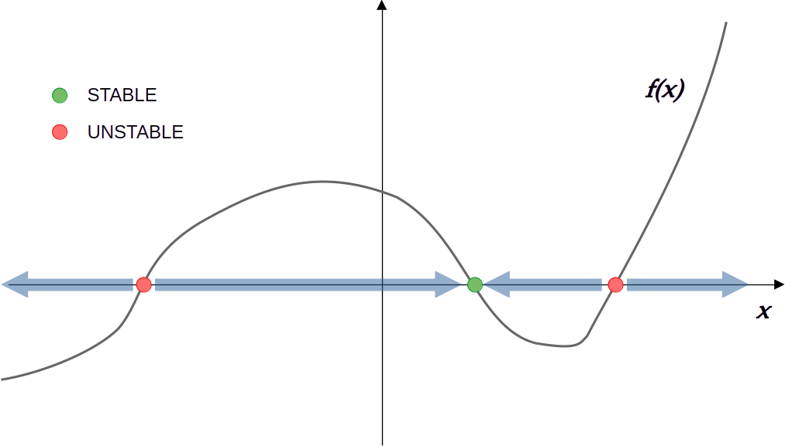

# Obiettivi e struttura

## Obiettivi didattici specifici
Al termine, lo studente dovrà essere in grado di:

- analizzare un sistema autonomo unidimensionale $\dot x=f(x)$ tramite equilibri e stabilità locale
- leggere una dinamica come discesa su un paesaggio $V(x)$ (minimi, massimi, barriere)
- descrivere biforcazioni elementari (transcritica e saddle--node) e il loro legame con soglie e tipping
- costruire una discretizzazione temporale e il metodo di Eulero esplicito
- distinguere errore locale ed errore globale, e separare la stabilità del modello dalla stabilità dello schema numerico
- collegare ODE e sistemi discreti come due aspetti della pratica computazionale

## Messaggio chiave
Quando "integriamo una ODE", in realtà stiamo simulando un sistema discreto che approssima il flusso continuo nel limite $\Delta t \to 0$.

## Struttura della lezione
- Parte I: struttura qualitativa delle ODE 1d (equilibri, paesaggi, biforcazioni)
- Parte II: integrazione numerica (discretizzazione, Eulero, errori e stabilità)
- Appendice: dinamiche discrete e mappa concettuale ODE $\leftrightarrow$ discreto

# PARTE I -- Struttura deterministica

## Sistemi autonomi 1D: definizione
Un sistema autonomo unidimensionale è:
$$
\dot x = f(x),
$$
dove $x(t)\in\mathbb{R}$ e $f$ dipende solo da $x$ (non esplicitamente dal tempo).

Interpretazione:
- $f(x)>0$ $\Rightarrow$ traiettoria tende a crescere
- $f(x)<0$ $\Rightarrow$ traiettoria tende a decrescere

## Lettura geometrica (linea di fase)
In 1D spesso non serve risolvere analiticamente:
- si identificano gli zeri di $f$
- tra due zeri consecutivi il segno di $f$ fissa la direzione del moto
- si rappresenta tutto su un asse reale con frecce (linea di fase)

{ height=50% } 

## Linearizzazione e criterio locale
Poni $x(t)=x^*+\xi(t)$ con $|\xi|$ piccolo. Allora:
$$
\dot \xi \approx f'(x^*)\,\xi.
$$

Conclusione:

- se $f'(x^*)<0$ $\Rightarrow$ $\xi$ decade $\Rightarrow$ $x^*$ stabile (attrattore)
- se $f'(x^*)>0$ $\Rightarrow$ $\xi$ cresce $\Rightarrow$ $x^*$ instabile (repulsore)
- se $f'(x^*)=0$ $\Rightarrow$ il test lineare non basta (servono termini non lineari)

## Esempio rapido (mentale)
Prendi $f(x)=x(1-x)$.

- Trova gli equilibri: $x^*=0$ e $x^*=1$
- Calcola $f'(x)=1-2x$
- Classifica stabilità via $f'(x^*)$

# Dinamica di gradiente e paesaggi

## Perchè introdurre i paesaggi
Due ragioni operative:

1) molti modelli deterministici sono (o si approssimano) come dinamiche che "scendono" lungo una funzione $V$
2) quando aggiungiamo rumore, l'immagine valle/barriera diventa quantitativa (metastabilità, escape, transizioni)

## Dinamica di gradiente: forma standard
Considera:
$$
\dot x = -V'(x).
$$

Lungo una traiettoria $x(t)$:
$$
\frac{d}{dt}V(x(t)) = V'(x(t))\,\dot x(t) = -\bigl(V'(x(t))\bigr)^2 \le 0.
$$

Quindi $V$ non aumenta nel tempo: la dinamica "scende" verso valori minori di $V$.

## Minimi, massimi, barriere
Equilibri: $V'(x^*)=0$.

- $x^*$ minimo locale di $V$ $\Rightarrow$ attrattore (stabile)
- $x^*$ massimo locale di $V$ $\Rightarrow$ repulsore (instabile)
- massimi separano bacini: barriere tra valli

## Potenziale formale in 1D
Per molte ODE $\dot x=f(x)$ si può definire formalmente:
$$
V(x) = -\int^x f(u)\,du,
$$
così che $\dot x = -V'(x)$.

Nota: in 1D è uno strumento intuitivo generale (non necessariamente un "potenziale fisico").

# Biforcazioni elementari

## Cosa è una biforcazione (idea)

Una biforcazione è un cambiamento qualitativo della dinamica al variare di un parametro $r$:

- cambiano numero di equilibri
- e/o cambia la loro stabilità
- conseguenza: soglie, transizioni, tipping

## Transcritica: modello guida
$$
\dot N = rN - N^2 = N(r-N).
$$

Equilibri:
$$
N_1^* = 0,\qquad N_2^* = r.
$$

Contesto: modelli di crescita, branching, soglie di sopravvivenza.

## Transcritica: stabilità e scambio
Derivata:
$$
f'(N)=r-2N.
$$

- in $N^*=0$: $f'(0)=r$ $\Rightarrow$ stabile se $r<0$, instabile se $r>0$
- in $N^*=r$: $f'(r)=-r$ $\Rightarrow$ stabile se $r>0$, instabile se $r<0$

A $r=0$ avviene uno scambio di stabilità: biforcazione transcritica.

## Interpretazione (soglia)
$r=0$ separa due regimi qualitativamente diversi:

- $r<0$: equilibrio stabile in $N=0$ (estinzione)
- $r>0$: equilibrio stabile in $N=r$ (persistenza)

In molti modelli, soglie di questo tipo sono l'oggetto che poi studiamo in presenza di rumore.

## Saddle--node: modello guida
$$
\dot x = r + x^2.
$$

Equilibri: risolvi $r+(x^*)^2=0$.

- se $r<0$:
$$
x^*_\pm=\pm\sqrt{-r}
$$
- se $r=0$: equilibrio doppio $x^*=0$
- se $r>0$: nessun equilibrio reale

## Saddle--node: stabilità e collisione
Qui $f(x)=r+x^2$ e:
$$
f'(x)=2x.
$$

Per $r<0$:

- in $x^*_-=-\sqrt{-r}$: $f'(x^*_-)<0$ $\Rightarrow$ stabile
- in $x^*_+=+\sqrt{-r}$: $f'(x^*_+)>0$ $\Rightarrow$ instabile

Quando $r\to 0^-$ i due equilibri collidono e scompaiono per $r>0$.

## Tipping deterministico (significato)
Se il sistema era vicino all'attrattore per $r<0$, aumentando $r$:

- l'attrattore si avvicina al repulsore
- alla soglia (collisione) non esiste piu` uno stato di riposo che trattenga la dinamica
- la traiettoria è forzata a muoversi in modo qualitativamente diverso

Questo è un tipping deterministico elementare (prima della parte stocastica).

# PARTE II -- Integrazione numerica delle ODE

## Perchè discretizzare
Un computer aggiorna lo stato solo a tempi discreti.

Introduci una griglia:
$$
t_n = t_0 + n\Delta t,\qquad n=0,1,2,\dots
$$
e approssima $x(t_n)$ con una sequenza $x_n$.

Messaggio: simulare una ODE significa simulare un sistema discreto che approssima il flusso continuo.

## Metodo di Eulero esplicito
Dalla definizione di derivata (approssimata a passo finito):
$$
\frac{x_{n+1}-x_n}{\Delta t}\approx f(x_n)
\quad\Rightarrow\quad
x_{n+1}=x_n+f(x_n)\Delta t.
$$

è il primo schema numerico: semplice, locale, ma con limiti chiari.

## Interpretazione geometrica di Eulero
- usa la pendenza $f(x_n)$ nel punto corrente
- costruisce un passo lungo la tangente
- è un metodo di primo ordine

Buona notazione operativa:
$$
x_{n+1}=g(x_n),\qquad g(x)=x+f(x)\Delta t.
$$

## Equazione test lineare
Per capire il ruolo di $\Delta t$:
$$
\dot x=\lambda x.
$$

Soluzione esatta:
$$
x(t)=x_0 e^{\lambda t}.
$$

Schema di Eulero:
$$
x_{n+1}=(1+\lambda\Delta t)x_n.
$$

## Stabilità numerica (idea)
Se $\lambda<0$ la soluzione continua decade.

Perchè anche la simulazione decada serve:
$$
|1+\lambda\Delta t|<1
\quad\Rightarrow\quad
0<\Delta t<\frac{2}{|\lambda|}.
$$

Se $\Delta t$ è troppo grande:
- l'errore viene amplificato
- possono comparire oscillazioni spurie (cambio di segno)
- un sistema stabile puo` diventare numericamente instabile

## Errori: locale vs globale
- errore locale di troncamento (un passo, partendo dal valore esatto): tipicamente $O(\Delta t^2)$ per Eulero
- errore globale (a tempo fissato $T$ dopo molti passi): tipicamente $O(\Delta t)$ per Eulero

Ridurre $\Delta t$:
- migliora l'accuratezza
- aumenta il costo computazionale

## Buona pratica: test di convergenza
Procedura minima:
- simula con $\Delta t$
- simula con $\Delta t/2$
- confronta traiettorie o osservabili a tempo $T$

Se i risultati cambiano significativamente, $\Delta t$ è troppo grande.

# APPENDICE -- Sistemi discreti

## Equazioni alle differenze
Dinamica discreta:
$$
x_{n+1}=g(x_n).
$$

Punto fisso $x^*$:
$$
x^*=g(x^*).
$$

## Stabilità dei punti fissi
Linearizza: $x_n=x^*+\xi_n$:
$$
\xi_{n+1}\approx g'(x^*)\,\xi_n.
$$

Quindi:
- stabile se $|g'(x^*)|<1$
- instabile se $|g'(x^*)|>1$

Confronto: per ODE conta il segno di $f'(x^*)$; per discreto conta il modulo.

## ODE $\to$ discreto (Eulero)
Da $\dot x=f(x)$:
$$
x_{n+1}=x_n+f(x_n)\Delta t
\quad\Rightarrow\quad
g(x)=x+f(x)\Delta t.
$$

Una scelta di schema numerico equivale a scegliere una mappa discreta che approssima il flusso continuo.

## Discreto $\to$ ODE (interpretazione)
Se $x_{n+1}=g(x_n)$ e i passi sono piccoli:
$$
\frac{x_{n+1}-x_n}{\Delta t}\approx f(x_n),
\qquad
f(x)\approx\frac{g(x)-x}{\Delta t}.
$$

Concetto: al computer siamo sempre in discreto; le ODE entrano come modello ideale/limite.

# Chiusura e raccordo

## Take-home messages
- La struttura deterministica (equilibri, stabilità, biforcazioni) è lo "scheletro" su cui si innesta il rumore
- I paesaggi $V(x)$ danno un linguaggio operativo per bacini e barriere
- Simulare una ODE significa scegliere uno schema discreto: accuratezza e stabilità dipendono da $\Delta t$
- ODE e sistemi discreti: stessa pratica, due rappresentazioni

## What comes next
- Aggiungiamo rumore: diffusivo e impulsivo
- La metafora valle/barriera diventa quantitativa (escape, metastabilità)
- Gli stessi problemi numerici (discretizzazione, stabilità) tornano in modo ancora piu` cruciale nelle SDE