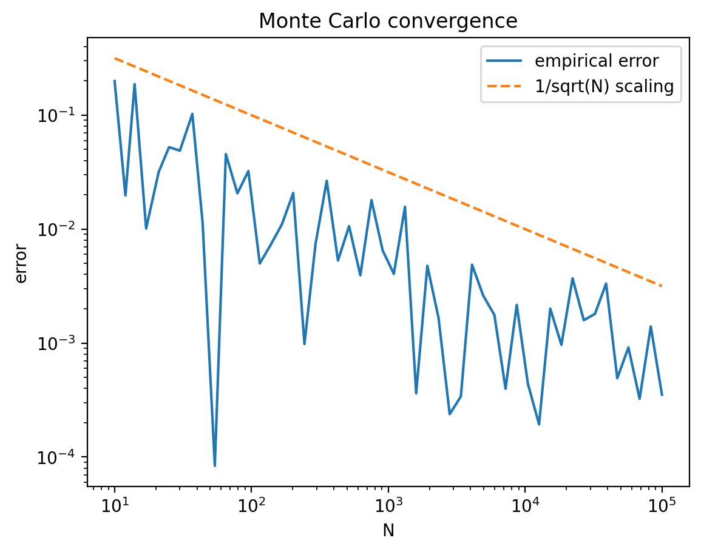
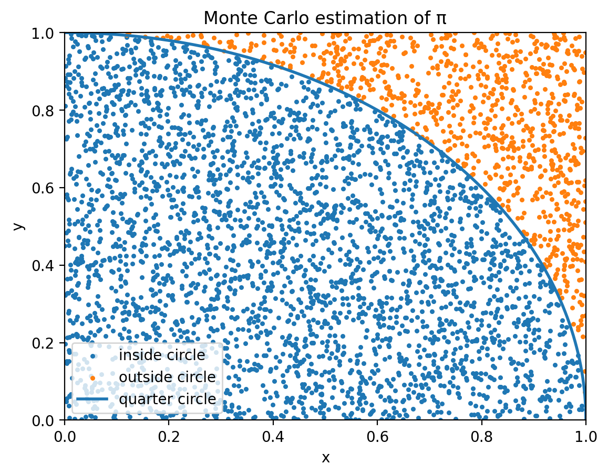
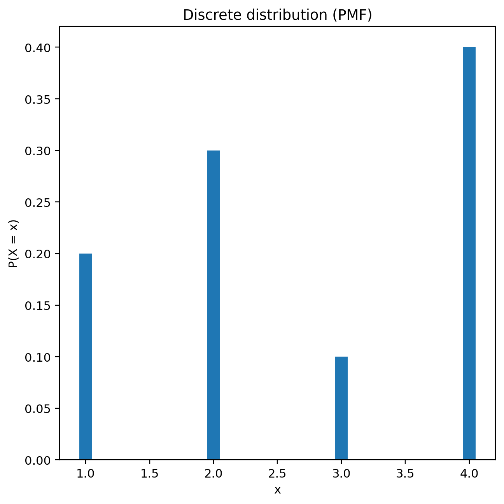
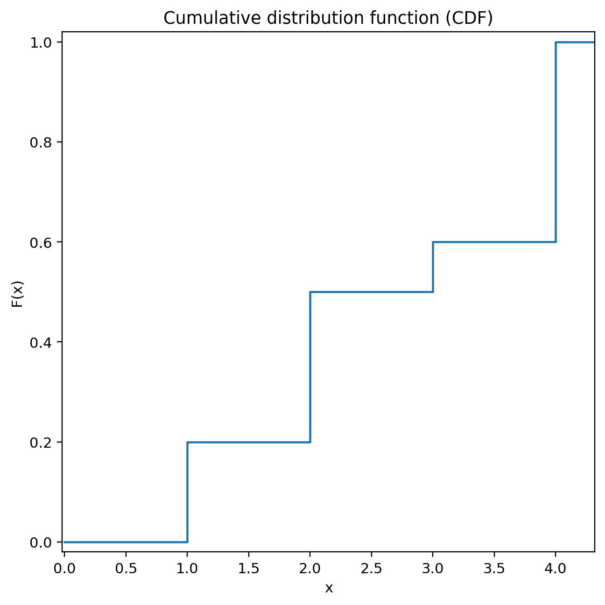
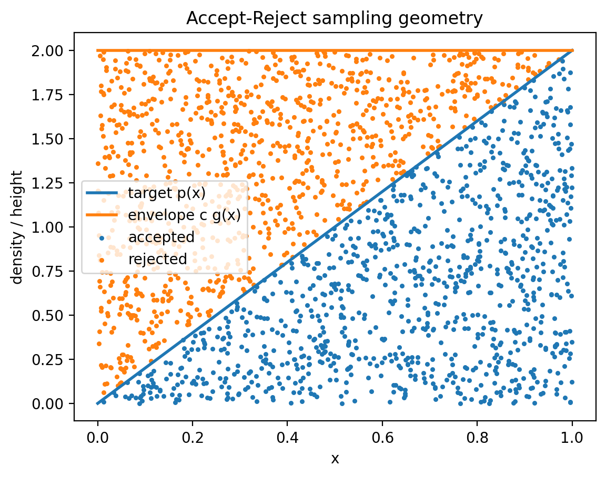
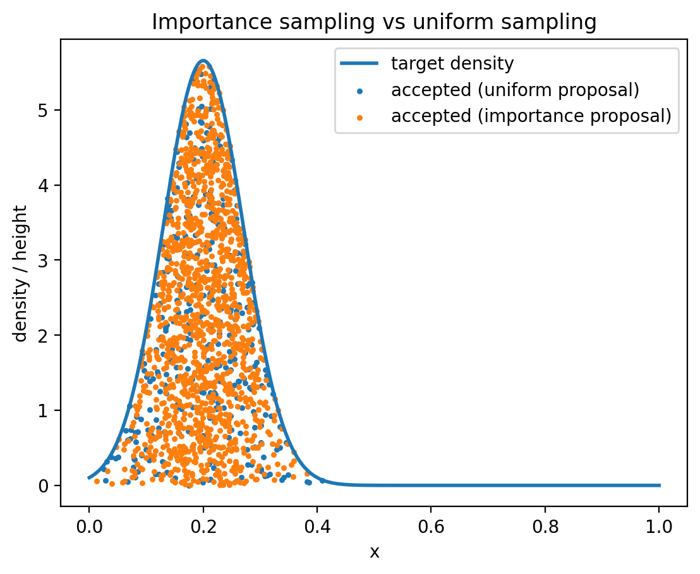
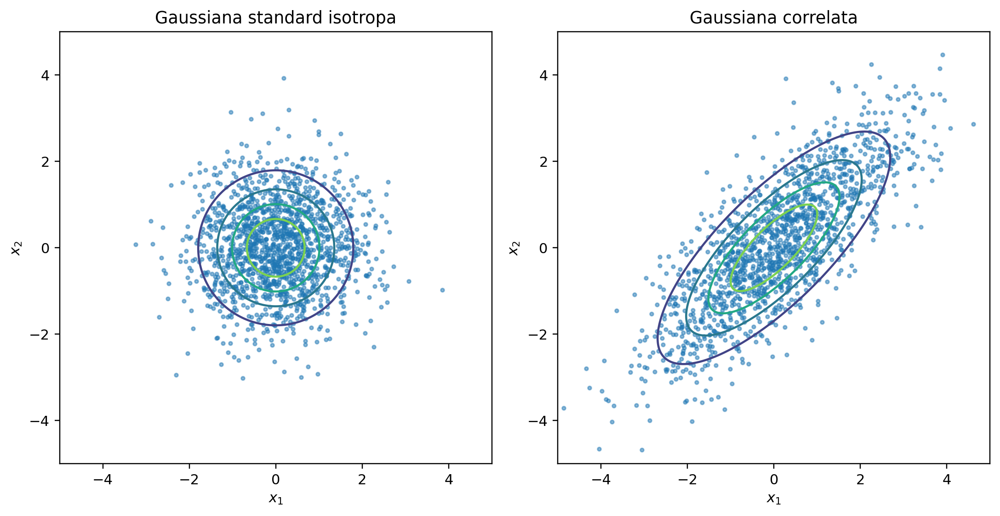
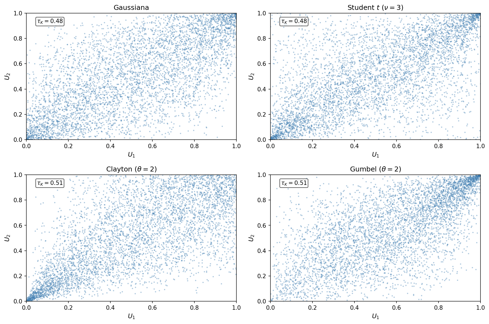

# Obiettivi della lezione

## Obiettivi didattici specifici

Al termine della lezione lo studente dovrà essere in grado di:

- comprendere il principio dei metodi Monte Carlo
- interpretare Monte Carlo come stima di una media
- distinguere errore statistico ed errore sistematico
- comprendere perché Monte Carlo è utile in alta dimensione
- generare campioni da distribuzioni assegnate
- comprendere il ruolo del campionamento nelle simulazioni

## Idea centrale

Sostituire un calcolo deterministico con una **media statistica su campioni casuali**.

---

# Origine dei metodi Monte Carlo

## Breve contesto storico

- sviluppati negli anni 40
- coinvolti:
  - **Stanislaw Ulam**
  - **John von Neumann**
  - **Nicholas Metropolis**

Applicazioni iniziali:

- trasporto neutronico
- problemi di fisica nucleare
- simulazioni statistiche

Il nome deriva dal **casino di Monte Carlo**.

---

# Monte Carlo come stima di una media

## Principio generale

Sia $X$ una variabile aleatoria con densità $p(x)$.

Il valore atteso di una funzione $f(x)$ è

$$
\langle f(X) \rangle =
\int f(x)p(x)\,dx
$$

Stima Monte Carlo:

$$
\langle f(X) \rangle
\approx
\frac{1}{N}\sum_{i=1}^N f(x_i)
$$

dove $x_i \sim p(x)$.

---

# Legge dei grandi numeri

## Convergenza della media campionaria

Se $x_i$ sono campioni indipendenti:

$$
\bar f_N = \frac{1}{N}\sum_{i=1}^N f(x_i)
$$

allora

$$
\bar f_N \to \langle f \rangle
\quad
(N\to\infty)
$$

## Errore statistico

$$
\sigma \sim \frac{1}{\sqrt N}
$$

Dal teorema del limite centrale: convergenza lenta ma universale.

---

# Errore statistico vs errore sistematico

## Errore statistico

Deriva dal numero finito di campioni.

Caratteristiche:

- fluttuazioni casuali
- decresce come $1/\sqrt N$
- stimabile dai dati

## Errore sistematico

Deriva da:

- generatore pseudocasuale di bassa qualità
- campionamento non coerente con $p(x)$
- trasformazioni numericamente instabili
- correlazioni indesiderate tra campioni

Non scompare aumentando $N$.

---

# Perché Monte Carlo è importante

:::: {.columns} 
::: {.column width="50%"}

## Il problema della dimensione

Molti problemi richiedono integrali:

$$
I = \int_{\Omega} f(\mathbf{x})\,d\mathbf{x}
$$

con $\mathbf{x}\in\mathbb{R}^d$. Nei metodi deterministici: numero di punti $\sim n^d$.

## Monte Carlo

Errore (sempre limite centrale della media):

$$
\sigma \sim \frac{1}{\sqrt N}
$$

dipende solo da $N$, è indipendente da $d$.

:::
::: {.column width="50%"}

:::
::::

---

# Interpretazione geometrica

## Stima di $\pi$

:::: {.columns}

::: {.column width="45%"}

- Genera punti uniformi nel quadrato unitario.
- Conta quelli nel quarto di cerchio:

$$
x^2+y^2\le 1
$$

$$
\pi \approx 4\frac{N_{in}}{N}
$$

Interpretazione:

probabilità = rapporto tra aree.

:::

::: {.column width="55%"}

{width=100%}

:::

::::

# Efficienza statistica

## Numero effettivo di campioni

Non tutti i campioni contribuiscono allo stesso modo.

Definizione intuitiva:

- campioni altamente correlati
- campioni con peso molto diverso

$\Rightarrow$ informazione ridotta.

Si introduce spesso:

numero **effettivo di campioni**

$$
N_{\mathrm{eff}} = \frac{N}{\tau} < N
$$

dove $\tau$ è la lunghezza di correlazione caratteristica.

---

# Il problema delle regioni rare

## Funzioni molto concentrate

In molti problemi:

- la maggior parte dello spazio contribuisce poco
- regioni piccole dominano l'integrale

Campionamento uniforme $\Rightarrow$ inefficiente, varianza enorme.

Esempi:

- barriere energetiche
- eventi rari
- code di distribuzioni

Soluzione naturale: concentrare i campioni dove serve.

$\Rightarrow$ **importance sampling**

---

# Generazione di numeri pseudocasuali

## Generatori

Un generatore produce numeri uniformi

$$
U\in[0,1)
$$

sequenza **deterministica** con proprietà statistiche buone.

Esempi:

- generatori congruenziali lineari
- Mersenne Twister
- PCG

## Perché il determinismo è accettabile

Non serve casualità ontologica: basta che la sequenza si comporti
**come se** fosse indipendente e uniforme rispetto alle osservabili di interesse.

---

# Riproducibilità e seed

## Il valore iniziale

Ogni generatore è inizializzato da un valore detto **seed**.

Vantaggi pratici:

- la simulazione è **riproducibile**
- si possono confrontare algoritmi a parità di sequenza
- il debugging è controllabile

Fissare il seed non riduce la qualità statistica:
cambia solo il punto di partenza nella sequenza.

## Attenzione

Sequenze con seed diversi producono risultati statisticamente equivalenti,
ma numericamente diversi.

---

# Metodo dell'inversione

## Idea

Se $F(x)$ è la CDF:

$$
F(x)=P(X\le x)
$$

e $U\sim \mathrm{Unif}(0,1)$,

definiamo

$$
X = F^{-1}(U)
$$

$\Rightarrow$ $X$ ha distribuzione $p(x)=F'(x)$.

---

# Perché funziona

## Dimostrazione (caso continuo)

Poiché $F$ è crescente, $F^{-1}(U) \le x$ equivale a $U \le F(x)$.

Quindi:

$$
P(X \le x) = P(F^{-1}(U) \le x) = P(U \le F(x)) = F(x)
$$

L'ultima uguaglianza vale perché $U$ è uniforme in $[0,1)$.

La variabile $X = F^{-1}(U)$ ha quindi esattamente la distribuzione $F$.

---

# Distribuzione discreta e CDF

:::: {.columns}

::: {.column width="50%"}

:::

::: {.column width="50%"}

:::

::::

---

# Caso generale: inversa generalizzata

## Distribuzioni discrete o miste

Quando $F$ non è strettamente crescente (tratti piatti, salti),
l'inversa classica non esiste.

Si definisce la **funzione quantile**:

$$
F^{-1}(u) = \inf\{\, x \in \mathbb{R} : F(x) \ge u \,\}, \quad u \in (0,1)
$$

Vale ancora:

$$
P(X \le x) = P(F^{-1}(U) \le x) = P(U \le F(x)) = F(x)
$$

La proprietà fondamentale è preservata anche nel caso discreto.

---

# Inversa generalizzata: note pratiche

## Quando usarla

- distribuzioni discrete (Poisson, binomiale, ...)
- distribuzioni miste (parte continua + massa puntuale)
- CDF definita per tabulazione

## Implementazione

Quando $F^{-1}$ non ha forma chiusa:

- tabulazione e interpolazione monotona
- bisezione o metodo di Newton su $F$
- evitare $U$ troppo vicino a $0$ o $1$
  (instabilità nelle code)

---

# Esempio: distribuzione esponenziale

Distribuzione:

$$
p(x)=\lambda e^{-\lambda x}
$$

CDF:

$$
F(x)=1-e^{-\lambda x}
$$

Metodo dell'inversione:

$$
X=-\frac{1}{\lambda}\ln U
$$

(poiché $U$ e $1-U$ hanno la stessa distribuzione uniforme)

---

# Limiti del metodo dell'inversione

## Problemi pratici

Richiede:

- CDF invertibile in forma chiusa o numericamente stabile
- inversione efficiente

Molte distribuzioni importanti:

- non hanno forma chiusa (gaussiana, beta, gamma...)
- richiedono metodi alternativi

Nel caso multidimensionale: costruire trasformazioni congiunte
compatibili con l'intera distribuzione è raramente conveniente.

---

# Metodo di accettazione-rifiuto

:::: {.columns}
::: {.column width="40%"}

## Idea

Usiamo una distribuzione ausiliaria $g(x)$.

Condizione:

$$
p(x) \le c\,g(x)
$$

Algoritmo:

1. genera $x\sim g(x)$
2. genera $u\sim U(0,1)$
3. accetta se

$$
u < \frac{p(x)}{c\,g(x)}
$$

:::
::: {.column width="60%"}

:::
::::

---

# Interpretazione geometrica

## Accept--reject

Campionamento uniforme sotto la curva

$$
c\,g(x)
$$

Accetta solo i punti sotto $p(x)$.

Efficienza:

$$
\text{efficienza} = \frac{1}{c}
$$

Scegliere $g(x)$ vicino a $p(x)$ riduce gli scarti
e aumenta la produttività del metodo.

---

# Campionamento per importanza

## Idea

Campionare non uniformemente.

Scriviamo

$$
I = \int f(x)\,dx =
\int \frac{f(x)}{q(x)}q(x)\,dx
$$

Campioniamo da $q(x)$.

Stima:

$$
I \approx
\frac{1}{N}
\sum_{i=1}^{N}
\frac{f(x_i)}{q(x_i)}
$$

---

# Importance sampling

:::: {.columns}
::: {.column width="40%"}

## Perché campionare meglio

Campionamento uniforme:

- molti punti cadono in regioni poco rilevanti

Importance sampling:

- concentra i campioni dove $f(x)$ contribuisce di più

:::

::: {.column width="60%"}

:::
::::

---

# Scelta della distribuzione ausiliaria

## Criterio ideale

La scelta ottimale sarebbe $q(x) \propto |f(x)|$:
la varianza della stima si annulla.

In pratica si sceglie $q(x)$ tale che:

- sia facile da campionare
- approssimi la forma di $|f(x)|$
- non sia mai troppo piccola dove $f(x)$ è grande

## Attenzione

Se $q(x)$ è molto piccola in regioni dove $f(x)$ è grande,
i pesi $f(x)/q(x)$ esplodono $\Rightarrow$ stima instabile.

---

# Osservabili e stime

## Osservabili

In molte simulazioni vogliamo stimare:

$$
\langle A \rangle =
\int A(x)p(x)\,dx
$$

Monte Carlo:

$$
\langle A \rangle \approx
\frac{1}{N}\sum_{i=1}^{N} A(x_i)
$$

con $x_i\sim p(x)$.

---

# Consistenza dello stimatore

## Proprietà desiderate

Uno stimatore Monte Carlo dovrebbe essere:

- **non distorto**: $\,\mathbf{E}[\hat A_N] = \langle A \rangle$
- **consistente**: $\,\hat A_N \to \langle A\rangle$ per $N\to\infty$
- con varianza controllabile: $\,\mathrm{Var}(\hat A_N) = \mathrm{Var}(A)/N$

Il risultato di una simulazione non è un numero esatto,
ma una **stima con incertezza controllabile**.

---

# Tecniche di riduzione della varianza

## Obiettivo

Ridurre l'incertezza **senza aumentare $N$**.

## Campionamento stratificato

Suddividere $\Omega$ in strati di uguale misura,
generare un campione in ciascuno.

Evita concentrazioni casuali in una zona sola.

## Antithetic variates

Per ogni $u \in [0,1)$ si usa anche $1-u$.

Le due valutazioni di $f$ tendono ad avere errori opposti:
la media è più stabile.

## Importance sampling

Già discusso: concentra i campioni nelle regioni rilevanti.

---

# Covarianza e correlazione

## Covarianza

Data due variabili $X$ e $Y$, la covarianza misura
se tendono a crescere insieme:

$$
\mathrm{Cov}(X,Y) = \mathbf{E}[(X - \mu_X)(Y - \mu_Y)]
$$

- $\mathrm{Cov} > 0$: crescono insieme
- $\mathrm{Cov} < 0$: una cresce, l'altra decresce
- $\mathrm{Cov} = 0$: non correlate (linearmente)

Limite: dipende dalle unità di misura di $X$ e $Y$.

---

# Coefficiente di correlazione di Pearson

## Correlazione

Si normalizza la covarianza con le deviazioni standard:

$$
\rho(X,Y) = \frac{\mathrm{Cov}(X,Y)}{\sigma_X \sigma_Y} \in [-1, 1]
$$

- $\rho = 1$: dipendenza lineare perfetta positiva
- $\rho = -1$: dipendenza lineare perfetta negativa
- $\rho = 0$: nessuna dipendenza **lineare**

## Attenzione

$\rho = 0$ non implica indipendenza.
Due variabili possono essere fortemente dipendenti
in modo non lineare e avere $\rho = 0$.

---

# Correlazione di Kendall

## Oltre la linearità

La correlazione di Pearson misura solo dipendenza lineare.
La **correlazione di Kendall** $\tau_K$ misura la concordanza
dei ranghi: due osservazioni $(x_i, y_i)$ e $(x_j, y_j)$ sono

- **concordanti** se $x_i > x_j$ e $y_i > y_j$ (o entrambe minori)
- **discordanti** altrimenti

$$
\tau_K = \frac{\text{coppie concordanti} - \text{coppie discordanti}}{\text{coppie totali}}
$$

## Vantaggio

$\tau_K$ è invariante per trasformazioni monotone:
se $U = F(X)$ con $F$ crescente, $\tau_K(U,V) = \tau_K(X,Y)$.

Per questo è la misura naturale da usare con le copule.

---

# Gaussiana multivariata

## Distribuzione

$$
p(\mathbf{x}) =
\frac{1}{(2\pi)^{d/2}(\det\Sigma)^{1/2}}
\exp\left[
-\frac12
(\mathbf{x}-\boldsymbol{\mu})^T
\Sigma^{-1}
(\mathbf{x}-\boldsymbol{\mu})
\right]
$$

dove $\Sigma$ è la matrice di covarianza:

$$
\Sigma_{ij} = \mathrm{Cov}(X_i, X_j)
$$

$\Sigma$ deve essere simmetrica e semidefinita positiva.

---

# Generazione tramite trasformazione lineare

## Metodo

Se $\Sigma = LL^T$ è una matrice di covarianza e $\mathbf{z}\sim \mathcal{N}(\mathbf{0},I)$, allora

$$
\mathbf{X} = \boldsymbol{\mu} + L\mathbf{z}
$$

$\mathbf{X}$ ha media $\boldsymbol{\mu}$ e covarianza $\Sigma$.

## Verifica

$\mathrm{Cov}(\mathbf{X}) = \mathbb{E}(\mathbf{X}\mathbf{X}^T) = L\,\mathbb{E}[\mathbf{z}\mathbf{z}^T]\,L^T = LIL^T = \Sigma$

---

# Fattorizzazione di Cholesky

## Metodo standard

Se $\Sigma$ è **strettamente definita positiva**:

$$
\Sigma = LL^T
$$

con $L$ triangolare inferiore.

Vantaggi:

- stabile e veloce
- semplice da implementare

Limite:

- fallisce se $\Sigma$ ha autovalori nulli o quasi nulli
- non applicabile a matrici singolari

---

# Decomposizione spettrale

## Alternativa generale

Diagonalizzazione di $\Sigma$:

$$
\Sigma = Q\Lambda Q^T
$$

con $Q$ ortogonale, $\Lambda$ diagonale con autovalori $\ge 0$.

Si pone:

$$
L = Q\Lambda^{1/2}
$$

## Interpretazione geometrica

$L$ ruota e dilata il vettore gaussiano isotropo,
deformando la sfera unitaria in un **ellissoide** di covarianza $\Sigma$.

Funziona anche quando $\Sigma$ è solo semidefinita positiva.

---

# Campionamento gaussiano multivariato

## Da isotropo a correlato

$\Sigma = R_\theta \Lambda R_\theta^T$, con $\theta = \pi/4$, $\Lambda = \mathrm{diag}(\lambda_1=4,\lambda_2=1/2)$

---

# Problemi numerici

## Matrici mal condizionate

Nella pratica, $\Sigma$ stimata dai dati può essere:

- quasi singolare (autovalori molto piccoli)
- numericamente non definita positiva
- singolare (distribuzioni degeneri)

## Strategie

**Regolarizzazione diagonale:**

$$
\Sigma_\varepsilon = \Sigma + \varepsilon I
$$

sposta gli autovalori lontano da zero.

**Troncamento spettrale:**
autovalori negativi o sotto soglia $\to$ posti a zero.

---

# Pseudoinversa di Moore--Penrose

## Quando $\Sigma$ è singolare

L'inversa ordinaria non esiste o non è affidabile.

Dalla decomposizione spettrale $\Sigma = Q\Lambda Q^T$:

$$
\Sigma^{+} = Q\Lambda^{+} Q^T
$$

dove $\Lambda^{+}$ inverte solo gli autovalori **significativamente diversi da zero**.

## Utilità

Permette di trattare distribuzioni gaussiane **degeneri**,
concentrate su sottospazi di dimensione inferiore.

Esempio: dati con correlazioni esatte, variabili ridondanti.

---

# Pseudoinversa come proiezione

## Distribuzioni degeneri

Se $\Sigma$ ha rango $r < d$, alcuni autovalori sono nulli: la distribuzione è concentrata su un **sottospazio di dimensione $r$**. Scriviamo la decomposizione ridotta:

$$ \Sigma = Q_r \Lambda_r Q_r^T $$

dove $Q_r \in \mathbb{R}^{d\times r}$ contiene solo gli $r$ autovettori significativi e $\Lambda_r$ i corrispondenti autovalori positivi.

## Generazione

Si campiona $\mathbf{Z}_r \in \mathbb{R}^r$ gaussiano standard, poi:

$$ \mathbf{X} = \boldsymbol{\mu} + Q_r \Lambda_r^{1/2} \mathbf{Z}_r $$

$Q_r \Lambda_r^{1/2}$ **proietta** il campionamento sul sottospazio rilevante. Le direzioni a varianza nulla non vengono mai esplorate.

---

# Oltre la dipendenza gaussiana: copule

## Il problema

La covarianza non basta a descrivere la dipendenza
tra variabili non gaussiane.

Due distribuzioni possono avere **stessa covarianza**
ma dipendenze molto diverse:

- concordanza nelle situazioni normali
- comportamento opposto nelle code

Serve uno strumento più generale.

---

# Copule: il teorema di Sklar

## Separare marginali e dipendenza

Data $F(x_1,\dots,x_d)$ con marginali $F_1,\dots,F_d$,
esiste una funzione $C:[0,1]^d\to[0,1]$ tale che

$$
F(x_1,\dots,x_d) = C(F_1(x_1),\dots,F_d(x_d))
$$

$C$ è la **copula**: contiene tutta e sola
la struttura di dipendenza.

## Idea chiave

Se $U_i = F_i(X_i)$, allora $U_i \sim \mathrm{Unif}(0,1)$
per ogni $i$, ma $(U_1,\dots,U_d)$ non sono indipendenti.

La loro distribuzione congiunta **è** la copula.

---

# Copule: simulazione e famiglie

## Come simulare

1. generare $(u_1,\dots,u_d)$ dalla copula $C$
2. applicare le inverse: $x_i = F_i^{-1}(u_i)$

Le marginali $F_i$ possono essere qualunque.

## Famiglie principali

- **Gaussiana**: dipendenza gaussiana, marginali libere
- **Student**: come gaussiana ma code più pesanti;
  cattura concordanza negli eventi estremi
- **Archimedee** (Clayton, Gumbel, Frank):
  asimmetria nella dipendenza tra coda inferiore
  e coda superiore

## Applicazioni

Finanza (crolli correlati), attuariale,
statistica multivariata con dati asimmetrici.

---

# Copule: confronto visivo 

## Stessa dipendenza, pattern diversi

{height=60%}

$\tau_K$ = correlazione di Kendall: versione robusta della correlazione

---

# Cosa non è ancora Monte Carlo

## Limiti della trattazione

In questa lezione:

- campionamento **indipendente**

Ma molti problemi richiedono:

- campionamento **correlato**
- distribuzioni definite implicitamente

Esempio:

$$
p(x) \propto e^{-E(x)}
$$

---

# Collegamento con la prossima lezione

## Catene di Markov

Quando non possiamo campionare direttamente:

costruiamo una **catena di Markov**

che abbia $p(x)$ come distribuzione stazionaria.

Algoritmi fondamentali:

- Metropolis
- Metropolis-Hastings
- Gibbs sampling

Base dei metodi **MCMC**.

---

# Take-home messages

- Monte Carlo = stima di una media tramite campionamento
- errore statistico $\sim 1/\sqrt N$, errore sistematico non scompare con $N$
- efficiente in alta dimensione: costo indipendente da $d$
- inversione, accept--reject, importance sampling: strumenti complementari
- variabili correlate: Cholesky, spettrale, pseudoinversa per casi degeneri
- copule: separare marginali e dipendenza
- base per metodi più avanzati (MCMC)
