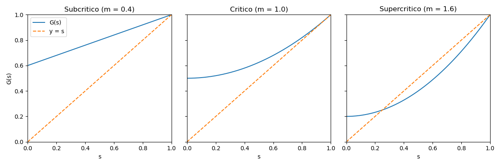

La crescita è un fenomeno universale ma raramente regolare.  
I modelli deterministici forniscono una visione media, ma non descrivono la **variabilità** e l’**imprevedibilità** osservate nei sistemi reali.  
I modelli di crescita e branching introducono il caso come componente dinamica, permettendo di analizzare la probabilità di espansione o estinzione di popolazioni, idee o strutture sociali.
I principali modelli di crescita stocastica e di ramificazione permettono infatti di comprendere il ruolo della casualità nella dinamica di popolazioni o sistemi in espansione, e analizzare applicazioni interdisciplinari in biologia, epidemiologia, economia e reti.

### Obiettivi didattici specifici

1. Comprendere la differenza tra crescita deterministica e stocastica.  
2. Introdurre la logica dei **processi di branching** e il concetto di estinzione.  
3. Analizzare esempi numerici e simulazioni di crescita casuale.  
4. Introdurre varianti continue (Yule, logistica stocastica).  
5. Collegare i modelli di crescita a fenomeni reali in diversi ambiti disciplinari.

### Struttura della lezione

La lezione è articolata in cinque parti principali:

1. **Crescita deterministica e stocastica** – differenze concettuali e modelli base.  
2. **Processo di branching (Galton–Watson)** – definizione, interpretazione, simulazione.  
3. **Distribuzioni e probabilità di estinzione** – comportamento medio e varianza.  
4. **Modelli di crescita continua e varianti** – Yule, logistica, processi moltiplicativi.  
5. **Applicazioni interdisciplinari** – biologia, epidemie, reti, economia.

---

## 1. Crescita deterministica e stocastica

La descrizione quantitativa dei processi di crescita rappresenta uno dei temi fondamentali dei modelli dinamici. In molti sistemi reali -- popolazioni biologiche, diffusione di innovazioni, espansione di gruppi sociali o dinamiche economiche -- la crescita non procede in modo regolare, ma mostra oscillazioni, arresti temporanei, accelerazioni improvvise ed episodiche estinzioni locali. Una modellizzazione puramente deterministica coglie soltanto il comportamento medio del sistema, trascurando la variabilitá che emerge dalle interazioni microscopiche o da fattori ambientali. 

L’introduzione di termini stocastici permette di rappresentare in maniera esplicita tali fluttuazioni, attribuendo loro un ruolo strutturale nel determinare la traiettoria evolutiva del processo. Il confronto fra crescita deterministica e crescita stocastica consente quindi di chiarire come la casualitá possa modificare non soltanto l’ampiezza delle oscillazioni attorno alla media, ma anche le proprietá qualitative della dinamica, come la probabilitá di estinzione o la formazione di code pesanti nella distribuzione delle dimensioni.

### 1.1 Crescita deterministica

Il punto di partenza dei modelli di crescita è l’osservazione che, in molti sistemi reali, la variazione del numero di individui, agenti o entità è proporzionale alla quantità già presente. Questa ipotesi di proporzionalità conduce naturalmente al modello differenziale più semplice:

$$
\frac{dN}{dt} = rN \,,
$$
dove $N(t)$ rappresenta la dimensione del sistema al tempo $t$ e $r$ è il tasso di crescita. L’equazione formalizza un’idea intuitiva: più grande è la popolazione, maggiore è il numero di nuovi individui che ci si può aspettare nell’unità di tempo.

La soluzione si ottiene integrando il rapporto $\frac{dN}{N} = r\, dt$:

$$
\int_{N_0}^{N(t)} \frac{dN'}{N'} = \int_0^{t} r\, ds \,,
$$
da cui segue immediatamente

$$
N(t) = N_0 e^{rt}\,.
$$
Si tratta della tipica crescita esponenziale, nella quale la popolazione raddoppia in tempi regolari (tempo di raddoppio $T = \frac{\ln 2}{r}$). Nel modello deterministico ogni traiettoria è perfettamente prevedibile a partire dalle condizioni iniziali: non esistono fluttuazioni e tutti gli individui contribuiscono allo stesso modo alla dinamica complessiva.

#### Perché questa equazione appare ovunque?

L’equazione esponenziale emerge in contesti estremamente diversi perché la condizione di proporzionalità fra crescita e dimensione è sorprendentemente generale. Alcuni esempi:

1. **Biologia delle popolazioni.** Se ogni individuo ha, in media, una probabilità costante di riprodursi, allora il numero atteso di nuovi nati per unità di tempo è proporzionale a $N$.

2. **Epidemiologia.** Nelle fasi iniziali di un’epidemia, quando i suscettibili sono molti, ogni infetto contagia in media per unità di tempo una frazione $r$ degli individui con cui è in contatto: la popolazione infetta cresce esponenzialmente *se l'individuo infetto è in contatto con tutta la popolazione in oggetto* (ipotesi di "full mixing", tipicamente verificata in comunitá ristrette).

3. **Finanza.** Gli interessi composti trasformano il capitale $C(t)$ in una quantità che soddisfa esattamente l’equazione $\frac{dC}{dt} = rC$dove $r$ è il tasso di interesse.

4. **Diffusione di innovazioni.** Se la probabilità che un individuo adotti un’innovazione è proporzionale al numero di persone che l’hanno già adottata, la dinamica iniziale è esponenziale.

5. **Processi con auto‐rafforzamento.** In presenza di meccanismi di feed‐back positivo, come apprendimento cumulativo o effetti di rete, la crescita iniziale può essere descritta dalla stessa equazione.

In sintesi, il modello esponenziale rappresenta un archetipo matematico: qualunque fenomeno in cui la velocità di crescita sia proporzionale alla dimensione del sistema può essere approssimato, almeno localmente nel tempo, da questa dinamica estremamente semplice e ricorrente.

### 1.2 Crescita stocastica

Nei sistemi reali, la crescita non procede mai in modo perfettamente regolare: condizioni ambientali, interazioni sociali, shock economici o biologici introducono variazioni difficili da prevedere. Per tenere conto di questa variabilità si introduce un termine casuale nella dinamica:

$$
\frac{dN}{dt} = rN + \sigma N\, \eta(t) \,,
$$
dove $\eta(t)$ rappresenta un rumore (in genere si assume bianco gaussiano) di media zero e varianza unitaria, mentre $\sigma$ controlla l’intensità relativa delle fluttuazioni. Ricordiamoci che nel formalismo di Itô questa equazione corrisponde alla SDE

$$
dN = r N\, dt + \sigma N \,dW\
$$
dove $W$ è il processo di Wiener.

Questa equazione è un esempio fondamentale di modello **moltiplicativo**: sia la crescita media sia il rumore sono proporzionali a $N$. Ciò significa che i sistemi più grandi presentano anche fluttuazioni assolute più forti, una proprietà osservata in biologia (popolazioni animali o cellulari), epidemiologia, mercati finanziari e sistemi sociali. 

Notare che questa equazione prevede la possibilità di un **processo di estinzione**: se le fluttuazioni portano $N(t)$ a zero, $dN/dt=0$ per cui $N(t´)$ rimarrá zero per $t'>t$.  

#### Interpretazione dell’equazione

Il termine deterministico $rN$ descrive la crescita media, come nel modello esponenziale classico. Il termine stocastico $\sigma N\, \eta(t)$ introduce una variabilità che può localmente favorire o frenare l’espansione, producendo traiettorie differenti anche in presenza della stessa condizione iniziale.

Il modello può essere visto come il limite continuo di una descrizione discreta in cui ciascun individuo contribuisce alla crescita con un effetto variabile. Questo meccanismo spiega la presenza di oscillazioni significative in molti sistemi complessi reali, dagli stessi contesti già citati: popolazioni ecologiche, processi epidemici, rendimenti economici, propagazione culturale o sociale.

#### Varianti del termine di rumore

Il termine $\sigma N\, \eta(t)$ è soltanto una delle molte forme possibili. A seconda del fenomeno considerato, la parte stocastica può assumere strutture diverse:

- **Rumore proporzionale a $N$**: modelli a crescita moltiplicativa (ad esempio processi geometrici browniani).
- **Rumore proporzionale a $\sqrt{N}$**: tipico per modelli con fluttuazioni demografiche interne, come nei processi di nascita-morte; riflette una varianza che cresce più lentamente della popolazione.
- **Rumore additivo o quasi-costante**: usato quando le fluttuazioni riflettono forzanti ambientali esterne indipendenti dalla dimensione del sistema.
- **Rumori ibridi o non lineari**: adottati quando specifiche interazioni o vincoli strutturali richiedono una dipendenza diversa dalla scala.

In tutti questi casi, la scelta della forma del rumore è guidata da un principio essenziale: **la dinamica deve garantire che $N(t)$ rimanga fisicamente interpretabile**, cioè non possa diventare negativo. Tale vincolo determina spesso la struttura del termine stocastico e distingue nettamente i modelli utilizzabili nei vari campi applicativi.

In sintesi, la crescita stocastica non è soltanto una perturbazione del modello deterministico: la presenza del rumore ne modifica la dinamica, introducendo dispersione crescente, asimmetrie nella distribuzione, e in certi casi una probabilità di estinzione non nulla anche quando il tasso medio $r$ è positivo.

#### Interpretazione dell’equazione

Il termine deterministico $rN$ descrive la crescita media, come nel caso esponenziale tradizionale. Il termine stocastico $\sigma N\, \eta(t)$ introduce invece una componente di aleatorietà che può localmente accelerare o rallentare l’espansione. In questo modo, due simulazioni con le stesse condizioni iniziali generano traiettorie diverse: non esiste più una sola evoluzione possibile.

L’equazione può essere interpretata come un limite continuo di un processo discreto in cui, a ogni intervallo di tempo, ogni individuo può contribuire in modo variabile alla crescita. Questa struttura modulare spiega perché modelli di questo tipo emergono naturalmente in:

1. **Dinamica delle popolazioni.** Le probabilità di nascita o morte sono soggette a fluttuazioni ambientali o demografiche.
2. **Epidemie.** Il numero effettivo di contatti varia nel tempo e nello spazio, producendo crescite irregolari dell’incidenza.
3. **Finanza e crescita economica.** I rendimenti di capitali, imprese o settori sono spesso modellati come processi geometrici browniani, che hanno esattamente la forma dell’equazione sopra.
4. **Diffusione di tecnologie o idee.** La propagazione può subire accelerazioni o rallentamenti imprevedibili dovuti a eventi sociali, media, shock reputazionali.

#### Conseguenze qualitative

Un aspetto cruciale è che le fluttuazioni **non** si limitano a perturbare leggermente la soluzione deterministica: in molti casi modificano profondamente la dinamica. Ad esempio:

- Le traiettorie possono diventare non esponenziali (ad esempio *log-normali* per il moto Browniano geometrico).
- La dispersione fra simulazioni cresce rapidamente nel tempo.
- La probabilità di estinzione può diventare non trascurabile, anche se $r > 0$.
- Le medie e le mediane non coincidono, riflettendo un comportamento intrinsecamente asimmetrico.

In sintesi, l’equazione di crescita stocastica mostra come l’introduzione di un rumore moltiplicativo trasformi un modello semplice e prevedibile in un sistema ricco, eterogeneo e fortemente sensibile alle fluttuazioni, più vicino al comportamento osservato nei sistemi complessi reali.

## 2. Processo di branching (Galton–Watson)

Il processo di branching di Galton–Watson rappresenta uno dei modelli stocastici fondamentali per descrivere sistemi in cui gli individui (o gli elementi costitutivi del sistema) si riproducono in modo indipendente e con un grado di variabilità intrinseca. Nato originariamente per studiare la probabilità di estinzione dei cognomi nelle popolazioni umane, questo modello ha trovato applicazioni trasversali in biologia evolutiva, epidemiologia, dinamiche di diffusione sociale, crescita di reti e analisi di cascati tecnologiche o economiche.

L’idea di fondo è estremamente semplice: ogni individuo genera un numero casuale di discendenti secondo una distribuzione fissata. Non vi è memoria, né interazione fra individui; la dinamica è governata esclusivamente dalla struttura probabilistica della riproduzione. Questa essenzialità rende il modello un prototipo ideale per comprendere come la variabilità microscopica possa amplificarsi nel tempo producendo fenomeni macroscopicamente complessi, quali estinzione, crescita esplosiva o forti oscillazioni.

Il processo è strutturato per generazioni discrete e fornisce uno dei primi esempi in cui una soglia critica -- determinata dal numero medio di discendenti -- separa regimi qualitativamente differenti: estinzione sicura, crescita marginale oppure espansione illimitata con probabilità positiva.

### 2.1 Definizione

Ogni individuo produce un numero casuale di discendenti $K$, descritto da una distribuzione discreta $P(K=k)$. Gli individui sono indipendenti e identicamente distribuiti. Il numero totale di individui alla generazione successiva è

$$
N_{t+1} = \sum_{i=1}^{N_t} K_i \,,
$$
dove gli $K_i$ sono copie indipendenti della variabile $K$. 

### 2.2 Valore medio e soglia critica

Il parametro cruciale del modello è la media della distribuzione di riproduzione:

$$
m = \mathbb{E}[K] \, .
$$
Da questo singolo valore emergono tre regimi distinti:

- se $m < 1$ l’estinzione avviene con probabilità pari a $1$;
- se $m = 1$ il sistema è critico: la media rimane costante ma la varianza cresce senza limiti;
- se $m > 1$ esiste una probabilità positiva di crescita illimitata del numero di discendenti .

Questa soglia critica mostra come anche una dinamica estremamente semplice possa produrre transizioni qualitative nel comportamento globale.

### 2.3 Simulazione discreta

```python
import numpy as np

def branching_process(N0, p_offspring, steps):
    N = [N0]
    for t in range(steps):
        total = 0
        for i in range(N[-1]):
            total += np.random.choice(list(p_offspring.keys()), 
                                      p=list(p_offspring.values()))
        N.append(total)
    return N

# distribuzione dei discendenti: 0, 1, 2 con probabilità 0.3, 0.4, 0.3
p = {0: 0.3, 1: 0.4, 2: 0.3}
trajectory = branching_process(1, p, 20)
print(trajectory)
```

Anche con gli stessi parametri, realizzazioni diverse possono portare rapidamente all’estinzione o, al contrario, a crescite esplosive. Questo comportamento riflette la natura intrinsecamente stocastica del processo e sottolinea come, in molte situazioni reali, l’esito finale non sia determinato soltanto dai valori medi, ma dalla struttura completa della distribuzione degli eventi riproduttivi.

## 3. Distribuzioni e probabilità di estinzione

Finora abbiamo descritto il processo di branching soprattutto tramite **il numero medio di discendenti** per individuo, cioè la media $m = \mathbb{E}[K]$. Questo parametro è importantissimo, perché ci aspettiamo che, in media, la popolazione diminuisca / resti costante / cresca a seconda se $m$ sia minore, uguale o maggiore di $1$.

Tuttavia, per capire **che cosa succede davvero** (estinzione, esplosioni di crescita, forti oscillazioni fra realizzazioni) la media da sola non basta. Abbiamo bisogno di guardare:

1. all’**intera distribuzione** di $K$ (quanto è probabile avere 0, 1, 2, … figli);
2. alla **dispersione** delle traiettorie, cioè alla varianza;
3. alla **probabilità di estinzione**, cioè alla probabilità che il processo arrivi prima o poi a $N_t = 0$.

### 3.1 Perché non basta la media

Ricordiamo la definizione del processo:
- alla generazione $t$ abbiamo $N_t$ individui;
- ognuno di essi genera un numero casuale di figli $K_i$ (tutti distribuiti come $K$);
- il numero totale di individui alla generazione successiva è $N_{t+1} = \sum_{i=1}^{N_t} K_i$.

Osserviamo che, una volta fissato $N_t$, tutte le variabili $K_i$ sono:
- indipendenti tra loro,
- con la stessa distribuzione (stesso $m$, stessa varianza, ecc.).

Il passo chiave è capire come si ottengono media e varianza di $N_{t+1}$ a partire da $N_t$.

#### Valore atteso di $N_{t+1}$

Condizionando su $N_t$, possiamo scrivere:

$$
\mathbb{E}[N_{t+1} \mid N_t] = \mathbb{E}\left[ \sum_{i=1}^{N_t} K_i \,\bigg|\, N_t \right]\,.
$$
Per linearità del valore atteso (cioè la proprietà che la media della somma è la somma delle medie), otteniamo:

$$
\mathbb{E}[N_{t+1} \mid N_t] = \sum_{i=1}^{N_t} \mathbb{E}[K_i \mid N_t]\, .
$$
Ma ogni $K_i$ ha la stessa distribuzione di $K$, quindi $\mathbb{E}[K_i \mid N_t] = \mathbb{E}[K] = m$, e dunque:

$$
\mathbb{E}[N_{t+1} \mid N_t] = \sum_{i=1}^{N_t} m = m N_t\,.
$$
Per ottenere il valor medio di $N_{t+1}$ indipendentemente dal valore precedente di $N_t$, calcoliamo la media rispetto a tutte le possibili realizzazioni di $N_t$:

$$
\mathbb{E}[N_{t+1}] = \mathbb{E}[\, \mathbb{E}[N_{t+1} \mid N_t]\, ] = \mathbb{E}[m N_t] = m\, \mathbb{E}[N_t].
$$
che porta per ricorrenza a

$$
\mathbb{E}[N_t] = m^t N_0\,.
$$
Quindi, **dal punto di vista del valore medio**, il processo di branching si comporta esattamente come un modello di crescita esponenziale: se $m > 1$ la media cresce come $m^t$, se $m < 1$ la media decresce, e così via.
A questo punto peró dobbiamo considerare il ruolo delle fluttuazioni: essendo un processo stocastico, anche per $m>1$ ci sará una probabilitá finita (anche se piccola) di estinzione.

### 3.2 Il ruolo della varianza: traiettorie molto diverse

Per capire quanto le traiettorie possano differire fra loro, consideriamo la varianza. Sempre condizionando su $N_t$:

$$
\mathrm{Var}(N_{t+1} \mid N_t) = \mathrm{Var}\left( \sum_{i=1}^{N_t} K_i \,\bigg|\, N_t \right)
$$
**Spiegazione:** Dato $N_t$, abbiamo un numero fisso di individui. Ogni individuo $i$ produce $K_i$ figli, dove le $K_i$ sono variabili aleatorie indipendenti e identicamente distribuite.

Se gli $K_i$ sono indipendenti, la varianza della somma è la somma delle varianze:

$$
\mathrm{Var}(N_{t+1} \mid N_t) = \sum_{i=1}^{N_t} \mathrm{Var}(K_i \mid N_t)
$$
Poiché tutti i $K_i$ hanno la stessa distribuzione, con varianza $\mathrm{Var}(K)$, otteniamo:

$$
\mathrm{Var}(N_{t+1} \mid N_t) = N_t\, \mathrm{Var}(K)
$$
**Interpretazione:** La varianza condizionata è proporzionale al numero di individui presenti. Ogni individuo contribuisce con $\mathrm{Var}(K)$ alla variabilità totale.

Questa relazione ha un'interpretazione molto intuitiva:
- se $N_t$ è grande e la varianza di $K$ è non trascurabile, allora le fluttuazioni di $N_{t+1}$ possono essere molto ampie;
- sistemi con la stessa media $m$ ma con distribuzioni di $K$ più o meno "larghe" (cioè diverse $\mathrm{Var}(K)$) generano traiettorie molto differenti.

Quindi:
- la media $\mathbb{E}[K]$ ci dice se, in media, il processo tende a crescere o diminuire;
- la varianza $\mathrm{Var}(K)$ e la forma della distribuzione di $K$ ci dicono *quanto* sono irregolari le traiettorie, e quanto è probabile osservare estinzioni rapide o crescite improvvise.

### Calcolo di $\mathrm{Var}(N_t)$

Per ottenere la varianza **non condizionata** non basta prendere la media di $\mathrm{Var}(N_{t+1} \mid N_t)$. Occorre usare la decomposizione fondamentale (vedi appendice B):

$$
\mathrm{Var}(N_{t+1}) = \mathbb{E}[\mathrm{Var}(N_{t+1}\mid N_t)] + \mathrm{Var}(\mathbb{E}[N_{t+1}\mid N_t])
$$
Questa identità (nota come "legge della varianza totale") separa:
1. $\mathbb{E}[\mathrm{Var}(N_{t+1}\mid N_t)]$: la varianza *media* all'interno di ciascuna possibile popolazione $N_t$
2. $\mathrm{Var}(\mathbb{E}[N_{t+1}\mid N_t])$: la varianza *tra* le medie condizionate per diverse $N_t$

Abbiamo i valori giá calcolati  di $\mathrm{Var}(N_{t+1}\mid N_t) = N_t\,\mathrm{Var}(K)$ e $\mathbb{E}[N_{t+1}\mid N_t] = m\,N_t$ , otteniamo:

$$
\mathrm{Var}(N_{t+1}) = \mathbb{E}[N_t]\,\mathrm{Var}(K) + \mathrm{Var}(m N_t)
$$
Per proseguire, l´osservazione cruciale è che $\mathrm{Var}(m N_t) = m^2\,\mathrm{Var}(N_t)$ dal momento che moltiplicare per una costante $m$ scala la varianza di $m^2$. Quindi:

$$
\mathrm{Var}(N_{t+1}) = \mathbb{E}[N_t]\,\mathrm{Var}(K) + m^2\,\mathrm{Var}(N_t) = m^t N_0 + m^2\,\mathrm{Var}(N_t)
$$
Questa **ricorrenza esatta** mostra immediatamente che:
- la varianza **non** segue semplicemente $\mathrm{Var}(N_t)=m^t N_0\,\mathrm{Var}(K)$;
- il comportamento asintotico dipende dal bilanciamento fra il termine "sorgente" $\mathbb{E}[N_t]\,\mathrm{Var}(K)$ e l'amplificazione $m^2$ della varianza al tempo precedente;
- per $m>1$ la varianza cresce ad un ritmo che supera quello della media (fattore $m^2$ vs $m$).

### Sul rapporto fra varianza e media

Introduciamo il rapporto:

$$
k_t = \frac{\mathrm{Var}(N_t)}{\mathbb{E}[N_t]}
$$
Per trovare una ricorrenza per $k_t$, partiamo dalla ricorrenza per $\mathrm{Var}(N_{t+1})$ dividendo entrambi i membri dell'uguaglianza per  $\mathbb{E}[N_{t+1}] = m\mathbb{E}[N_t]$:

$$
\frac{\mathrm{Var}(N_{t+1})}{\mathbb{E}[N_{t+1}]} = \frac{\mathbb{E}[N_t]\mathrm{Var}(K)}{m\mathbb{E}[N_t]} + \frac{m^2\mathrm{Var}(N_t)}{m\mathbb{E}[N_t]}
$$
Semplificando:

$$
\frac{\mathrm{Var}(N_{t+1})}{\mathbb{E}[N_{t+1}]} = \frac{\mathrm{Var}(K)}{m} + m\frac{\mathrm{Var}(N_t)}{\mathbb{E}[N_t]}
$$
Quindi:

$$
k_{t+1} = \frac{\mathrm{Var}(K)}{m} + m k_t
$$
Comportamento asintotico:
- Se **$m < 1$**: $k_t$ tende a un limite finito $k_\infty = \frac{\mathrm{Var}(K)}{m(1-m)}$[¹]
- Se **$m = 1$**: $k_{t+1} = \mathrm{Var}(K) + k_t$, quindi $k_t$ cresce linearmente: $k_t = \mathrm{Var}(K) \cdot t + k_0$
- Se **$m > 1$**: $k_{t+1}>mk_t$ per cui $k_t>m^t k_0$; $k_t$ cresce esponenzialmente come $m^t$

Questo comportamento riflette il fatto che, nei processi di branching, **le fluttuazioni relative crescono nel tempo**, soprattutto nel regime supercritico ($m>1$).

[¹] $k_1=\frac{\mathrm{Var}(K)}{m} + m k_0$, $k_2 = \frac{\mathrm{Var}(K)}{m} + \mathrm{Var}(K) +m^2 k_0$, $k_2 = \frac{\mathrm{Var}(K)}{m} + \mathrm{Var}(K) + m \mathrm{Var}(K) +m^3 k_0$, $\ldots$, $k_t= \frac{\mathrm{Var}(K)}{m} \sum_{k=0}^{t-1} m^t +m^t k_0$, $\ldots$ per cui ricordando che $\sum_{k=0}^{t-1}=\frac{1-m^t}{1-m}$ e facendo il limite $k_\infty=\lim_{t\to\infty} k_t$ ottengo il risultato aspettato

### Relazione con la probabilità di estinzione

Intuitivamente, l'idea che *"se la varianza è $\mathcal{O}(1)$, allora a ogni passo è possibile arrivare a 0"* è  corretta, ma va precisata:
- Ciò che conta realmente è la **probabilità che tutti gli individui della generazione $t$ producano zero figli**;
- Questa probabilità è:

$$
\mathbb{P}(N_{t+1}=0\mid N_t) = (\mathbb{P}(K=0))^{N_t}
$$
Quindi la connessione fra estinzione e varianza non è diretta: ciò che governa l'estinzione è **probabilitá assegnata allo stato $K=0$**, non la varianza in sé. Processi con la stessa varianza ma $\mathbb{P}(K=0)$ diversa hanno probabilità di estinzione completamente differenti.

**Esempio:**
Consideriamo due distribuzioni con stessa media $m=2$ e stessa varianza $\mathrm{Var}(K)=2$:
1. Distribuzione A: $\mathbb{P}(K=0)=0.1$, $\mathbb{P}(K=4)=0.9$
2. Distribuzione B: $\mathbb{P}(K=0)=0.4$, $\mathbb{P}(K=3)=0.6$

Entrambe hanno media 2 e varianza 2, ma la distribuzione B ha probabilità di estinzione molto più alta perché $\mathbb{P}(K=0)$ è maggiore.

La varianza entra in gioco indirettamente perché amplifica le fluttuazioni (facendo sì che $N_t$ possa diventare piccolo più facilmente), ma non determina direttamente la probabilità di estinzione. Quest'ultima dipende criticamente da $\mathbb{P}(K=0)$.

### 3.3 Che cosa intendiamo per probabilità di estinzione

La **probabilità di estinzione** è la probabilità che, prima o poi, il processo raggiunga lo stato $N_t = 0$ che è un punto fisso del modello di Galton–Watson (da 0 non nascono nuovi individui). Questa probabilità dipende non solo da $m = \mathbb{E}[K]$ ma anche dall’intera distribuzione di $\mathbb{P}(K)$.

Concettualmente, possiamo pensare così:
- se la distribuzione di $K$ assegna una probabilità significativa all’evento $K=0$, allora anche in presenza di $m>1$ è possibile che, per diverse generazioni consecutive, si verifichino “sequenze sfortunate” in cui tutti gli individui producono zero discendenti: il processo raggiunge $N_t=0$ e non riparte più;
- se la distribuzione ha invece una coda che consente, con una probabilità non trascurabile, la nascita di molti discendenti, allora esistono traiettorie che “esplodono” rapidamente, anche se altre si estinguono.

Nella parte successiva useremo strumenti come le **funzioni generatrici** per calcolare in modo più preciso questa probabilità di estinzione. Qui è importante soprattutto l’idea di fondo:

> anche quando la media $m$ è maggiore di 1 (quindi la popolazione cresce “in media”), l’estinzione può comunque avvenire con una certa probabilità, perché all’inizio il numero di individui è piccolo e le fluttuazioni contano moltissimo.

Il processo di branching è quindi un esempio molto chiaro di come, nei sistemi stocastici, **“media che cresce” non significa affatto “crescita garantita”**: il destino del sistema è il risultato della combinazione fra media, varianza e forma della distribuzione degli eventi elementari.

### 3.4 Equazione di estinzione

In un processo di Galton--Watson ogni individuo genera un numero casuale di figli, indicato con $K$. Poiché ciascun discendente evolve secondo una dinamica identica e indipendente da quella degli altri, la probabilità che **una singola** linea di discendenza si estingua è la stessa probabilità $q$ di estinzione che stiamo cercando per l’intero processo.

Condizionando sul numero di discendenti $K=k$, l’estinzione completa richiede che tutte le $k$ linee indipendenti si estinguano. La probabilità di tale evento è dunque $q^k$. Per ottenere la probabilità effettiva di estinzione del processo dobbiamo mediare rispetto alla distribuzione di $K$:

$$
q=\sum_{k=0}^{\infty} P(K=k)\, q^k.
$$
Il valore di $q$ deve quindi essere un **punto fisso** della funzione che compare al secondo membro. Introdotta la funzione generatrice della distribuzione di $K$,

$$
G(s)=\sum_{k=0}^{\infty} P(K=k)\, s^k,
$$
l’equazione di estinzione assume la forma compatta

$$
q=G(q).
$$
A questo punto il problema si riduce a studiare le intersezioni tra il grafico di $G(s)$ e la bisettrice $s\mapsto s$. Poiché $G$ è continua, monotona crescente e convessa nell’intervallo $[0,1]$, con $G(0)=P(K=0)$ e $G(1)=1$. La pendenza finale è $G'(1)=m$, il valore atteso della progenie. Ne segue che:
- se $m<1$, il grafico di $G$ interseca la bisettrice solo nel punto $s=1$;
- se $m=1$, la tangenza in $s=1$ produce ancora un’unica soluzione $q=1$;
- se $m>1$, la curva di $G$ taglia la bisettrice in un punto $q<1$ prima di tornare a $1$.


Queste proprietà geometriche conducono alla classificazione delle soluzioni:
- se $m\le 1$, l’unica soluzione nell’intervallo $[0,1]$ è **$q=1$**, quindi l’estinzione è certa;
- se $m>1$, esistono due soluzioni: $q=1$ e una seconda soluzione **$q<1$**, che rappresenta la probabilità effettiva di estinzione. In questo caso la probabilità di sopravvivenza  è $1-q>0$.

La funzione generatrice fornisce quindi un metodo compatto e molto potente per determinare la probabilità di estinzione, anche quando la distribuzione di $K$ è complessa, offrendo una caratterizzazione unificata della dinamica dei processi ramificati.

### 3.5 Comportamento delle distribuzioni

La distribuzione di $N_t$ presenta un comportamento molto caratteristico dei processi di branching. Anche quando la media cresce, la maggior parte delle traiettorie tende a concentrarsi verso zero:
- moltissime realizzazioni si estinguono rapidamente;
- una piccola frazione realizza crescite molto elevate, producendo valori di $N_t$ lontani dalla media.

Il risultato è una distribuzione **fortemente asimmetrica**, spesso definita *heavy-tailed*. In pratica:

- la media $\mathbb{E}[N_t]$ è dominata dalle poche traiettorie esplosive;
- la grande maggioranza delle traiettorie contribuisce invece alla parte bassa della distribuzione, spesso con $N_t=0$.

Questo fenomeno è comune in molti sistemi auto-rinforzanti, dove piccoli eventi iniziali possono determinare biforcazioni nette tra estinzione ed espansione. I processi di branching costituiscono quindi un modello base per comprendere i meccanismi stocastici alla radice delle distribuzioni sbilanciate osservate in biologia, fisica statistica, epidemiologia, dinamiche sociali e modelli di diffusione nelle reti.

> Il fatto che la maggior parte delle traiettorie tenda a concentrarsi verso zero non dipende dal valore specifico di $P(K=0)$. Anche se la probabilità di generare zero figli è molto piccola, il processo può comunque incontrare, in qualche generazione, una sequenza sfavorevole di riproduzioni che porta alla decrescita o all’estinzione. Nei processi di Galton--Watson la sopravvivenza indefinita richiede una crescita sostenuta in ogni fase, mentre la decrescita può verificarsi già dopo una singola generazione sfavorevole. Di conseguenza, anche nei casi supercritici ($m>1$), la probabilità di estinzione $q$ è spesso elevata e il comportamento tipico delle traiettorie rimane vicino allo zero, mentre la media è dominata dalle poche realizzazioni che esplodono rapidamente.
> 
> **Esempio.** Consideriamo un processo di Galton--Watson supercritico con $P(K=0)=0.01$. $P(K=1)=0.49$ e $P(K=3)=0.50$. Il valore atteso della progenie è $m = 0\cdot 0.01 + 1\cdot 0.49 + 3\cdot 0.50 = 1.99$, quindi il processo è fortemente supercritico ($m$ è quasi $2$). Nonostante ciò, la probabilità di estinzione $q$ è circa $q \approx 0.335$, cioè **un terzo di tutte le traiettorie si estingue**.
>
> Perché è possibile, anche con $P(K=0)=1\%$? Perché l’estinzione può avvenire anche attraverso sequenze come:
> 
> - 1 individuo → 1 figlio → 1 figlio → 1 figlio → 0 figli  
> - 1 individuo → 3 figli → (tutti e tre producono 1 figlio) → 1 figlio → 0 figli  
> - ecc.
> 
> La probabilità di avere *solo* riproduzione minima (qui $K=1$) per molte generazioni non è affatto trascurabile. Di conseguenza:
> 
> - basta **una sola generazione** con $K=0$ per estinguere l’intera discendenza;
> - per sopravvivere indefinitamente, invece, occorre mantenere una crescita sostenuta ad ogni passo.
> 
> La sopravvivenza è quindi un evento raro ma esplosivo: le poche traiettorie che non si estinguono crescono in media come $m^t$ e dominano completamente $\mathbb{E}[N_t]$. La maggioranza, pur con $P(K=0)\ll 1$, si porta rapidamente verso lo zero o si estingue.

## 4. Modelli di crescita continua e varianti

Nelle sezioni precedenti abbiamo analizzato processi in cui la dinamica procede per generazioni discrete: ogni passo temporale rappresenta una generazione, e gli individui producono un certo numero di discendenti secondo una distribuzione assegnata. In molti contesti scientifici, però, la crescita non avviene a “salti” ma in modo continuativo: individui che si riproducono in qualunque istante, popolazioni che variano su scale temporali molto lunghe, o sistemi fisici e biologici descritti naturalmente da equazioni differenziali.

In questa sezione introduciamo alcuni modelli di **crescita continua**, che rappresentano l’analogo differenziale dei processi di branching. Questi modelli mantengono la stessa logica di fondo -- crescita proporzionale alla quantità presente, interazione con risorse o limiti ambientali, influenza delle fluttuazioni -- ma sono descritti da equazioni differenziali deterministiche o stocastiche. Essi permettono di integrare la prospettiva discreta con un quadro più generale, utile in ecologia, epidemiologia, dinamiche evolutive e sistemi complessi.

Le tre sottosezioni che seguono presentano:  
(1) un modello di crescita pura esponenziale (processo di Yule),  
(2) un’estensione con limitazione delle risorse tramite crescita logistica stocastica,  
(3) la sua simulazione numerica in ambiente computazionale.

### 4.1 Processo di Yule (crescita pura) e versione stocastica continua

Il processo di Yule descrive una situazione di **crescita pura**: ogni individuo si riproduce indipendentemente con un tasso costante $\lambda$. A livello medio questo conduce all’equazione differenziale deterministica

$$
\frac{dN}{dt} = \lambda N\.,
$$
la cui soluzione è

$$
N(t) = N_0 e^{\lambda t}\,.
$$
Questa è esattamente la stessa equazione di crescita esponenziale incontrata all’inizio: la popolazione cresce in modo proporzionale alla dimensione corrente. Il processo di Yule “microscopico” è in realtà un processo a stati discreti (un processo di nascita pura), ma quando il numero di individui è grande è molto utile approssimarlo con un modello stocastico continuo, descritto da una equazione differenziale stocastica (SDE).

#### Dal modello deterministico alla SDE (forma di Itô)

Per introdurre in modo esplicito le fluttuazioni, aggiungiamo un termine di rumore **moltiplicativo** al modello deterministico. Scriviamo:

$$
dN_t = \lambda N_t\, dt + \sigma N_t\, dW_t\,, 
$$
dove:
- $N_t$ è la popolazione al tempo $t$;
- $\lambda$ è il tasso medio di crescita;
- $\sigma$ è l’intensità del rumore;
- $W_t$ è un moto browniano standard (le cui “derivate formali” $dW_t/dt$ corrispondono al rumore bianco).

Questa è una SDE in senso di **Itô**: il termine $dW_t$ rappresenta una fluttuazione casuale con media zero e varianza proporzionale a $dt$. La struttura è del tutto analoga a quella degli esempi visti prima:
- la crescita media è proporzionale a $N_t$;
- le fluttuazioni sono anch’esse proporzionali a $N_t$ (rumore moltiplicativo).

In questa formulazione il processo di Yule “diffuso” diventa un caso standard di **moto browniano geometrico**, ampiamente usato in finanza, biologia e fisica statistica.

#### Tipi di rumore: perché proprio $\sigma N_t dW_t$?

Come discusso in precedenza, la forma del rumore non è unica. Alcuni esempi tipici:

- **$\sigma N_t dW_t$** (rumore proporzionale a $N_t$): descrive fluttuazioni che crescono con la scala del sistema, tipiche di variabilità “ambientale” o di effetti moltiplicativi;
- **$\sigma \sqrt{N_t} dW_t$**: più adatto a catturare pure fluttuazioni demografiche interne (nasce da limiti diffusi di processi di nascita-morte discreti);
- **$\sigma dW_t$**: rumore additivo, che rappresenta perturbazioni quasi indipendenti dalla dimensione del sistema.

Nel contesto del processo di Yule, la scelta $\sigma N_t dW_t$ è naturale perché:
1. rispetta il carattere moltiplicativo della crescita (più individui, più grande la fluttuazione assoluta);
2. è compatibile con l’idea che il tasso effettivo di crescita fluttui nel tempo.

#### Cambio di variabile: il logaritmo della popolazione

Il passo fondamentale per capire perché emergono distribuzioni lognormali è osservare che la SDE è lineare in $N_t$ ma con coefficiente casuale. Per semplificare la dinamica, consideriamo la variabile logaritmica

$$
X_t = \ln N_t\,.
$$
Usiamo il **lemma di Itô** per trovare la SDE soddisfatta da $X_t$. Data la SDE

$$
dN_t = \lambda N_t\, dt + \sigma N_t\, dW_t\,,
$$
e la funzione $f(N) = \ln N$, il lemma di Itô ci dice che

$$
df(N_t) = f'(N_t)\, dN_t + \frac{1}{2} f''(N_t)\, (dN_t)^2\,.
$$

Sostituendo $f'(N) = 1/N$ e $f''(N) = -1/N^2$, si ha:

$$
dX_t = \frac{1}{N_t} dN_t + \frac{1}{2}\left(-\frac{1}{N_t^2}\right) (dN_t)^2\,.
$$
Ora inseriamo $dN_t = \lambda N_t\, dt + \sigma N_t\, dW_t$. Otteniamo:

- primo termine:

$$
\frac{1}{N_t} dN_t = \lambda\, dt + \sigma\, dW_t\,;
$$
- secondo termine: in Itô, $(dW_t)^2 = dt$ e i termini come $dt\, dW_t$ o $(dt)^2$ si trascurano, quindi

$$
(dN_t)^2 = (\sigma N_t\, dW_t)^2 = \sigma^2 N_t^2\, (dW_t)^2 = \sigma^2 N_t^2\, dt\,.
$$
Allora

$$
\frac{1}{2}\left(-\frac{1}{N_t^2}\right) (dN_t)^2 
= -\frac{1}{2}\frac{1}{N_t^2} \sigma^2 N_t^2\, dt
= -\frac{1}{2}\sigma^2\, dt\,.
$$
Combinando i due contributi:

$$
dX_t = \left(\lambda - \frac{1}{2}\sigma^2\right) dt + \sigma\, dW_t\,.
$$
Questa è una SDE **lineare** con coefficiente costante: la dinamica di $X_t$ è un moto browniano con drift costante $\lambda - \frac{1}{2}\sigma^2$.

> Nel caso di un rumore proporzionale a $\sqrt{N_t}$, la variabile da considerare sarebbe stata
> $$X_t = \sqrt{N_t}\,;$$
> infatti, usando il lemma di Itô con $f'(N) = \frac{1}{2} N^{-1/2}$ e $f''(N) = -\frac{1}{4} N^{-3/2}$ e sostituendo $dN_t = \lambda N_t\, dt + \sigma \sqrt{N_t}\, dW_t$, $(dN_t)^2 = \sigma^2 N_t\, dt$ otteniamo
> $$f'(N_t) dN_t = \frac{\lambda}{2} \sqrt{N_t}\, dt + \frac{\sigma}{2}\, dW_t$$
> $$\frac{1}{2} f''(N_t) (dN_t)^2 = -\frac{\sigma^2}{8\sqrt{N_t}}\, dt$$
> per cui combinando i contributi arriviamo a:
> $$dX_t = \left(\frac{\lambda}{2} X_t - \frac{\sigma^2}{8X_t}\right)\, dt + \frac{\sigma}{2}\, dW_t$$
> In questo caso specifico (a differenza dell'esempio logaritmico), la trasformazione **non ha completamente linearizzato** l'equazione in una SDE a coefficienti costanti, a causa della dipendenza da $X_t$ nel termine di drift $\frac{\lambda}{2} X_t$ e in parte del termine correttivo $\frac{\sigma^2}{8X_t}$.
> Tuttavia, $X_t = \sqrt{N_t}$ è la trasformazione standard per l'SDE con rumore $\propto \sqrt{N_t}$ perché è l'unica che rende il **coefficiente del rumore (la parte $dW_t$) costante** ($\sigma/2$), trasformando l'SDE in:
> $$dX_t = a(X_t)\, dt + b\, dW_t$$
> dove $b = \sigma/2$ è costante. Ovviamente, questa equazione ha un comportamento problematico vicino alle estinzioni (i.e. quando $X_t \sim 0$) e procedure di integrazione numerica come Eulero-Maodpraana falliscono.

#### Soluzione della SDE e distribuzione lognormale

La SDE per $X_t$,

$$
dX_t = \left(\lambda - \frac{1}{2}\sigma^2\right) dt + \sigma\, dW_t\,,
$$
si integra facilmente:

$$
X_t = X_0 + \left(\lambda - \frac{1}{2}\sigma^2\right) t + \sigma W_t\,,
$$
dove $X_0 = \ln N_0$. Poiché $W_t$ è una variabile gaussiana con media $0$ e varianza $t$, segue che $X_t$ è una variabile normale:

$$
X_t \sim \mathcal{N}\left(\,X_0 + \left(\lambda - \frac{1}{2}\sigma^2\right) t,\; \sigma^2 t\,\right)\,.
$$
Ritornando alla variabile originale $N_t = e^{X_t}$, concludiamo che $N_t$ è **lognormale**: il logaritmo di $N_t$ è normale, quindi la sua distribuzione è asimmetrica, con una coda lunga verso destra.

Riassumendo:

- il modello deterministico fornisce la crescita media $N_0 e^{\lambda t}$;
- la versione stocastica moltiplicativa produce una famiglia di traiettorie in cui $\ln N_t$ è normale e $N_t$ è lognormale;
- poche traiettorie crescono molto più della media, molte rimangono al di sotto, dando luogo a una distribuzione fortemente sbilanciata.

Questa struttura lognormale è osservata in numerosi contesti interdisciplinari: dalla crescita di imprese o città, alla distribuzione di citazioni scientifiche, alla dimensione di cluster in reti complesse. Il processo di Yule e la sua versione stocastica continua forniscono quindi un ponte concettuale fra modelli di crescita “pura” e le distribuzioni empiriche heavy-tailed tipiche dei sistemi reali.

### 4.2 Crescita logistica stocastica

Quando le risorse sono limitate, la crescita esponenziale non è sostenibile: nasce così il modello **logistico** deterministico

$$
\frac{dN}{dt} = rN\left(1 - \frac{N}{K}\right)\,, 
$$
dove $r$ è il tasso di crescita intrinseco e $K$ è la **capacità portante** (valore di equilibrio stabilizzato per $N(t)$). In questo modello:
- se $N_0$ è piccolo (i.e. $N_0\ll K$), la popolazione cresce inizialmente quasi in modo esponenziale;
- quando $N(t)$ si avvicina a $K$, il termine $(1 - N/K)$ frena la crescita;
- per $t$ grande, la soluzione tende in modo regolare e monotono a $N(t)\to K$.

La dinamica è perfettamente liscia: una sola traiettoria possibile per ogni condizione iniziale.

Nei sistemi reali, però, l’ambiente e le interazioni non sono mai perfettamente stabili: risorse che fluttuano, condizioni climatiche variabili, shock casuali, interazioni sociali disomogenee. Per rappresentare questi effetti introduciamo un termine di rumore nel modello logistico:

$$
\frac{dN}{dt} = rN\left(1 - \frac{N}{K}\right) + \sigma N\, \eta(t),
$$
dove:

- il primo termine $rN(1 - N/K)$ è il **drift deterministico**, identico al modello logistico classico;
- il secondo termine $\sigma N\, \eta(t)$ introduce fluttuazioni moltiplicative con intensità controllata da $\sigma$;
- $\eta(t)$ rappresenta un rumore bianco (formalmente la derivata di un moto browniano).

Questa equazione è una SDE non lineare: non è più ragionevole aspettarsi una soluzione esplicita semplice. Tuttavia, possiamo capire qualitativamente cosa succede:

- vicino a $N \approx K$, il termine deterministico spinge il sistema verso l’equilibrio, ma il rumore lo fa oscillare attorno a $K$;
- se $\sigma$ è piccolo, le oscillazioni sono contenute e l’andamento resta “vicino” alla curva logistica deterministica;
- se $\sigma$ è grande, le fluttuazioni possono spingere il sistema lontano da $K$, talvolta portandolo verso valori bassi di $N$, dove il rischio di estinzione aumenta;
- la forma moltiplicativa del rumore ($\propto N$) fa sì che le fluttuazioni siano deboli quando la popolazione è piccola e più intense quando è grande, coerentemente con molte situazioni ecologiche o sociali.

Un aspetto importante è che il modello stocastico ammette scenari che il modello deterministico non prevede:
- compare una **nuvola di traiettorie** attorno alla soluzione logistica media;
- può emergere una distribuzione stazionaria non banale dei valori di $N(t)$ (non concentrata in un unico punto);
- per valori sufficientemente grandi di $\sigma$, il sistema può occasionalmente “scendere” verso zero e, se si impone $N(t)\ge 0$, restare estinto.

Dal punto di vista didattico, la lezione chiave è che l’introduzione di rumore in un modello già non lineare (qui la logisticità) genera una ricca varietà di comportamenti, difficili da studiare analiticamente ma facilmente esplorabili con simulazioni numeriche.

### 4.2 Simulazione di crescita logistica stocastica

Per studiare la dinamica del modello logistico stocastico utilizziamo uno schema numerico di tipo **Euler–Maruyama**, cioè l’analogo stocastico del metodo di Eulero per equazioni differenziali ordinarie. Il codice seguente approssima la SDE discretizzando il tempo con passo $dt$:

```python
import numpy as np
import matplotlib.pyplot as plt

def logistic_stochastic(N0, r, K, sigma, dt, steps):
    N = np.zeros(steps)
    N[0] = N0
    for t in range(steps-1):
        dN = r*N[t]*(1 - N[t]/K)*dt + sigma*N[t]*np.sqrt(dt)*np.random.randn()
        N[t+1] = max(N[t] + dN, 0)
    return N

N = logistic_stochastic(10, r=0.5, K=100, sigma=0.2, dt=0.01, steps=2000)
plt.plot(N)
plt.xlabel("tempo")
plt.ylabel("popolazione N(t)")
plt.show()
```
### 4.2 Crescita logistica stocastica

Quando le risorse sono limitate:
$$\frac{dN}{dt} = rN(1 - N/K) + \sigma N \eta(t),$$
dove $K$ è la capacità portante.
Il termine rumoroso introduce oscillazioni intorno all’equilibrio.

## 5. Applicazioni interdisciplinari

I modelli stocastici di crescita, estinzione e ramificazione compaiono in modo naturale in una vasta gamma di fenomeni reali. In tutti questi ambiti, l’idea centrale è che l’evoluzione del sistema non sia determinata da una singola traiettoria, ma da un insieme di possibili storie, ciascuna con una propria probabilità. Di conseguenza, quantità come media, varianza e probabilità di estinzione diventano strumenti fondamentali per interpretare i dati e formulare previsioni.

### 5.1 Biologia

In biologia, i processi di nascita, morte e mutazione sono tipicamente discreti e intrinsecamente aleatori. Anche quando osserviamo una popolazione molto grande, ciò che accade a livello individuale dipende da eventi casuali: una cellula può dividersi prima o dopo, una mutazione può verificarsi in una generazione ma non nella successiva, una piccola colonia può scomparire per puro caso.

Modelli come il processo di branching o la crescita stocastica aiutano a descrivere:

- la proliferazione cellulare, dove ogni cellula può duplicarsi con un certo tasso oppure morire;
- la dinamica delle specie rare, per cui la probabilità di estinzione non è trascurabile anche se il tasso di crescita medio è positivo;
- l’emergere di mutazioni genetiche, analizzabile come una ramificazione in cui linee mutanti possono espandersi o estinguersi.

Questi modelli permettono di distinguere tra effetti medi (ad esempio il tasso di crescita globale) ed effetti dovuti alle fluttuazioni, spesso rilevanti nei sistemi biologici reali.

### 5.2 Epidemiologia

Nel contesto epidemiologico, la struttura matematica di un’epidemia precoce è molto vicina a un processo di branching: ogni individuo infetto genera un numero casuale di nuovi infetti $K$. Ciò permette di collegare in modo diretto la teoria delle estinzioni alle dinamiche di diffusione delle malattie.

L’indicatore chiave è il numero riproduttivo di base

$$
R_0 = \mathbb{E}[K]\,, 
$$
che rappresenta la media del numero di nuovi casi generati da un singolo infetto in una popolazione suscettibile.
- Se $R_0 < 1$, la catena dei contagi tende a spegnersi e la probabilità di estinzione è elevata.
- Se $R_0 > 1$, l’epidemia può crescere rapidamente e generare focolai di dimensione molto grande.

La teoria stocastica mette in luce un aspetto che i modelli deterministici non mostrano: anche quando $R_0 > 1$, non è garantito che l’epidemia prenda piede. Esiste sempre una probabilità non nulla che i primi contagi si esauriscano, perché il processo è guidato da poche interazioni iniziali fortemente influenzate dal caso. Questa distinzione è cruciale nelle analisi di rischio e nelle valutazioni delle strategie di contenimento.

### 5.3 Economia e finanza

In economia e finanza molti fenomeni sono modellati come processi di crescita moltiplicativa, dove una quantità — reddito, capitale, dimensione di un’impresa, prezzo di un’attività — evolve secondo dinamiche del tipo

$$
\frac{dX}{dt} = \mu X + \sigma X \eta(t)\,.
$$
Questi modelli, concettualmente simili ai processi di Yule e alle SDE moltiplicative, generano distribuzioni non gaussiane:
- **log–normali**, quando il rumore ha intensità moderata;
- **power–law**, quando sono presenti meccanismi addizionali di selezione, competizione o assorbimento.

L’esito è una distribuzione molto asimmetrica, caratterizzata da una grande massa di unità piccole e poche unità estremamente grandi. Questo schema ricorre in vari contesti:
- dimensioni e fatturati delle imprese;
- ricchezza individuale;
- volume e capitalizzazione delle imprese quotate;
- diffusione di prodotti o tecnologie nel mercato.

La dimensione stocastica permette di comprendere perché valori estremi — come grandi fortune o imprese dominanti — non siano anomalie, ma conseguenze strutturali dei meccanismi di crescita proporzionale.

### 5.4 Reti e innovazione

La crescita delle reti, specialmente nelle prime fasi, può essere interpretata attraverso un modello di ramificazione: ogni nodo ha una probabilità di generare nuovi collegamenti o di attrarre nuovi nodi. Le reti tecnologiche, sociali e informative mostrano spesso dinamiche in cui:
- nuovi nodi si agganciano preferenzialmente a nodi già esistenti,
- i collegamenti si propagano come “rami” successivi,
- si creano cluster, comunità e strutture gerarchiche.

Questi meccanismi producono distribuzioni di grado fortemente asimmetriche e favoriscono fenomeni di innovazione cumulativa, dove un’idea o una tecnologia genera a sua volta nuove idee in modo ramificato. L’analogia con i processi aleatori chiarisce perché:
- alcune innovazioni restino marginali,
- altre crescano rapidamente,
- e pochissime diventino dominanti.

La dimensione probabilistica dei modelli di rete è essenziale per interpretare l’evoluzione di sistemi complessi come social network, infrastrutture digitali, ecosistemi dell’innovazione e mercati tecnologici.

## Riferimenti

* Harris, T. E. (1963). *The Theory of Branching Processes*. Springer.
* Kimmel, M., & Axelrod, D. E. (2002). *Branching Processes in Biology*. Springer.
* Allen, L. J. S. (2003). *An Introduction to Stochastic Processes with Applications to Biology*. Pearson.
* Newman, M. E. J. (2010). *Networks: An Introduction*. Oxford University Press.
* Mitzenmacher, M. (2004). *A Brief History of Generative Models for Power Law and Lognormal Distributions*. Internet Mathematics, 1(2): 226–251.

# Appendice A: Derivazione Completa della Varianza nei Processi di Branching

## A.1 Formulazione del Problema

Consideriamo un processo di branching con:
- $N_0$: popolazione iniziale (possibilmente aleatoria)
- $K$: numero di figli per individuo, con distribuzione i.i.d.
- $m = \mathbb{E}[K]$: numero medio di figli
- $\sigma^2 = \mathrm{Var}(K)$: varianza del numero di figli

La dinamica è: $$N_{t+1} = \sum_{i=1}^{N_t} K_i^{(t)}$$dove $K_i^{(t)}$ sono copie indipendenti di $K$.

## A.2 Decomposizione della Varianza

Dalla legge della varianza totale:

$$
\mathrm{Var}(N_{t+1}) = \mathbb{E}[\mathrm{Var}(N_{t+1} \mid N_t)] + \mathrm{Var}(\mathbb{E}[N_{t+1} \mid N_t])
$$

Calcoliamo i due termini separatamente.

### Termine 1: $\mathbb{E}[\mathrm{Var}(N_{t+1} \mid N_t)]$

Per un dato $N_t = n$:

$$
\mathrm{Var}(N_{t+1} \mid N_t = n) = \mathrm{Var}\left(\sum_{i=1}^n K_i\right) = n\sigma^2
$$
Quindi:

$$
\mathbb{E}[\mathrm{Var}(N_{t+1} \mid N_t)] = \mathbb{E}[N_t \sigma^2] = \sigma^2 \mathbb{E}[N_t]
$$

### Termine 2: $\mathrm{Var}(\mathbb{E}[N_{t+1} \mid N_t])$

La media condizionata è:

$$
\mathbb{E}[N_{t+1} \mid N_t = n] = \mathbb{E}\left[\sum_{i=1}^n K_i\right] = n m
$$
Quindi:

$$
\mathrm{Var}(\mathbb{E}[N_{t+1} \mid N_t]) = \mathrm{Var}(m N_t) = m^2 \mathrm{Var}(N_t)
$$

### Ricorrenza completa

Combinando i due termini:

$$
\boxed{\mathrm{Var}(N_{t+1}) = \sigma^2 \mathbb{E}[N_t] + m^2 \mathrm{Var}(N_t)}
$$

## A.3 Soluzione della Ricorrenza

### A.3.1 Media della popolazione

Ricordiamo che:

$$
\mathbb{E}[N_t] = N_0 m^t
$$
dove se $N_0$ è aleatorio, $N_0$ va inteso come $\mathbb{E}[N_0]$.

### A.3.2 Sostituzione nella ricorrenza

Sostituendo $\mathbb{E}[N_t] = N_0 m^t$:

$$
\mathrm{Var}(N_{t+1}) = \sigma^2 N_0 m^t + m^2 \mathrm{Var}(N_t)
$$

Definiamo $v_t = \mathrm{Var}(N_t)$. La ricorrenza diventa:

$$
v_{t+1} = \sigma^2 N_0 m^t + m^2 v_t
$$

### A.3.3 Risoluzione iterativa

Partiamo da $t=0$:

- **Passo 0**: $v_0 = \mathrm{Var}(N_0)$ (condizione iniziale)
- **Passo 1**:
  $$v_1 = \sigma^2 N_0 m^0 + m^2 v_0 = \sigma^2 N_0 + m^2 v_0$$
- **Passo 2**:
  $$v_2 = \sigma^2 N_0 m^1 + m^2 v_1 = \sigma^2 N_0 m + m^2(\sigma^2 N_0 + m^2 v_0)$$
  $$= \sigma^2 N_0 (m + m^2) + m^4 v_0$$
- **Passo 3**:
  $$v_3 = \sigma^2 N_0 m^2 + m^2 v_2 = \sigma^2 N_0 m^2 + m^2[\sigma^2 N_0 (m + m^2) + m^4 v_0]$$
  $$= \sigma^2 N_0 (m^2 + m^3 + m^4) + m^6 v_0$$

### A.3.4 Forma generale

Si osserva il pattern:
$$v_t = \sigma^2 N_0 \sum_{k=0}^{t-1} m^{t-1+k} + m^{2t} v_0$$

La somma può essere riscritta:
$$\sum_{k=0}^{t-1} m^{t-1+k} = m^{t-1} \sum_{k=0}^{t-1} m^k = m^{t-1} \cdot \frac{m^t - 1}{m - 1} \quad \text{per } m \neq 1$$

## A.4 Formula Finale

### Caso generale $m \neq 1$:
$$
\boxed{\mathrm{Var}(N_t) = \sigma^2 N_0 \, m^{t-1} \frac{m^t - 1}{m - 1} + m^{2t} \mathrm{Var}(N_0)}
$$

### Caso critico $m = 1$:
La ricorrenza diventa:
$$v_{t+1} = \sigma^2 N_0 + v_t$$
Quindi:
$$v_t = v_0 + \sigma^2 N_0 t$$
$$\boxed{\mathrm{Var}(N_t) = \mathrm{Var}(N_0) + \sigma^2 N_0 t \quad \text{per } m=1}$$

## A.5 Caso tipico: $N_0$ deterministico

Se $N_0$ è noto con certezza, allora $\mathrm{Var}(N_0) = 0$.

### Per $m \neq 1$:
$$
\boxed{\mathrm{Var}(N_t) = \sigma^2 N_0 \, m^{t-1} \frac{m^t - 1}{m - 1}}
$$

### Per $m = 1$:
$$
\boxed{\mathrm{Var}(N_t) = \sigma^2 N_0 t}
$$

## A.6 Comportamento Asintotico

### A.6.1 Regime subcritico ($m < 1$)
Per $t \to \infty$:
$$\mathrm{Var}(N_t) \sim \sigma^2 N_0 \frac{m^{t-1}}{1 - m} \to 0$$
Decade esponenzialmente a zero.

### A.6.2 Regime critico ($m = 1$)
$$
\mathrm{Var}(N_t) = \sigma^2 N_0 t \to \infty
$$
Crescita lineare.

### A.6.3 Regime supercritico ($m > 1$)
Per $t$ grande:
$$\mathrm{Var}(N_t) \sim \sigma^2 N_0 \frac{m^{2t-1}}{m - 1}$$
Crescita esponenziale con base $m^2$.

## A.7 Rapporto Varianza/Media

Definiamo:
$$k_t = \frac{\mathrm{Var}(N_t)}{\mathbb{E}[N_t]} = \frac{v_t}{N_0 m^t}$$

### Per $m \neq 1$, $N_0$ deterministico:
$$
k_t = \sigma^2 m^{-1} \frac{m^t - 1}{m - 1}
$$

### Comportamento di $k_t$:
- $m < 1$: $k_t \to \frac{\sigma^2}{m(1-m)}$ finito
- $m = 1$: $k_t = \sigma^2 t \to \infty$ linearmente
- $m > 1$: $k_t \sim \frac{\sigma^2}{m-1} m^{t-1} \to \infty$ esponenzialmente

## A.8 Verifiche di Consistenza

### Verifica 1: $t=1$
Per $m \neq 1$, $N_0$ deterministico:
$$\mathrm{Var}(N_1) = \sigma^2 N_0 m^0 \frac{m^1 - 1}{m-1} = \sigma^2 N_0$$
Coerente con $\mathrm{Var}(N_1 \mid N_0) = N_0 \sigma^2$.

### Verifica 2: $m=1$
Applicando la regola di de l'Hôpital alla formula generale:
$$\lim_{m \to 1} \sigma^2 N_0 m^{t-1} \frac{m^t - 1}{m-1} = \sigma^2 N_0 \cdot 1^{t-1} \cdot t = \sigma^2 N_0 t$$
Coerente con la formula del caso critico.

## A.9 Note Importanti

1. **Indipendenza**: Le $K_i$ devono essere mutualmente indipendenti e indipendenti da $N_t$.
2. **Linearità**: La formula vale perché $\mathbb{E}[N_{t+1} \mid N_t] = mN_t$ è lineare in $N_t$.
3. **Generalizzazioni**: Per processi non lineari o con dipendenze, servono approcci diversi.
4. **Distribuzione esatta**: Questa è solo la varianza, non la distribuzione completa di $N_t$.


# Appendice B: La Legge della Varianza Totale e la sua Derivazione

## B.1 Enunciato Formale

La **Legge della Varianza Totale** (conosciuta anche come **Teorema di Decomposizione della Varianza**) afferma che per due variabili aleatorie $X$ e $Y$ definite sullo stesso spazio di probabilità:

$$
\boxed{\mathrm{Var}(Y) = \mathbb{E}[\mathrm{Var}(Y \mid X)] + \mathrm{Var}(\mathbb{E}[Y \mid X])}
$$

Dove:
- $\mathrm{Var}(Y \mid X)$ è la varianza di $Y$ condizionata a $X$
- $\mathbb{E}[Y \mid X]$ è il valore atteso di $Y$ condizionato a $X$

## B.2 Derivazione Completa

### B.2.1 Passaggio 1: Definizioni di base

Sia:

$$
\mu_Y = \mathbb{E}[Y], \quad \mu_{Y|X} = \mathbb{E}[Y \mid X]
$$
Per definizione:

$$
\mathrm{Var}(Y) = \mathbb{E}[(Y - \mu_Y)^2]
$$
### B.2.2 Passaggio 2: Scomposizione della differenza

Scriviamo:

$$
Y - \mu_Y = (Y - \mu_{Y|X}) + (\mu_{Y|X} - \mu_Y)
$$
### B.2.3 Passaggio 3: Calcolo del quadrato

$$
(Y - \mu_Y)^2 = (Y - \mu_{Y|X})^2 + (\mu_{Y|X} - \mu_Y)^2 + 2(Y - \mu_{Y|X})(\mu_{Y|X} - \mu_Y)
$$

### B.2.4 Passaggio 4: Aspettativa condizionata

Prendiamo l'aspettativa condizionata a $X$:

$$
\mathbb{E}[(Y - \mu_Y)^2 \mid X] = \mathbb{E}[(Y - \mu_{Y|X})^2 \mid X] + (\mu_{Y|X} - \mu_Y)^2 + 2(\mu_{Y|X} - \mu_Y)\mathbb{E}[(Y - \mu_{Y|X}) \mid X]
$$

Osserviamo che:
1. $\mathbb{E}[(Y - \mu_{Y|X})^2 \mid X] = \mathrm{Var}(Y \mid X)$ per definizione
2. $\mathbb{E}[(Y - \mu_{Y|X}) \mid X] = \mathbb{E}[Y \mid X] - \mu_{Y|X} = 0$

Quindi:

$$
\mathbb{E}[(Y - \mu_Y)^2 \mid X] = \mathrm{Var}(Y \mid X) + (\mu_{Y|X} - \mu_Y)^2
$$

### B.2.5 Passaggio 5: Aspettativa non condizionata

Prendiamo ora l'aspettativa rispetto a $X$:

$$
\mathbb{E}[\mathbb{E}[(Y - \mu_Y)^2 \mid X]] = \mathbb{E}[\mathrm{Var}(Y \mid X)] + \mathbb{E}[(\mu_{Y|X} - \mu_Y)^2]
$$
Ma:
1. $\mathbb{E}[\mathbb{E}[(Y - \mu_Y)^2 \mid X]] = \mathbb{E}[(Y - \mu_Y)^2] = \mathrm{Var}(Y)$ per la legge dell'aspettativa totale
2. $\mathbb{E}[(\mu_{Y|X} - \mu_Y)^2] = \mathrm{Var}(\mu_{Y|X}) = \mathrm{Var}(\mathbb{E}[Y \mid X])$

### B.2.6 Passaggio 6: Risultato finale

Quindi:

$$
\boxed{\mathrm{Var}(Y) = \mathbb{E}[\mathrm{Var}(Y \mid X)] + \mathrm{Var}(\mathbb{E}[Y \mid X])}
$$

## B.3 Interpretazione Geometrica

Consideriamo lo spazio di Hilbert $L^2(\Omega, \mathcal{F}, \mathbb{P})$ delle variabili aleatorie con secondo momento finito. La legge della varianza totale corrisponde al **Teorema di Pitagora**:

Sia $\mathcal{G} = \sigma(X)$ la $\sigma$-algebra generata da $X$. Allora:

1. $\mathbb{E}[Y \mid X]$ è la **proiezione ortogonale** di $Y$ sullo spazio delle variabili $\mathcal{G}$-misurabili
2. $Y - \mathbb{E}[Y \mid X]$ è ortogonale a $\mathbb{E}[Y \mid X]$
3. Per l'ortogonalità:

$$
|Y|^2 = |Y - \mathbb{E}[Y \mid X]|^2 + |\mathbb{E}[Y \mid X]|^2
$$
che è equivalente alla legge della varianza totale

## B.4 Dimostrazione Alternativa via Aspettative

### B.4.1 Usando la legge dell'aspettativa totale

$$
\mathrm{Var}(Y) = \mathbb{E}[Y^2] - (\mathbb{E}[Y])^2
$$
Per la legge dell'aspettativa totale:

$$
\mathbb{E}[Y] = \mathbb{E}[\mathbb{E}[Y \mid X]]
$$
$$
\mathbb{E}[Y^2] = \mathbb{E}[\mathbb{E}[Y^2 \mid X]]
$$
### B.4.2 Sostituzione

Sappiamo che:

$$
\mathbb{E}[Y^2 \mid X] = \mathrm{Var}(Y \mid X) + (\mathbb{E}[Y \mid X])^2
$$
Quindi:

$$
\mathbb{E}[Y^2] = \mathbb{E}[\mathrm{Var}(Y \mid X)] + \mathbb{E}[(\mathbb{E}[Y \mid X])^2]
$$

### B.4.3 Riassemblaggio

$$
\mathrm{Var}(Y) = \mathbb{E}[\mathrm{Var}(Y \mid X)] + \mathbb{E}[(\mathbb{E}[Y \mid X])^2] - (\mathbb{E}[\mathbb{E}[Y \mid X]])^2
$$
Ma:

$$
\mathbb{E}[(\mathbb{E}[Y \mid X])^2] - (\mathbb{E}[\mathbb{E}[Y \mid X]])^2 = \mathrm{Var}(\mathbb{E}[Y \mid X])
$$

Quindi otteniamo nuovamente la formula.

## B.5 Applicazione ai Processi di Branching

### B.5.1 Nel nostro caso specifico

Per $Y = N_{t+1}$ e $X = N_t$:

**Termine 1:** $\mathbb{E}[\mathrm{Var}(N_{t+1} \mid N_t)]$

$$
\mathrm{Var}(N_{t+1} \mid N_t) = N_t \mathrm{Var}(K) \quad \Rightarrow \quad \mathbb{E}[\mathrm{Var}(N_{t+1} \mid N_t)] = \mathbb{E}[N_t] \mathrm{Var}(K)
$$

**Termine 2:** $\mathrm{Var}(\mathbb{E}[N_{t+1} \mid N_t])$

$$
\mathbb{E}[N_{t+1} \mid N_t] = m N_t \quad \Rightarrow \quad \mathrm{Var}(\mathbb{E}[N_{t+1} \mid N_t]) = \mathrm{Var}(m N_t) = m^2 \mathrm{Var}(N_t)
$$

### B.5.2 Ricorrenza risultante

$$
\mathrm{Var}(N_{t+1}) = \mathrm{Var}(K) \mathbb{E}[N_t] + m^2 \mathrm{Var}(N_t)
$$

## B.6 Generalizzazioni

### B.6.1 Per più variabili di condizionamento

Se $X_1, X_2, \ldots, X_n$ formano una partizione o una filtrazione:

$$
\mathrm{Var}(Y) = \mathbb{E}[\mathrm{Var}(Y \mid X_1, \ldots, X_n)] + \sum_{i=1}^n \mathbb{E}[\mathrm{Var}(\mathbb{E}[Y \mid X_1, \ldots, X_i] \mid X_1, \ldots, X_{i-1})]
$$

### B.6.2 Versione condizionale

Per una terza variabile $Z$:

$$
\mathrm{Var}(Y \mid Z) = \mathbb{E}[\mathrm{Var}(Y \mid X, Z) \mid Z] + \mathrm{Var}(\mathbb{E}[Y \mid X, Z] \mid Z)
$$

## B.7 Esempi Illustrativi

### B.7.1 Esempio 1: Processo a due stadi

Sia $X \sim \mathrm{Poisson}(\lambda)$ e $Y \mid X \sim \mathrm{Binomial}(X, p)$.

Allora:
- $\mathbb{E}[Y \mid X] = pX$
- $\mathrm{Var}(Y \mid X) = p(1-p)X$
- $\mathbb{E}[\mathrm{Var}(Y \mid X)] = p(1-p)\lambda$
- $\mathrm{Var}(\mathbb{E}[Y \mid X]) = p^2 \lambda$
- $\mathrm{Var}(Y) = p(1-p)\lambda + p^2 \lambda = p\lambda$ (coerente con $Y \sim \mathrm{Poisson}(p\lambda)$)

### B.7.2 Esempio 2: Mistura di Normali

Sia $X \in \{1, 2\}$ con $P(X=1) = \pi$, e $Y \mid X=i \sim N(\mu_i, \sigma_i^2)$.

Allora:

$$
\mathrm{Var}(Y) = \pi\sigma_1^2 + (1-\pi)\sigma_2^2 + \pi(1-\pi)(\mu_1 - \mu_2)^2
$$
dove:
- $\mathbb{E}[\mathrm{Var}(Y \mid X)] = \pi\sigma_1^2 + (1-\pi)\sigma_2^2$
- $\mathrm{Var}(\mathbb{E}[Y \mid X]) = \pi(1-\pi)(\mu_1 - \mu_2)^2$

## B.8 Note Storiche

La legge della varianza totale era implicitamente usata già da Gauss nella teoria degli errori, ma la formulazione moderna si deve principalmente a:
- **Carl Friedrich Gauss** (teoria degli errori, 1809)
- **Andrey Kolmogorov** (formalizzazione assiomatica, 1933)
- **Joseph L. Doob** (teoria dei processi stocastici, 1953)

È un caso speciale della **formula di decomposizione dell'errore quadratico medio** nella teoria della stima.

## B.9 Importanza nella Teoria dei Processi Stocastici

1. **Martingale**: Se $\mathbb{E}[Y \mid X] = X$ (martingala), allora $\mathrm{Var}(Y) = \mathbb{E}[\mathrm{Var}(Y \mid X)] + \mathrm{Var}(X)$
2. **Processi di Markov**: Permette di derivare equazioni per momenti di ordine superiore
3. **Processi di ramificazione**: Fondamentale per calcolare varianze e covarianze
4. **Processi di diffusione**: Usata nella derivazione delle equazioni di Fokker-Planck

# Appendice C: Il processo di Yule come limite continuo del processo di Galton–Watson

Il processo di Yule può essere interpretato come il limite continuo di un processo di Galton–Watson quando si considerano passi temporali molto piccoli e un numero medio di figli per generazione appena superiore a uno. Questo collegamento è concettualmente utile perché mostra come una crescita deterministica esponenziale, corretta da fluttuazioni moltiplicative, emerga naturalmente da un modello di ramificazione discreto.

#### Passo 1: un Galton–Watson quasi–critico

Consideriamo un processo di Galton–Watson con generazioni a intervalli regolari di durata $\Delta t$. Indichiamo con $K$ il numero di figli prodotti da un individuo in un intervallo $\Delta t$, con media

$$
\mathbb{E}[K] = 1 + \lambda \Delta t\,.
$$
Questa scelta corrisponde a un processo **quasi–critico**, in cui la popolazione cresce lentamente (in media), in proporzione al parametro $\lambda$.

Nel limite $\Delta t \to 0$, la probabilità che un individuo abbia più di un figlio in un singolo intervallo deve necessariamente andare a zero. Un’ipotesi naturale è quindi che:
- con probabilità $1 - \lambda \Delta t$ l’individuo non genera figli;
- con probabilità $\lambda \Delta t$ produce esattamente un nuovo individuo.
Questo schema è compatibile con l’idea di riproduzione “a tassi”, come nei processi di nascita continui.

#### Passo 2: equazione di evoluzione media

Nel processo discreto abbiamo, ad ogni generazione,

$$
\mathbb{E}[N_{t+\Delta t} \mid N_t] = (1 + \lambda \Delta t) N_t\,.
$$
Sviluppando per passi successivi,

$$
\mathbb{E}[N_{t+n\Delta t}] = N_0 (1 + \lambda \Delta t)^n\,.
$$
Ponendo $t = n \Delta t$ e facendo tendere $\Delta t \to 0$,

$$
(1 + \lambda \Delta t)^{t/\Delta t} \to e^{\lambda t}\,,
$$
da cui

$$
\mathbb{E}[N(t)] = N_0 e^{\lambda t}\,,
$$
che è esattamente la crescita media del processo di Yule.

#### Passo 3: fluttuazioni nel limite continuo

Le fluttuazioni del processo di Galton–Watson, pur discrete, diventano sempre più regolari quando $\Delta t \to 0$. Il motivo è che in ogni intervallo di tempo molto piccolo può capitare al più un evento di nascita, con probabilità proporzionale a $\Delta t$. Questo porta alla descrizione stocastica continua

$$
dN = \lambda N\, dt + \sqrt{\lambda N}\, dW_t\,,
$$
dove il termine $\sqrt{\lambda N}$ deriva dal fatto che il numero di eventi di nascita in un intervallo molto breve è di ordine $\mathrm{Var}(K) \propto \Delta t$, come avviene nei processi di Poisson.

Questa equazione differenziale stocastica è la versione diffusa del processo di Yule: il primo termine rappresenta la crescita media, il secondo la componente aleatoria dovuta al fatto che le nascite avvengono come eventi discreti.

#### Passo 4: emergenza della distribuzione log–normale

A questo punto si introduce la variabile logaritmica $X(t) = \log N(t)$. Applicando Itô:

$$
dX = \left(\lambda - \frac{\lambda}{2N}\right) dt + \sqrt{\frac{\lambda}{N}}\, dW_t\,.
$$
Per popolazioni non troppo piccole, si può approssimare

$$dX \approx \lambda\, dt + \sqrt{\frac{\lambda}{N}}\, dW_t\,.$$

L’integrazione mostra che $X(t)$ segue approssimativamente un moto browniano con deriva, e dunque $N(t)$ ha una distribuzione approssimativamente log–normale. Questa è la stessa forma di fluttuazione che si osserva nel processo di Yule classico.

#### Sintesi concettuale

- Il processo di Galton–Watson, con passo temporale $\Delta t$, descrive riproduzioni per generazioni discrete.
- Se la media per generazione è $1 + \lambda \Delta t$, il limite continuo $\Delta t \to 0$ dà luogo al processo di Yule.
- Le fluttuazioni di nascita, che nel discreto derivano dalla distribuzione di $K$, nel continuo si trasformano in un rumore proporzionale a $\sqrt{N}$.
- La crescita moltiplicativa genera naturalmente distribuzioni log–normali, in accordo con le predizioni di Yule.

In questo modo, il processo di Yule può essere visto come il limite scalato e continuo di un modello di ramificazione discreto, con un’interpretazione intuitiva: quando le generazioni diventano infinitesimalmente ravvicinate, la crescita per salti si trasforma in un processo continuo con tasso $\lambda$ e fluttuazioni interne.

# Appendice C: Derivazione Microscopica del Moto Browniano Geometrico (GBM)

La derivazione del **Moto Browniano Geometrico (GBM)** da un modello discreto (come una camminata aleatoria sui prezzi) non si basa sulla dinamica di nascita e morte del Galton–Watson, ma sull'ipotesi realistica che i **rendimenti (o variazioni relative)** in intervalli di tempo molto piccoli siano indipendenti e distribuiti in modo identico.

Questo è il modello standard, noto come **Camminata Aleatoria Moltiplicativa**, che è la base della moderna teoria finanziaria (come il modello Black–Scholes).

Il GBM descrive un processo in cui la variabile (ad esempio, il prezzo di un'azione, $P$) evolve attraverso **shock moltiplicativi**.

## Passo 1: Modello Discreto (Camminata Aleatoria Moltiplicativa)

Consideriamo il prezzo $P_t$ ad un tempo $t$. Assumiamo che il prezzo al tempo successivo $t + \Delta t$ sia dato dal prezzo attuale moltiplicato per un fattore di crescita aleatorio, $R_k$:
$$P_{k+1} = P_k \cdot R_k$$
dove $\Delta t$ è l'intervallo di tempo (es. un giorno), e $R_k$ è il rendimento totale (crescita + shock aleatorio) nell'intervallo.

Il rendimento $R_k$ è una variabile casuale con:
* Media che riflette la crescita deterministica del prezzo.
* Varianza che riflette la volatilità (il rumore).

## Passo 2: Sviluppo del Prezzo su un Intervallo Lungo

Dopo $n$ passi discreti, il prezzo finale $P_t$ (dove $t = n \Delta t$) è dato da:

$$P_t = P_0 \cdot R_1 \cdot R_2 \cdot \dots \cdot R_n =P_0 \prod_{i=1}^n R_i$$

## Passo 3: Ipotesi Realistiche e Limite Continuo

Per far emergere il GBM, stabiliamo le seguenti ipotesi sui rendimenti elementari $R_k$:

1. **Indipendenza:** I rendimenti $R_k$ sono indipendenti l'uno dall'altro.

2. **Rendimento Medio:** Il rendimento atteso è leggermente superiore a 1 (crescita positiva), e scala con $\Delta t$:
   $$\mathbb{E}[R_k] \approx 1 + \mu \Delta t$$
3. **Varianza/Volatilità:** La varianza dei rendimenti $R_k$ è proporzionale a $\Delta t$:

   $$\mathrm{Var}(R_k) \approx \sigma^2 \Delta t$$
### Analisi Logaritmica (Linearizzazione)

Per trasformare il prodotto in una somma, applichiamo il logaritmo alla Camminata Aleatoria Moltiplicativa:
$$\ln P_t = \ln P_0 + \sum_{k=1}^n \ln R_k$$

Sia $Y_k = \ln R_k$ il **log-rendimento** nell'intervallo $k$.

Per $\Delta t$ molto piccolo, usiamo l'approssimazione di Taylor $\ln(1+x) \approx x$. Poiché $R_k \approx 1 + \text{piccole variazioni}$, abbiamo:
$$Y_k = \ln R_k = \ln(1 + (R_k - 1)) \approx R_k - 1$$
Il log-rendimento $Y_k$ è la variazione percentuale del prezzo.

## Passo 4: Convergenza al Processo Gaussiano

Analizziamo la media e la varianza del log-rendimento $Y_k$ nel limite $\Delta t \to 0$:

### A. Varianza e Volatilità

Dalle ipotesi sulla varianza di $R_k$, possiamo dimostrare che:
$$\mathrm{Var}(Y_k) = \mathrm{Var}(\ln R_k) \approx \sigma^2 \Delta t$$
### B. Media e Drift Corretto

La media del log-rendimento non è semplicemente $\mu \Delta t$ a causa della **correzione di Itô** (o correzione di Jensen nel discreto).

Usando l'espansione di Taylor di $\mathbb{E}[\ln(R)]$ attorno a $\mathbb{E}[R]$ (dove $\mathbb{E}[R] = 1 + \mu \Delta t$), si ottiene:
$$\mathbb{E}[Y_k] \approx \left(\mu - \frac{1}{2}\sigma^2\right) \Delta t$$
Il termine $-\frac{1}{2}\sigma^2 \Delta t$ è la **correzione del drift**, essenziale per bilanciare la crescita esponenziale e la volatilità.

## Passo 5: Il Teorema del Limite Centrale e il Passaggio all'SDE

La somma $\ln P_t = \sum_{k=1}^n Y_k$ è una somma di $n$ variabili casuali indipendenti. Per il **Teorema del Limite Centrale**, quando $n \to \infty$ ($\Delta t \to 0$, mantenendo $t=n\Delta t$ fisso), questa somma converge ad una **distribuzione Normale (Gaussiana)** con:

1. **Media totale:** $\mathbb{E}[\ln P_t] = n \cdot \mathbb{E}[Y_k] \approx n \left(\mu - \frac{1}{2}\sigma^2\right) \Delta t = \left(\mu - \frac{1}{2}\sigma^2\right) t$

2. **Varianza totale:** $\mathrm{Var}(\ln P_t) = n \cdot \mathrm{Var}(Y_k) \approx n (\sigma^2 \Delta t) = \sigma^2 t$

La variabile $\ln P_t$ evolve quindi come un **Moto Browniano con Drift**:
$$d(\ln P_t) = \left(\mu - \frac{1}{2}\sigma^2\right) dt + \sigma\, dW_t$$
### Passo 6: La SDE Finale (GBM)

Applichiamo la trasformazione inversa, ovvero il **Lemma di Itô** (che qui è l'operazione inversa della linearizzazione logaritmica) alla funzione $P_t = f(\ln P_t) = e^{\ln P_t}$.

Questo riporta alla forma differenziale stocastica moltiplicativa:
$$dP_t = \mu P_t\, dt + \sigma P_t\, dW_t$$
Questa SDE è il **Moto Browniano Geometrico (GBM)**.

### Sintesi Concettuale

Il GBM emerge non perché gli individui si riproducono (come nel Yule), ma perché le **variazioni relative (i rendimenti) sono indipendenti** e seguono una distribuzione asintoticamente Normale, e le fluttuazioni sono **moltiplicative** (la dimensione dello shock è proporzionale al valore attuale).
