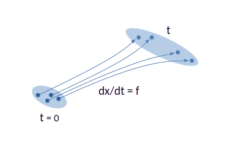
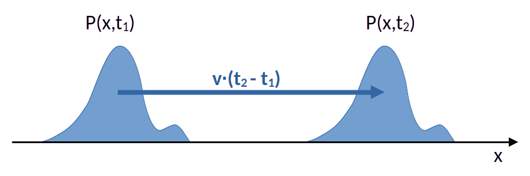

# Obiettivi della dispensa

In questa dispensa studiamo il passaggio da una dinamica continua sulle traiettorie ad una dinamica sulla densità di probabilità.

Nella dispensa precedente lo spazio degli stati era discreto e l'evoluzione avveniva tramite salti tra stati distinti. In quel contesto la probabilità veniva redistribuita secondo una master equation. Qui affrontiamo invece il caso in cui lo stato del sistema appartiene a uno spazio continuo. In questo scenario la stessa domanda concettuale si ripresenta in una forma nuova:

> se conosco la legge che governa le traiettorie, come evolve nel tempo una distribuzione iniziale di condizioni iniziali?

Vedremo che già nel caso puramente deterministico la risposta non è banale. Una ODE non evolve soltanto punti singoli dello spazio delle fasi: essa trasporta anche una densità di probabilità. Questo trasporto è descritto da una equazione di continuità.

Quando poi alla dinamica deterministica si aggiunge il rumore, le traiettorie non vengono più soltanto trasportate: si disperdono. A livello statistico compare allora un termine diffusivo, e la densità soddisfa la Fokker--Planck equation.

L'obiettivo della dispensa è rendere visibile con chiarezza la struttura comune ai due casi.

Al termine della dispensa lo studente dovrebbe essere in grado di:

1. capire perché una ODE induce una dinamica sulla pdf se le condizioni iniziali sono distribuite;
2. derivare l'equazione di continuità a partire dall'evoluzione delle osservabili;
3. interpretare il drift come trasporto della massa probabilistica;
4. comprendere il ruolo delle condizioni al bordo nella conservazione della probabilità;
5. riconoscere la Fokker--Planck come controparte sulla pdf di una SDE;
6. scrivere la Fokker--Planck nella sua forma conservativa;
7. discutere il caso a drift e diffusione costanti;
8. introdurre il concetto di distribuzione stazionaria;
9. trattare il caso particolare di drift gradiente;
10. collegare la distinzione tra accuratezza forte e debole al rapporto tra traiettorie e statistiche.

# 1. Dalla traiettoria deterministica alla distribuzione iniziale

Consideriamo una equazione differenziale ordinaria del tipo

$$
\dot x = f(x,t),
$$

dove, per semplicità, possiamo pensare inizialmente a $x \in \mathbb{R}^d$.

Se viene assegnata una singola condizione iniziale

$$
x(0) = x_0,
$$

la dinamica deterministica individua una traiettoria ben definita $x(t)$.

Questa è la prospettiva più comune quando si studiano le ODE: una condizione iniziale produce una traiettoria unica.

Ma supponiamo ora di non avere una singola condizione iniziale, bensì una **distribuzione di condizioni iniziali** descritta da una densità

$$
p(x,0).
$$

Questa situazione è del tutto naturale. Può riflettere:

* incertezza sperimentale sulla condizione iniziale;
* variabilità intrinseca tra realizzazioni nominalmente identiche;
* un ensemble di sistemi preparati in stati diversi;
* la volontà di descrivere statisticamente una popolazione di traiettorie.

A questo punto la domanda non è più soltanto “come evolve un punto $x_0$?”, ma:

> come evolve nel tempo la densità $p(x,t)$ sotto l'azione del flusso deterministico?

Questa domanda è il punto di attacco corretto per costruire l'equazione di continuità.

## 1.1 Traiettoria singola e nuvola di punti

È utile visualizzare la situazione in questo modo.

* una singola condizione iniziale è un punto nello spazio degli stati;
* una distribuzione iniziale è una nuvola di punti;
* il flusso deterministico muove ogni punto della nuvola;
* di conseguenza, l'intera nuvola si deforma nel tempo.

Il fatto che la dinamica sia deterministica non significa che la distribuzione resti ferma. Significa solo che ogni punto della distribuzione viene trasportato secondo la legge assegnata.

> **Idea chiave**
> Una ODE non evolve soltanto traiettorie singole: evolve anche distribuzioni iniziali, trasportandole nello spazio degli stati.

# 2. Osservabili medie ed equazione di continuità

Per derivare l'equazione soddisfatta dalla densità, il modo più pulito è partire dall'evoluzione del valore medio di una osservabile.

Sia $\varphi(x)$ una funzione sufficientemente regolare. Il suo valore medio rispetto alla pdf $p(x,t)$ è

$$
\langle \varphi \rangle_t = \int \varphi(x) p(x,t)\,dx.
$$

Vogliamo capire come varia nel tempo questa quantità.

## 2.1 Derivata temporale della media

Deriviamo rispetto al tempo:

$$
\frac{d}{dt}\langle \varphi \rangle_t = \frac{d}{dt} \int \varphi(x) p(x,t)\,dx = \int \varphi(x) \partial_t p(x,t)\,dx.
$$

D'altra parte, se la dinamica delle traiettorie è governata da

$$
\dot x = f(x,t),
$$

allora lungo una traiettoria vale

$$
\frac{d}{dt}\varphi(x(t)) = \sum_i \frac{\partial \varphi}{\partial x_i} \frac{dx_i}{dt} = \nabla \varphi(x(t)) \cdot f(x(t),t).
$$

Facendo la media sull'ensemble, otteniamo

$$
\frac{d}{dt}\langle \varphi \rangle_t = \int \nabla \varphi(x) \cdot f(x,t)\, p(x,t)\,dx.
$$

Abbiamo dunque due espressioni per la stessa quantità:

$$
\int \varphi(x) \partial_t p(x,t)\,dx = \int \nabla \varphi(x) \cdot f(x,t)\, p(x,t)\,dx.
$$

## 2.2 Integrazione per parti

Ora integriamo per parti il termine a destra. Supponendo che i termini di bordo siano nulli oppure trattabili in modo appropriato, otteniamo

$$
\int \nabla \varphi \cdot (fp)\,dx = -\int \varphi \, \nabla \cdot (fp)\,dx.
$$

Quindi

$$
\int \varphi(x) \left[ \partial_t p(x,t) + \nabla \cdot \bigl(f(x,t)p(x,t)\bigr)\right]\,dx = 0 \;.
$$

Poiché questa relazione vale per ogni osservabile regolare $\varphi$, si conclude che la pdf deve soddisfare

$$
\partial_t p(x,t) = -\nabla \cdot \bigl(f(x,t)p(x,t)\bigr) = -\nabla \cdot J(x,t) \;.
$$

Questa è l'**equazione di continuità** associata alla ODE.

# 3. Interpretazione dell'equazione di continuità

La formula

$$
\partial_t p = -\nabla \cdot (fp)
$$

ha una struttura molto trasparente. Se definiamo la **corrente di probabilità deterministica**

$$
J(x,t) = f(x,t)p(x,t),
$$

allora l'equazione diventa

$$
\partial_t p + \nabla \cdot J = 0.
$$

Questa è esattamente una legge di conservazione.

## 3.1 Significato fisico

La probabilità non viene creata né distrutta all'interno del dominio: essa scorre con una corrente $J$ determinata dal campo di velocità $f$ e dalla densità $p$.

Il drift $f$ trasporta la massa probabilistica nello spazio degli stati.

Per questo motivo, in un linguaggio intuitivo, si dice che la ODE induce un **trasporto** della pdf.

## 3.2 Caso di drift costante

Se il drift è costante,

$$
f(x,t)=v,
$$

allora l'equazione di continuità diventa

$$
\partial_t p + v \cdot \nabla p = 0.
$$

La soluzione è una semplice traslazione della distribuzione iniziale:

$$
p(x,t)=p(x-vt,0).
$$

In questo caso la densità si muove rigidamente nello spazio senza deformarsi.

## 3.3 Trasporto non rigido

In generale, però, il trasporto non è rigido. Se il campo $f(x,t)$ varia nello spazio, la nuvola di probabilità può:

* traslare;
* comprimersi;
* espandersi;
* deformarsi.

L'equazione di continuità tiene conto di tutto questo tramite la divergenza della corrente.

> **Idea chiave**
> Una ODE induce un drift della pdf: la distribuzione viene trasportata dal flusso deterministico.

# 4. Conservazione della probabilità e ruolo del bordo

L'equazione di continuità suggerisce che la probabilità totale si conserva, ma questo va verificato con attenzione, perché il risultato dipende dal comportamento al bordo del dominio.

Integrando l'equazione di continuità su un dominio $\Omega$, otteniamo

$$
\frac{d}{dt}\int_{\Omega} p(x,t)\,dx = -\int_{\Omega} \nabla \cdot J\,dx\;.
$$

Applicando il teorema della divergenza,

$$
\frac{d}{dt}\int_{\Omega} p(x,t)\,dx = -\int_{\partial \Omega} J \cdot n\, dS\;,
$$

dove $n$ è la normale uscente al bordo.

Questa formula è molto importante perché mostra che la variazione della probabilità totale nel dominio dipende interamente dal flusso attraverso il bordo.

## 4.1 Casi tipici

### 1. Dominio tutto lo spazio con decadimento sufficiente all'infinito

Se il dominio è tutto $\mathbb{R}^d$ e la corrente decade abbastanza rapidamente all'infinito, il flusso netto è nullo e quindi

$$
\frac{d}{dt}\int p(x,t)\,dx = 0.
$$

### 2. Bordo riflettente

Se si impone

$$
J \cdot n = 0
$$

sul bordo, la probabilità non attraversa la frontiera e si conserva nel dominio.

### 3. Bordo assorbente

Se invece il bordo è assorbente, la probabilità può uscire dal dominio e non rientrare. In questo caso la massa probabilistica interna decresce nel tempo.

### 4. Condizioni periodiche

In un dominio periodico il flusso che esce da una parte rientra dall'altra, e la probabilità totale si conserva.

## 4.2 Perché questo punto è essenziale

Nella derivazione dell'equazione di continuità abbiamo usato una integrazione per parti. Questo passaggio non è innocuo: richiede ipotesi sui termini di bordo. Le condizioni al bordo non sono quindi un dettaglio marginale da aggiungere alla fine, ma parte integrante del problema matematico e della sua interpretazione fisica.

# 5. Passaggio alle SDE

Passiamo ora al caso in cui la dinamica delle traiettorie non sia più puramente deterministica, ma includa una componente casuale.

Consideriamo una SDE del tipo

$$
dX_t = a(X_t,t)dt + B(X_t,t)dW_t
$$

dove:

* $a(x,t)$ è il drift;
* $B(x,t)$ è la matrice che modula il rumore;
* $W_t$ è un processo di Wiener multidimensionale.

Questa equazione descrive una situazione in cui coesistono:

* una tendenza media regolare, data da $a$;
* una componente fluttuante, data da $B dW_t$.

## 5.1 Differenza rispetto alla ODE

La differenza concettuale rispetto al caso deterministico è immediata.

* per una ODE, una condizione iniziale determina una traiettoria unica;
* per una SDE, la stessa condizione iniziale può generare molte traiettorie diverse, perché il rumore produce realizzazioni differenti.

Di conseguenza, la descrizione statistica non è più soltanto una conseguenza di una distribuzione iniziale: è intrinseca alla dinamica stessa.

Questo rende ancora più naturale cercare una equazione diretta per la pdf.

# 6. Dalla SDE alla Fokker--Planck

L'idea della derivazione è analoga a quella usata per la ODE, ma ora l'evoluzione di una osservabile lungo la traiettoria deve essere trattata con il calcolo di Ito.

Sia ancora $\varphi(x)$ una osservabile regolare. Applichiamo la formula di Ito alla traiettoria $X_t$ che soddisfa

$$
dX_t^i = a_i(X_t,t)\,dt + \sum_k B_{ik}(X_t,t)\,dW_t^k\;.
$$

Allora

$$
d\varphi(X_t) =
\sum_i \partial_i \varphi(X_t)\, dX_t^i
+
\frac12
\sum_{i,j}
\partial_i\partial_j \varphi(X_t)\, dX_t^i dX_t^j\;.
$$

Sostituendo $dX_t^i$ e usando le regole di Ito

$$
dt\,dt=0\;,
\qquad
dt\,dW_t^k=0\;,
\qquad
dW_t^k dW_t^\ell = \delta_{k\ell}\,dt\;,
$$

si ottiene

$$
dX_t^i dX_t^j = \sum_k B_{ik}(X_t,t)B_{jk}(X_t,t)\,dt\;.
$$

Se definiamo quindi la matrice di diffusione

$$
D_{ij}(x,t)=\sum_k B_{ik}(x,t)B_{jk}(x,t)\;,
$$

cioè

$$
D(x,t)=B(x,t)B(x,t)^T
$$

la formula di Ito diventa

$$
d\varphi(X_t) = \left[
\sum_i a_i(X_t,t)\,\partial_i\varphi(X_t)
+ \frac12\sum_{i,j} D_{ij}(X_t,t)\,\partial_i\partial_j\varphi(X_t)
\right]dt
+ \sum_{i,k} B_{ik}(X_t,t)\,\partial_i\varphi(X_t)\,dW_t^k.
$$

Prendendo il valor medio, il termine proporzionale a $dW_t^k$ dà contributo nullo in media, e quindi resta

$$
\frac{d}{dt}\mathbb{E}[\varphi(X_t)] = \mathbb{E}\left[
\sum_i a_i\,\partial_i\varphi
+ \frac12\sum_{i,j} D_{ij}\,\partial_i\partial_j\varphi
\right].
$$

Se $p(x,t)$ è la densità di probabilità di $X_t$, questo si riscrive come

$$
\int \varphi(x)\,\partial_t p(x,t)\,dx =
\int \left[
\sum_i a_i(x,t)\,\partial_i\varphi(x)
+ \frac12\sum_{i,j} D_{ij}(x,t)\,\partial_i\partial_j\varphi(x)
\right] p(x,t)\,dx\;.
$$

Ora integriamo per parti, assumendo condizioni al bordo tali da annullare i termini di bordo. Per il termine di drift otteniamo

$$
\int \sum_i a_i\,\partial_i\varphi \; p\,dx
= -\int \varphi \,\sum_i \partial_i(a_i p)\,dx\;,
$$

mentre per il termine diffusivo, integrando per parti due volte,

$$
\int \frac12\sum_{i,j} D_{ij}\,\partial_i\partial_j\varphi \; p\,dx
= \int \varphi \,\frac12\sum_{i,j}\partial_i\partial_j(D_{ij}p)\,dx\; .
$$

Segue quindi

$$
\int \varphi(x)\,\partial_t p(x,t)\,dx
= \int \varphi(x) \left[
-\sum_i \partial_i(a_i p)
+ \frac12\sum_{i,j}\partial_i\partial_j(D_{ij}p)
\right]dx\;.
$$

Poiché questa identità vale per ogni osservabile regolare $\varphi$, concludiamo che la densità soddisfa

$$
\partial_t p
= -\sum_i \partial_i(a_i p)
+ \frac12\sum_{i,j}\partial_i\partial_j\bigl(D_{ij}p\bigr)\;.
$$

Questa è la **Fokker--Planck equation**. Essa è la controparte sulla pdf della SDE, esattamente come l'equazione di continuità era la controparte sulla pdf della ODE.

## 6.1 Struttura della formula

La Fokker--Planck contiene due contributi distinti:

1. un termine di drift del primo ordine,
   $$
   -\sum_i \partial_i(a_i p),
   $$
   che trasporta la pdf;

2. un termine diffusivo del secondo ordine,
   $$
   \frac12 \sum_{i,j} \partial_i \partial_j (D_{ij} p),
   $$
   che ne allarga e deforma la distribuzione.

> **Idea chiave**
> La SDE non induce solo trasporto della pdf, ma trasporto più diffusione.

# 7. Forma conservativa e corrente di probabilità

Anche la Fokker--Planck può essere letta come una legge di conservazione.

Nel caso più semplice in cui la diffusione sia isotropa e sufficientemente regolare, essa può essere riscritta nella forma

$$
\partial_t p = -\nabla \cdot J
$$

dove $J$ è la corrente di probabilità totale.

Nel caso unidimensionale con diffusione costante $D$, la formula diventa particolarmente semplice:

$$
\partial_t p = -\partial_x(ap) + D\,\partial_x^2 p
$$

che si può scrivere come

$$
\partial_t p = -\partial_x J
$$

con

$$
J = ap - D\,\partial_x p\;.
$$

Questa espressione mostra in modo molto chiaro i due contributi:

* $ap$ è il flusso convettivo dovuto al drift;
* $-D\partial_x p$ è il flusso diffusivo, che tende a smussare i gradienti della densità.

## 7.1 Lettura fisica

La diffusione agisce contro gli accumuli locali di probabilità. Se in una regione la densità è molto alta rispetto alle regioni vicine, il termine diffusivo tende a spargere quella massa probabilistica.

Il drift, invece, imprime una direzione media del moto.

La Fokker--Planck è dunque una equazione di trasporto-diffusione per la probabilità.

# 8. Condizioni al bordo nel caso stocastico

Anche per la Fokker--Planck le condizioni al bordo sono decisive.

Integrando la forma conservativa su un dominio $\Omega$, si ottiene ancora

$$
\frac{d}{dt}\int_{\Omega} p(x,t)\,dx = -\int_{\partial \Omega} J \cdot n\, dS.
$$

Di nuovo, la conservazione o meno della probabilità nel dominio dipende dal flusso normale al bordo.

## 8.1 Casi tipici

### Bordo riflettente

La condizione

$$
J \cdot n = 0
$$

impedisce il passaggio netto di probabilità attraverso la frontiera.

### Bordo assorbente

La probabilità che raggiunge il bordo viene persa dal dominio.

### Dominio illimitato

Si richiede in genere un decadimento sufficiente della densità e della corrente all'infinito.

## 8.2 Un punto concettuale importante

Nel caso stocastico le condizioni al bordo non servono soltanto a completare il problema differenziale. Servono anche a definire il significato fisico del processo: riflessione, assorbimento, confinamento, uscita dal dominio.

# 9. Caso esattamente risolvibile: drift costante e diffusione costante

Studiamo ora un caso in cui traiettorie, schema numerico e pdf possono essere messi in corrispondenza in modo del tutto trasparente.

Consideriamo in una dimensione la SDE

$$
dX_t = a\,dt + \sqrt{2D}\,dW_t\;,
$$

dove $a$ e $D$ sono costanti.

## 9.1 Soluzione della traiettoria

Integrando formalmente tra $t$ e $t+\Delta t$, si ottiene

$$
X_{t+\Delta t} = X_t + a\,\Delta t + \sqrt{2D}\,(W_{t+\Delta t}-W_t)\;.
$$

Poiché l'incremento del Wiener è gaussiano con media nulla e varianza $\Delta t$, possiamo scrivere

$$
W_{t+\Delta t}-W_t = \sqrt{\Delta t}\,\eta
$$

con

$$
\eta \sim \mathcal{N}(0,1).
$$

Dunque

$$
X_{t+\Delta t} = X_t + a\,\Delta t + \sqrt{2D\,\Delta t}\,\eta\;.
$$

Questa è esattamente la forma di un passo di Euler--Maruyama in questo caso particolare. Qui però non è solo uno schema numerico: è anche la legge esatta dell'incremento.

## 9.2 Evoluzione della pdf

Se al tempo iniziale il sistema è localizzato in un punto $x_0$, allora la pdf a tempo $t$ è una gaussiana:

$$
p(x,t\mid x_0,0) = \frac{1}{\sqrt{4\pi Dt}} \exp\left[-\frac{(x-x_0-at)^2}{4Dt}\right].
$$

Questa funzione è la **Green function** della Fokker--Planck associata.

## 9.3 Interpretazione

* il centro della gaussiana si muove con velocità $a$;
* la varianza cresce linearmente nel tempo come $2Dt$;
* il drift trasporta il centro della distribuzione;
* la diffusione la allarga.

Questo esempio è importante perché condensa in un solo modello tutta la struttura concettuale della dispensa.

# 10. Distribuzioni stazionarie

Una distribuzione $p_{st}(x)$ si dice **stazionaria** se non cambia nel tempo:

$$
\partial_t p_{st}(x)=0.
$$

Nel caso della Fokker--Planck ciò significa che la densità soddisfa una equazione differenziale ordinaria o alle derivate parziali senza dipendenza temporale.

## 10.1 Stazionarietà non implica sempre flusso nullo

Questo punto merita attenzione: $J=0$ è condizione sufficiente ma non necessaria il sistema sia stazionario; in altre parole:

* **equilibrio a flusso nullo**: $J=0$;
* **stato stazionario più generale**: $\nabla \cdot J = 0$.

Nel primo caso non c'è corrente netta di probabilità. Nel secondo può esistere una circolazione stazionaria compatibile con la conservazione locale della massa probabilistica.

Questo punto sarà importante soprattutto in dimensione superiore, ma vale la pena enunciarlo già qui.

# 11. Caso di drift gradiente

Uno dei casi più importanti è quello in cui il drift deriva dal gradiente di un potenziale.

Supponiamo, in una dimensione o in più dimensioni, che

$$
a(x) = -\nabla U(x),
$$

con diffusione costante.

Nel caso a flusso nullo, la condizione stazionaria si ricava imponendo

$$
J=0.
$$

Nel caso unidimensionale con diffusione costante $D$, abbiamo

$$
J = ap - D\partial_x p.
$$

Imponendo $J=0$,

$$
D\partial_x p = ap.
$$

Se $a(x)=-U'(x)$, allora

$$
D\partial_x p = -U'(x)p,
$$

e quindi

$$
\frac{\partial_x p}{p} = -\frac{U'(x)}{D}.
$$

Integrando,

$$
p_{st}(x) \propto e^{-U(x)/D}.
$$

Questa è la forma standard della distribuzione stazionaria in un potenziale confinante.

## 11.1 Interpretazione

Il potenziale $U(x)$ gioca il ruolo di paesaggio che tende a concentrare la probabilità nelle regioni basse, mentre la diffusione tende a spargerla.

La forma esponenziale della stazionaria codifica proprio questo equilibrio tra confinamento e dispersione.

# 12. Esempio: Ornstein--Uhlenbeck

Il caso più importante di drift lineare mean reverting è il processo di Ornstein--Uhlenbeck

$$
dX_t = -\gamma X_t\,dt + \sqrt{2D}\,dW_t
$$

con $\gamma > 0$.

Qui il drift spinge sistematicamente il sistema verso l'origine, mentre il rumore tende a disperderlo.

La Fokker--Planck corrispondente è

$$
\partial_t p = \partial_x(\gamma x p) + D\partial_x^2 p\;.
$$

La distribuzione stazionaria associata alla soluzione con $J=0$ è quindi la soluzione di $\gamma x p + D\partial_x p=0$ ovvero la gaussiana:

$$
p_{st}(x) \propto \exp\left(-\frac{\gamma x^2}{2D}\right).
$$

Questo esempio è paradigmatico perché mostra in forma completamente controllabile:

* drift mean reverting;
* diffusione costante;
* esistenza di una stazionaria normalizzabile;
* rilassamento verso l'equilibrio.

## 13. Drift polinomiali: criterio rapido di confinamento

Nel caso unidimensionale, se il drift $a(x)$ è un polinomio, allora esso è automaticamente della forma
$$
a(x) = -U'(x),
$$
dove $U(x)$ è un potenziale polinomiale.

Per stabilire se possa esistere una distribuzione stazionaria normalizzabile, non occorre allora analizzare tutto il polinomio in dettaglio. Basta guardare il termine di grado più alto, perché per $|x|$ grande sia il drift sia il potenziale sono dominati dal loro termine principale.

Se il termine dominante del drift è
$$
a(x)\sim c\,x^m,
$$
allora il termine dominante del potenziale è
$$
U(x)\sim -\frac{c}{m+1}x^{m+1}.
$$

Affinché la dinamica sia confinante su tutta la retta, il potenziale deve crescere verso $+\infty$ sia per $x\to +\infty$ sia per $x\to -\infty$. Questo può accadere solo se il termine dominante di $U(x)$ ha grado pari e coefficiente positivo. Equivalentemente, il termine dominante del drift deve avere grado dispari e coefficiente negativo.

Si ottiene così un criterio molto semplice:

- se il termine dominante del drift è del tipo
$$
a(x)\sim -\alpha x^{2n+1}, \qquad \alpha>0,
$$
allora la dinamica è confinante e può ammettere una distribuzione stazionaria normalizzabile;

- se il termine dominante è del tipo
$$
a(x)\sim +\alpha x^{2n+1}, \qquad \alpha>0,
$$
allora il drift spinge verso l'esterno e non si ottiene una distribuzione stazionaria normalizzabile su tutto $\mathbb{R}$;

- se il termine dominante ha grado pari, allora il drift ha lo stesso segno per $x\to+\infty$ e per $x\to-\infty$; di conseguenza non può essere restaurativo su entrambi i lati e, in generale, non confina la dinamica su tutta la retta.

In termini del potenziale, la condizione di confinamento si esprime nel modo più diretto come
$$
U(x)\to +\infty \qquad \text{per } x\to\pm\infty.
$$

Questo fornisce un test immediato: guardando il termine dominante del drift, o in modo equivalente quello del potenziale, si può capire a colpo d'occhio se la dinamica può ammettere una distribuzione stazionaria normalizzabile.

# 14. Accuratezza forte, accuratezza debole e livello di descrizione

Concludiamo tornando sul rapporto tra traiettorie e statistica.

Quando si discretizza una SDE, ad esempio con Euler--Maruyama, si può valutare l'accuratezza in due sensi diversi.

## 14.1 Accuratezza forte

Misura quanto bene la traiettoria numerica approssima una traiettoria esatta realizzazione per realizzazione.

Questa nozione è naturale quando interessa il dettaglio dei cammini individuali.

## 14.2 Accuratezza debole

Misura quanto bene il metodo numerico riproduce le medie delle osservabili.

Questa nozione è naturale quando interessa il comportamento statistico, cioè l'evoluzione di quantità del tipo

$$
\mathbb{E}[\varphi(X_t)].
$$

## 14.3 Perché qui è importante

Dal punto di vista della Fokker--Planck, l'accuratezza debole è particolarmente naturale, perché una buona riproduzione delle medie delle osservabili significa una buona riproduzione dell'evoluzione statistica del processo.

In altri termini:

* accuratezza forte $\to$ livello delle traiettorie;
* accuratezza debole $\to$ livello della pdf e delle osservabili medie.

Questa distinzione chiude il cerchio concettuale della dispensa, perché mostra ancora una volta che esistono due livelli di descrizione della stessa dinamica: quello dei cammini individuali e quello della distribuzione di probabilità.

# 15. Sintesi finale

Riassumiamo i passaggi fondamentali.

1. Una ODE con distribuzione iniziale di condizioni iniziali induce una dinamica sulla pdf.
2. Tale dinamica si ottiene studiando l'evoluzione delle osservabili medie e porta alla equazione di continuità:

$$
\partial_t p = -\nabla \cdot (fp).
$$

3. Il drift trasporta la densità di probabilità.
4. La conservazione della probabilità dipende dal flusso attraverso il bordo.
5. Una SDE aggiunge al drift una componente rumorosa.
6. La controparte sulla pdf della SDE è la Fokker--Planck:

$$
\partial_t p = -\sum_i \partial_i(a_i p) + \frac12 \sum_{i,j} \partial_i \partial_j \bigl(D_{ij} p\bigr).
$$

7. La Fokker--Planck ha struttura di trasporto-diffusione e può essere scritta in forma conservativa.
8. Il caso a drift e diffusione costanti produce un kernel gaussiano, interpretabile come Green function.
9. Le distribuzioni stazionarie descrivono regimi in cui la pdf non evolve più nel tempo.
10. Nel caso di drift gradiente con diffusione costante, la stazionaria a flusso nullo ha forma esponenziale nel potenziale.
11. La distinzione tra accuratezza forte e debole riflette la distinzione tra livello delle traiettorie e livello della statistica.

# 16. Lettura unificante

A questo punto possiamo vedere con chiarezza il quadro generale.

## Caso discreto

* traiettorie con salti tra stati discreti;
* tassi di transizione;
* master equation per la pdf.

## Caso continuo deterministico

* traiettorie governate da una ODE;
* flusso deterministico;
* equazione di continuità per la pdf.

## Caso continuo stocastico

* traiettorie governate da una SDE;
* drift più diffusione;
* Fokker--Planck per la pdf.

In tutti e tre i casi la struttura concettuale è la stessa:

1. si assegna una dinamica alle traiettorie;
2. questa dinamica induce un generatore;
3. il generatore determina una equazione lineare per la distribuzione di probabilità.

Questa è l'idea unificante che lega master equation, equazione di continuità e Fokker--Planck.