## Obiettivi della lezione

**Idea centrale:** Quando non possiamo campionare direttamente da $\pi(x)$, costruiamo una **dinamica artificiale** che abbia $\pi$ come distribuzione di equilibrio.

**Obiettivi:**

- definire una catena di Markov e interpretare la matrice di transizione
- distinguere irriducibilità, aperiodicità ed ergodicità
- comprendere il ruolo della distribuzione stazionaria e del bilancio dettagliato
- spiegare perché i metodi MCMC sono utili quando il campionamento diretto fallisce
- derivare e applicare la regola di accettazione di Metropolis e Metropolis-Hastings
- riconoscere i principali problemi di efficienza (termalizzazione, autocorrelazione, metastabilità)

## Da MC a MCMC

:::: {.columns}
::: {.column width="50%"}

Nella lezione precedente:

- campionamento **indipendente** da $p(x)$ nota
- inversione, accept-reject, importance sampling

Ma molti problemi reali richiedono di campionare

$$
\pi(x) \propto \tilde\pi(x)
$$

con $\tilde\pi$ calcolabile ma $Z = \int \tilde\pi\,dx$ **intrattabile**.

:::
::: {.column width="50%"}

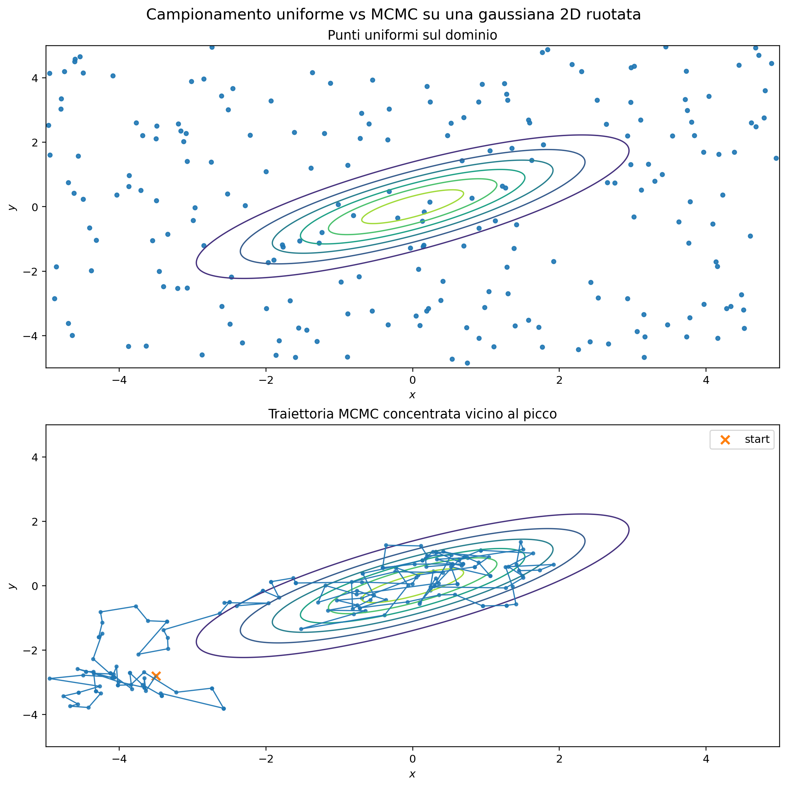{width=90%}

*Campionamento diretto (indipendente) vs traiettoria MCMC (correlata)*

:::
::::

# Catene di Markov

## Definizione

:::: {.columns}
::: {.column width="55%"}

Una **catena di Markov** è una successione $X_0, X_1, X_2, \dots$ tale che

$$
P(X_{t+1}=j \mid X_t=i, X_{t-1},\dots) = P(X_{t+1}=j \mid X_t=i).
$$

Il futuro dipende **solo dallo stato presente**, non dalla storia.

La matrice di transizione $P$ raccoglie queste probabilità:

$$
P_{ij} = P(X_{t+1}=j \mid X_t=i),
$$

con $P_{ij}\ge 0$ e $\sum_j P_{ij}=1$ per ogni $i$.

:::
::: {.column width="45%"}

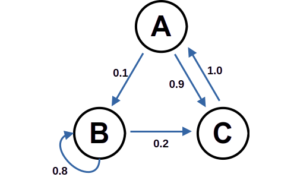{width=100%}

*Grafo di una catena a tre stati con probabilità di transizione*

:::
::::

## Evoluzione della distribuzione

:::: {.columns}
::: {.column width="70%"}

Se $\mu^{(t)}$ è la distribuzione al tempo $t$ (vettore riga):

$$
\mu^{(t+1)} = \mu^{(t)} P,
\qquad
\mu^{(t)} = \mu^{(0)} P^t.
$$

Il comportamento a lungo termine della catena coincide con lo studio delle potenze di $P$. In particolare, se la catena è finita, irriducibile e aperiodica,

$$
\lim_{t\to\infty} \mu^{(0)} P^t = \pi,
$$

dove $\pi$ è la distribuzione di equilibrio, cioè il punto fisso $\pi\, P = \pi$.

:::
::: {.column width="30%"}

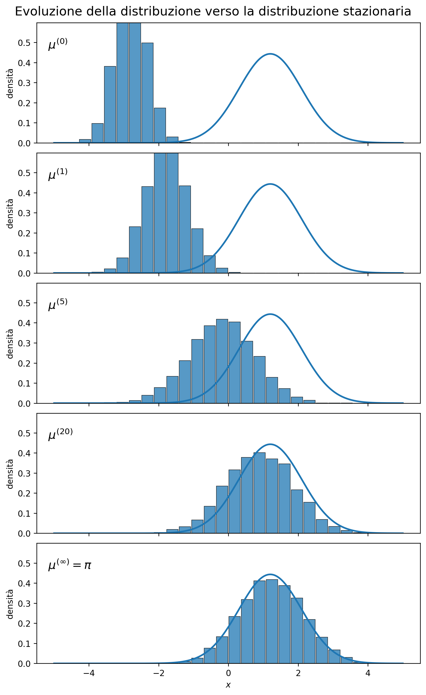{height=95%}

:::
::::

# Proprietà fondamentali

## Irriducibilità e aperiodicità

:::: {.columns}
::: {.column width="50%"}

**Irriducibilità**

Tutti gli stati comunicano: da ogni stato si può raggiungere ogni altro stato.

$\Rightarrow$ la catena può esplorare tutto lo spazio.

**Aperiodicità**

Lo stato $i$ ha periodo $d(i) = \gcd\{n \ge 1 : (P^n)_{ii}>0\}$.

Se $d(i)=1$ per tutti gli stati: la catena è **aperiodica**.

$\Rightarrow$ niente oscillazioni rigide, convergenza regolare.

:::
::: {.column width="40%"}
*Catena riducibile*

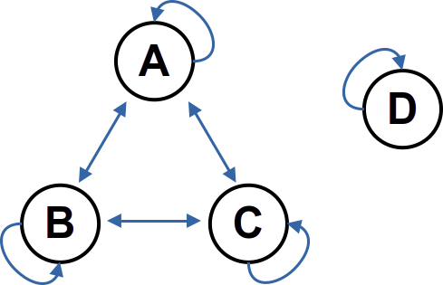{width=60%}  

*Catena periodica (periodo 3)*

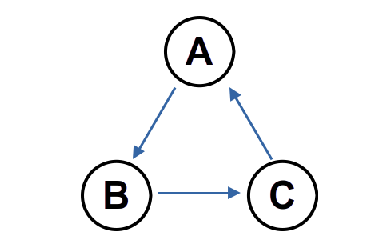{width=60%}  

:::
::::

## Convergenza ed ergodicità

:::: {.columns}
::: {.column width="55%"}

**Convergenza all'equilibrio**

Se la catena è finita, irriducibile e aperiodica, allora

$$
\lim_{t\to\infty} \mu^{(0)} P^t = \pi,
$$

dove $\pi$ è la distribuzione di equilibrio, cioè il punto fisso

$$
\pi P = \pi.
$$

In questo caso la catena dimentica la condizione iniziale.

:::
::: {.column width="45%"}

**Ricorrenza e transienza**

- **Ricorrente**: lo stato viene rivisitato quasi certamente.
- **Transiente**: c'è probabilità positiva di non tornarci più.

Nelle catene finite irriducibili, tutti gli stati sono ricorrenti positivi.

:::
::::

## Punto di vista spettrale

$$
\mu^{(0)} = \pi + \sum_{k\ge 2} c_k v_k,
$$

con $v_k P = \lambda_k v_k$, $\pi P = \pi$. Dopo $n$ passi,

$$
\mu^{(0)} P^n = \pi + \sum_{k\ge 2} c_k \lambda_k^n v_k.
$$

Se la catena è ergodica, gli autovalori diversi da $1$ soddisfano $|\lambda_k| < 1$, quindi i modi transitori decadono e resta solo la distribuzione stazionaria $\pi$.

## Ergodicità e transienti

:::: {.columns}
::: {.column width="60%"}

Una catena **finita, irriducibile e aperiodica** è ergodica. Siccome i *modi transienti* decadono con il numero di passi, la catena "dimentica" la condizione iniziale.

**Per i metodi MCMC:**

| Proprietà | Ruolo |
|---|---|
| Irriducibilità | esplora tutto lo spazio |
| Aperiodicità | evita cicli rigidi |
| Ergodicità | garantisce convergenza a $\pi$ |

:::
::: {.column width="40%"}

*Convergenza di una catena con tre condizioni iniziali diverse*

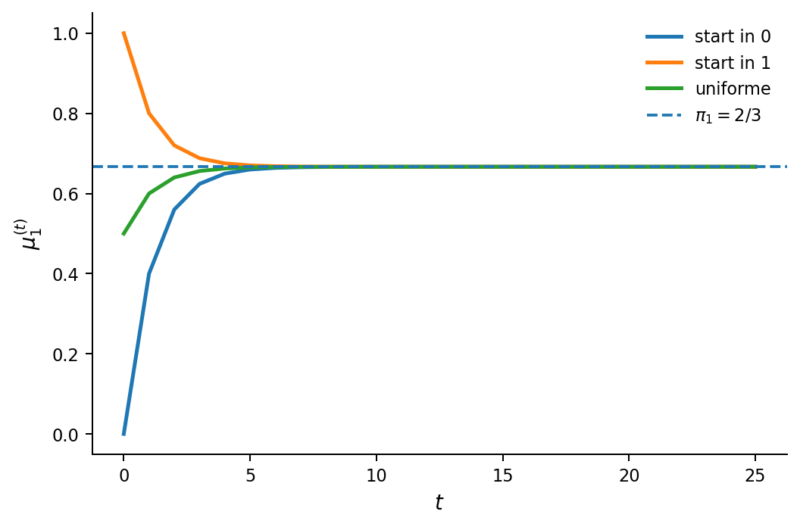{width=100%}

:::
::::

# Flussi di probabilità e stazionarietà

## Distribuzione stazionaria e bilancio globale

Per una distribuzione stazionaria $\pi$ vale

$$
\pi_j = \sum_i \pi_i P_{ij}.
$$

Interpretazione:
- il flusso totale che entra in $j$ in un passo è
  $$
  \sum_i \pi_i P_{ij};
  $$
- il flusso totale che esce da $j$ è
  $$
  \pi_j \sum_k P_{jk} = \pi_j.
  $$

Quindi, in equilibrio, flusso entrante e uscente coincidono.

## Bilancio dettagliato 

:::: {.columns}
::: {.column width="60%"}

Il **bilancio dettagliato** richiede che il flusso sia bilanciato stato per stato:

$$
\pi_i P_{ij} = \pi_j P_{ji} \qquad \text{per ogni } i,j.
$$

Implica la stazionarietà, ma **non** è equivalente ad essa in generale.

Significato: in equilibrio il flusso $i\to j$ uguaglia il flusso $j\to i$.

Una catena che soddisfa il bilancio dettagliato rispetto a $\pi$ si dice **reversibile** rispetto a $\pi$.

$\Rightarrow$ Metropolis e Metropolis-Hastings sono progettati esattamente per soddisfare questa condizione.

:::
::: {.column width="40%"}

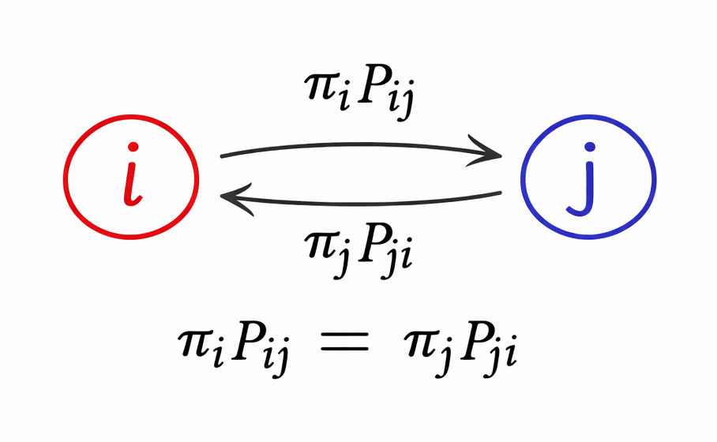{width=100%}

*Flussi bilanciati tra coppie di stati in equilibrio*

:::
::::

## Perché usare MCMC?

:::: {.columns}
::: {.column width="45%"}

Vogliamo calcolare

$$
\langle A \rangle_\pi = \int A(x)\,\pi(x)\,dx
$$

ma non sappiamo campionare direttamente da $\pi$.

Spesso $\pi$ è nota solo nella forma

$$
\pi(x) = \frac{1}{Z}\tilde\pi(x),
$$

dove $\tilde\pi$ è calcolabile e $Z$ non lo è.

:::
::: {.column width="55%"}

**Principio ergodico:** se la catena è ergodica con stazionaria $\pi$,

$$
\frac{1}{N}\sum_{t=1}^N A(X_t) \to \langle A \rangle_\pi \quad (N\to\infty).
$$

**Esempi di $\pi$ con $Z$ intrattabile:**

| Contesto | $\tilde\pi(x)$ | $Z$ |
|---|---|---|
| Fisica stat. | $e^{-\beta E(x)}$ | funz. di partizione |
| Bayes | $L(y\mid\theta)\,p(\theta)$ | evidenza marginale |
| Reti | $e^{-H(x)}$ | normalizzazione |

:::
::::

## Due conseguenze pratiche

:::: {.columns}
::: {.column width="50%"}

**Burn-in (termalizzazione)**

I primi passi risentono della condizione iniziale.

Si scarta la parte iniziale della traiettoria prima di stimare le osservabili.

**Campioni correlati**

A differenza del Monte Carlo diretto, i campioni successivi non sono indipendenti.

$$
N_{\mathrm{eff}} = \frac{N}{\tau} < N
$$

dove $\tau$ è il tempo di autocorrelazione.

:::
::: {.column width="50%"}

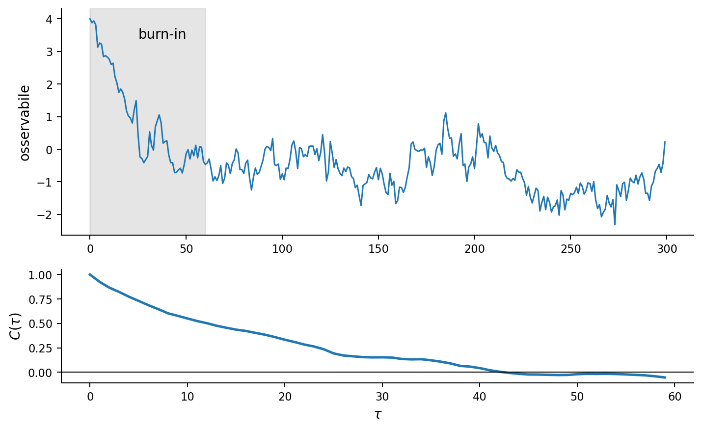{width=100%}

*Traiettoria con burn-in (zona grigia) e campioni correlati*

:::
::::

# Algoritmo di Metropolis

## Mossa = Proposta + Accettazione

**Ingredienti:**

1. una proposta simmetrica $q(x'\mid x) = q(x\mid x')$
2. una regola di accettazione

**Regola di accettazione:**

$$
A(x\to x') = \min\!\left(1,\frac{\tilde\pi(x')}{\tilde\pi(x)}\right).
$$

- se $x'$ è più probabile: accetta sempre
- se $x'$ è meno probabile: accetta con probabilità $\tilde\pi(x')/\tilde\pi(x)$

Se rifiutata: $X_{t+1}=x$ (si resta fermi).

**$Z$ si cancella nel rapporto** $\Rightarrow$ non serve calcolarlo.

## Metropolis: caso di Boltzmann

:::: {.columns}
::: {.column width="55%"}

Se $\pi(x) \propto e^{-\beta E(x)}$, il rapporto diventa

$$
\frac{\tilde\pi(x')}{\tilde\pi(x)} = e^{-\beta(E(x')-E(x))}.
$$

La probabilità di accettazione è quindi

$$
A(x\to x') = \min\!\left(1,\, e^{-\beta\Delta E}\right),
$$

dove $\Delta E = E(x')-E(x)$.

- $\Delta E < 0$ (energia diminuisce): accetta sempre
- $\Delta E > 0$ (energia cresce): accetta con probabilità $e^{-\beta\Delta E}$

:::
::: {.column width="45%"}

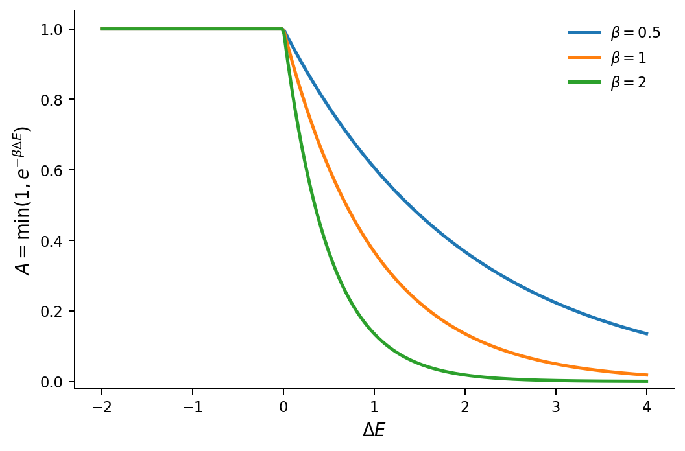{width=100%}

*Probabilità di accettazione in funzione di $\Delta E$ per diversi $\beta$*

:::
::::

## Metropolis: bilancio dettagliato

Per $x\ne x'$, il kernel di transizione è $P(x\to x') = q(x'\mid x)\,A(x\to x')$.

Moltiplicando per $\pi(x)$ e usando la simmetria di $q$:

$$
\pi(x)\,P(x\to x') = q(x'\mid x)\,\min\!\bigl(\pi(x),\,\pi(x')\bigr).
$$

Questa espressione è **simmetrica** in $x \leftrightarrow x'$, quindi

$$
\pi(x)\,P(x\to x') = \pi(x')\,P(x'\to x).
$$

Il detailed balance è verificato $\Rightarrow$ $\pi$ è stazionaria.

## Metropolis: pseudocodice

:::: {.columns}
::: {.column width="60%"}

```python
def metropolis(x0, n_steps):
    x = x0
    samples = []
    for _ in range(n_steps):
        x_new = propose_symmetric(x)
        r = pi_tilde(x_new) / pi_tilde(x)
        alpha = min(1.0, r)
        if uniform_0_1() < alpha:
            x = x_new
        samples.append(x)
    return samples
```

:::
::: {.column width="40%"}

**Note:**

- `propose_symmetric`: qualunque proposta con $q(x'\mid x)=q(x\mid x')$
- `pi_tilde`: densità **non normalizzata**
- se rifiutato, il punto corrente viene **ripetuto** nei campioni

:::
::::

# Algoritmo di Metropolis-Hastings

## MH: Imporre il detailed balance

Vogliamo costruire $P(x \to x')$ in modo che $\pi$ sia stazionaria.

Imponiamo

$$
\pi(x)\,P(x \to x') = \pi(x')\,P(x' \to x).
$$

Se scriviamo

$$
P(x \to x') = q(x' \mid x)\,A(x \to x'),
$$

allora otteniamo

$$
\pi(x)\,q(x' \mid x)\,A(x \to x') =
\pi(x')\,q(x \mid x')\,A(x' \to x).
$$

## MH: regola di accettazione

Una scelta che soddisfa il detailed balance è

$$
A(x \to x') =
\min\!\left(\;
1, \frac{\pi(x')\,q(x \mid x')}{\pi(x)\,q(x' \mid x)}
\;\right)\,.
$$

Infatti allora

$$
\pi(x)\,P(x \to x') =
\min\bigl(\;
\pi(x)\,q(x' \mid x),\pi(x')\,q(x \mid x')
\;\bigr)\,,
$$

che è simmetrico nello scambio $x \leftrightarrow x'$. (n.b.: se $q$ è simmetrica, usando l'identità  $\min(a,b)=a\min(1,a/b)$ valida per $a,b>0$ otteniamo la regola di Metropolis)

## MH: proposta non simmetrica

:::: {.columns}
::: {.column width="55%"}

Con proposta $q(x'\mid x)$ non necessariamente simmetrica, la regola di accettazione diventa

$$
A(x\to x') = \min\!\left(1,\;
\frac{\tilde\pi(x')\,q(x\mid x')}{\tilde\pi(x)\,q(x'\mid x)}\right).
$$

Il **fattore di Hastings** $q(x\mid x')/q(x'\mid x)$ corregge l'asimmetria della proposta.

**Metropolis come caso particolare:**

se $q(x'\mid x)=q(x\mid x')$, il fattore si semplifica e si recupera la regola di Metropolis.

:::
::: {.column width="45%"}

**Esempio di proposta asimmetrica:**

$$
q(i+1\mid i)=0.7,\quad q(i-1\mid i)=0.3.
$$

Senza correzione: drift artificiale verso destra.

Il fattore di Hastings **compensa** esattamente questo sbilanciamento.

:::
::::

# Heat bath / Gibbs sampling

## Aggiornamento condizionato

:::: {.columns}
::: {.column width="60%"}

Se la configurazione è $x=(x_1,\dots,x_n)$, si aggiorna $x_i$ **campionando esattamente** dalla distribuzione condizionata:

$$
\pi(x_i \mid x_1,\dots,x_{i-1},x_{i+1},\dots,x_n).
$$

La proposta **coincide** con la condizionata target $\Rightarrow$ accettazione sempre uguale a 1, nessun rifiuto.

**Gibbs sampling:** aggiornamento ciclico di tutte le componenti.

:::
::: {.column width="40%"}

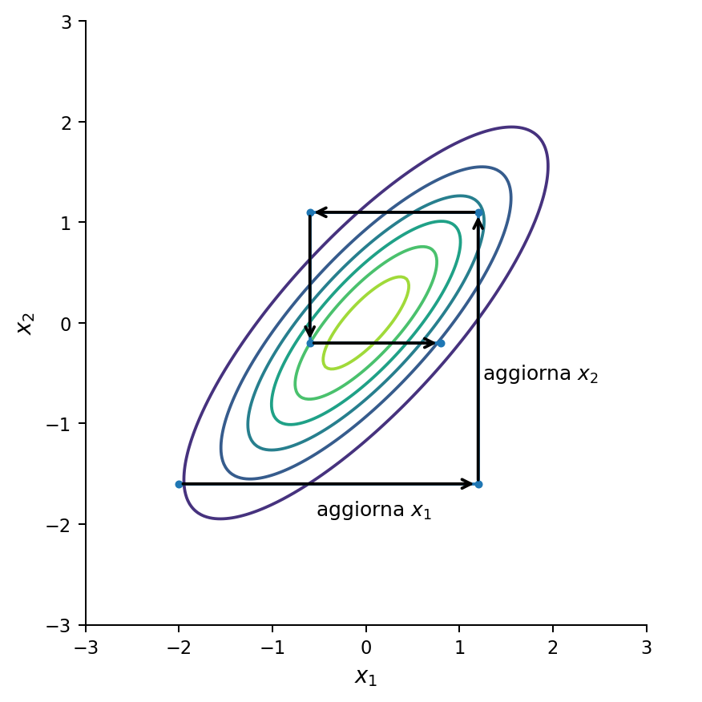{width=90%}

*Aggiornamento di una componente alla volta lungo le condizionate*

:::
::::

## Due esempi

:::: {.columns}
::: {.column width="50%"}

**Modello di Ising**

Ogni spin $s_i\in\{-1,+1\}$.

Fissati i vicini, la condizionata di $s_i$ dipende solo dal campo locale.

Si campiona direttamente il nuovo $s_i$: nessun rifiuto.

:::
::: {.column width="50%"}

**Modello bayesiano gerarchico**

$$
\pi(\mu,\sigma\mid y) \propto L(y\mid\mu,\sigma)\,p(\mu)\,p(\sigma).
$$

Se $\pi(\mu\mid\sigma,y)$ è gaussiana, si campiona direttamente.

Si alterna: $\mu\mid\sigma,y$ poi $\sigma\mid\mu,y$.

:::
::::

## Riepilogo

:::: {.columns}
::: {.column width="60%"}

| | Metropolis | MH | Gibbs|
|---|---|---|---|
| Proposta | simmetrica | qualunque | condizionata |
| Accettazione | $\min(1,\tilde\pi'/\tilde\pi)$ | rapporto MH | sempre 1 |
| Richiede | $\tilde\pi$ | $\tilde\pi$, $q$ | condizionate esplicite |
| Rifiuti | possibili | possibili | no |
| Generalità | alta | massima | dipende dal modello |

:::
::: {.column width="40%"}

**Quando scegliere cosa:**

- **Metropolis**: semplice, proposta naturale (es. random walk)
- **MH**: proposta informata, asimmetrica, su spazi complessi
- **Gibbs**: condizionate semplici, modelli gerarchici

:::
::::

# Efficienza


## Tasso di accettazione

:::: {.columns}
::: {.column width="55%"}

Nel random walk Metropolis, l'ampiezza della proposta determina il tasso di accettazione:

- passi **troppo piccoli** $\Rightarrow$ quasi tutto accettato, ma esplorazione lenta
- passi **troppo grandi** $\Rightarrow$ quasi tutto rifiutato, catena ferma

L'efficienza dipende dal compromesso tra ampiezza e tasso di accettazione.

**Regola pratica:** in spazi continui, un tasso di accettazione intorno al 20-40% è spesso un buon punto di partenza.

:::
::: {.column width="45%"}

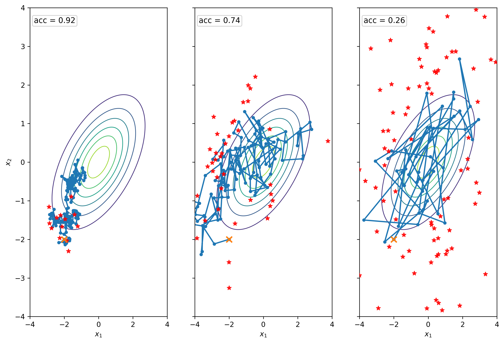{width=100%}

*Traiettorie con tasso di accettazione troppo alto, ottimale, troppo basso*

:::
::::

## Autocorrelazione e indipendenza

:::: {.columns}
::: {.column width="55%"}

Per un'osservabile $A_t = A(X_t)$, la funzione di autocorrelazione è

$$
C(\tau) = \langle A_t\,A_{t+\tau}\rangle - \langle A\rangle^2.
$$

Il **tempo di autocorrelazione integrato** $\tau_{\mathrm{int}}$ misura quanti passi equivalgono a un campione indipendente.

Il numero effettivo di campioni:

$$
N_{\mathrm{eff}} = \frac{N}{\tau_{\mathrm{int}}} \ll N.
$$

:::
::: {.column width="45%"}

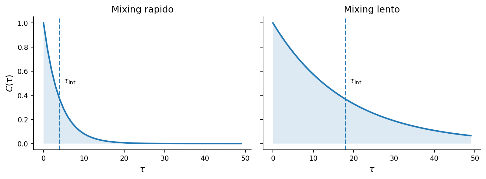{width=100%}

*Funzione di autocorrelazione per catene con mixing rapido e lento*

:::
::::

## Metastabilità e multimodalità

:::: {.columns}
::: {.column width="50%"}

Se $\pi$ ha più modi separati da **barriere elevate**, la catena può restare intrappolata a lungo in una sola regione.

I tempi di mixing diventano enormi: la stima numerica risulta distorta pur essendo l'algoritmo formalmente corretto.

**Soluzioni parziali:**

- Simulated Annealing
- Parallel Tempering
- Hamiltonian Monte Carlo

:::
::: {.column width="50%"}

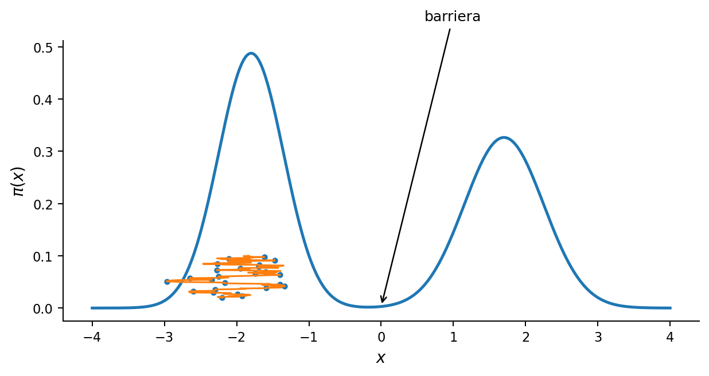{width=100%}

*Catena intrappolata in un modo: l'altro resta inesplorato*

:::
::::

## Diagnostica empirica

:::: {.columns}
::: {.column width="50%"}

Strumenti pratici:

- andamento temporale delle osservabili (stazionarietà visiva)
- stabilità delle medie cumulative
- confronto tra catene con condizioni iniziali diverse
- autocorrelazioni empiriche
- frequenza di accettazione

Questi strumenti **non sostituiscono** la teoria, ma sono indispensabili per valutare una simulazione concreta.

:::
::: {.column width="50%"}

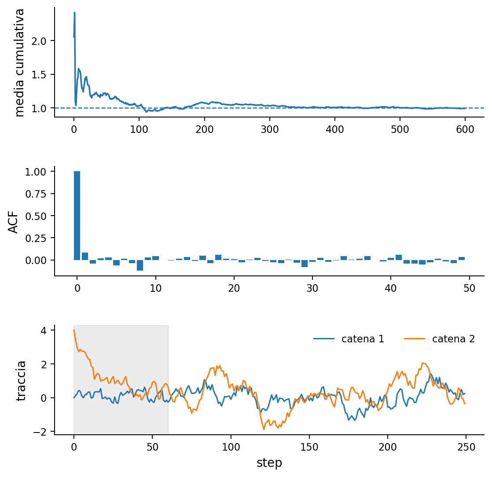{width=80%}

*Diagnostica: medie cumulative, autocorrelazione, confronto tra catene*

:::
::::

# Estensioni

## Oltre Metropolis

**Metropolis adattivo**

La proposta viene aggiornata durante la simulazione usando l'informazione empirica raccolta dalla catena.

**Hamiltonian Monte Carlo**

Usa variabili ausiliarie di momento e una dinamica quasi deterministica per proporre mosse lunghe con alta accettazione.

**Simulated annealing**

Introduce una temperatura decrescente nel tempo per trasformare il campionamento in una procedura di ottimizzazione globale.

## Dove ricompaiono queste idee

| Contesto | Metodo dominante |
|---|---|
| Modelli di spin | Metropolis, heat bath |
| Inferenza bayesiana | MH, Gibbs, HMC |
| Boltzmann machine | Gibbs, heat bath |
| Ottimizzazione combinatoria | simulated annealing |

## Take-home message

:::: {.columns}
::: {.column width="60%"}

- una catena di Markov ergodica converge a un'unica $\pi$, qualunque sia la condizione iniziale
- il detailed balance è il principio costruttivo per progettare dinamiche corrette
- Metropolis: proposta simmetrica, $Z$ si cancella nel rapporto
- Metropolis-Hastings: generalizza a proposte asimmetriche con il fattore di Hastings
- heat bath / Gibbs: nessun rifiuto, richiede condizionate esplicite
- correttezza teorica $\ne$ efficienza pratica: burn-in, autocorrelazione, metastabilità contano

:::
::: {.column width="40%"}

**Prossima lezione:**

- equazioni differenziali stocastiche (SDE)
- rumore diffusivo e rumore impulsivo
- la struttura MCMC tornerà come strumento di simulazione delle SDE

:::
::::
