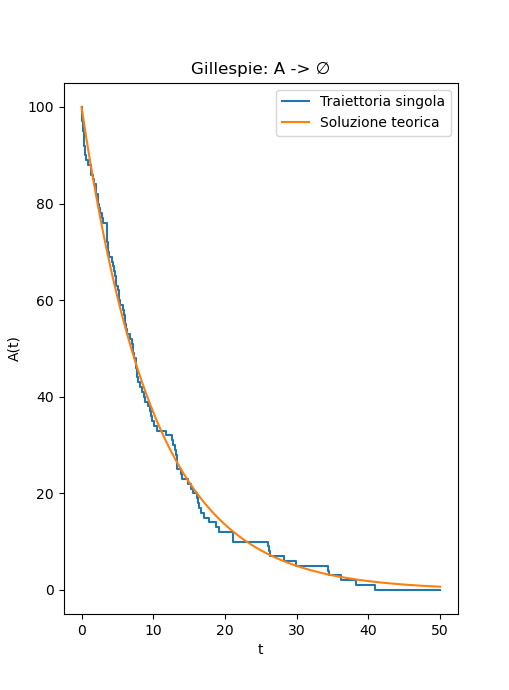
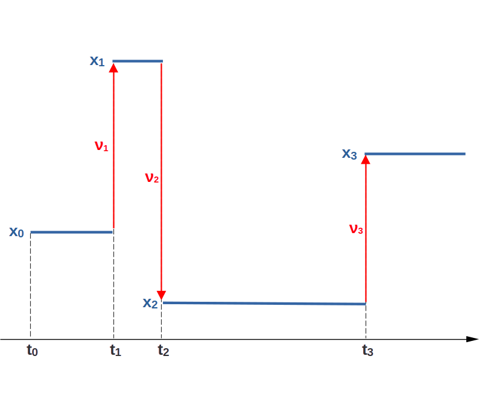

## Obiettivi della lezione

**Idea centrale:** simulare sistemi in cui l’evoluzione avviene tramite **eventi discreti nel tempo**.

**Obiettivi:**

- comprendere cosa è un processo a eventi discreti
- derivare il tempo di attesa esponenziale
- implementare il metodo di Gillespie
- capire quando e perché usare approssimazioni (tau-leaping)
- collegare modelli discreti e descrizioni continue

---

## Processi a eventi discreti

#### Definizione

Un sistema è descritto da:

- stato $x$
- eventi possibili $j=1,\dots,M$
- tassi $a_j(x)$
- regole di aggiornamento

#### Idea chiave

L’evoluzione è **stocastica**:

- quando accade un evento → casuale  
- quale evento accade → casuale  

---

## Esempi

#### Eventi discreti

- chimica: $A + B \to C$
- epidemie: $S \to I$
- code: $n \to n+1$

#### Punto comune

La dinamica è una sequenza di **salti casuali nel tempo**

---

## Tempo di attesa

#### Assunzione

Eventi con tasso costante $\lambda$ $\Rightarrow$ $\lambda dt$ è la probabilità di **un** evento in $[t,t+dt]$

#### Risultato

La probabilità $P(T<t)$ che sia avvenuto un evento al tempo $T<t$ soddisfa 
$$
P(T < t+dt) = P(T < t) +[1-P(T < t)] \lambda dt
$$
da cui deriva
$$
P(T < t) = 1 - e^{-\lambda t}
$$

La corrispondente densità di probabilità è una **distribuzione esponenziale** $$p(t) = \lambda e^{-\lambda t}$$

---

## Interpretazione

#### Proprietà chiave

- tempo medio/caratteristico: $\tau=1/\lambda$
- assenza di memoria

#### Significato

Il sistema “attende” un tempo casuale prima del prossimo evento

---

## Generazione del tempo

#### Metodo dell’inversione

Se $U \sim \mathrm{Unif}(0,1)$:

$$
\Delta t = -\frac{1}{\lambda}\ln U
$$

#### Idea

Trasformiamo uniforme → distribuzione esponenziale

---

## Metodo di Gillespie

:::: {.columns}
::: {.column width="50%"}

#### Idea generale

Simulare il sistema:

- un evento alla volta
- con tempi casuali esatti

#### Differenza dalle ODE

- ODE → tempo continuo deterministico  
- Gillespie → salti discreti casuali  

:::
::: {.column width="50%"}

{width=80%}

:::
::::

---

## Tasso totale

:::: {.columns}
::: {.column width="50%"}

#### Sistema con $M$ eventi

$$
a_0(x) = \sum_{j=1}^{M} a_j(x)
$$
\medskip

dove $x$ indica lo stato del sistema ed i tassi possono dipendere da $x$

:::
::: {.column width="50%"}

#### Interpretazione

Tasso complessivo del sistema:

\medskip
* ogni evento ha una probabilità di accadere $a_i(x)dt$
* gli eventi sono scorrelati/indipendenti
*  la probabilità che accada **uno** degli eventi è $a_0(x)dt$

::: 
:::: 

---

## Passo di simulazione

:::: {.columns}
::: {.column width="60%"}

#### Due scelte casuali
\medskip
1. tempo del prossimo evento:

$$
\Delta t = \frac{1}{a_0(x)}\ln\!\left(\frac{1}{U_1}\right)
$$

2. evento selezionato:

$$
P(i) = \frac{a_i(x)}{a_0(x)}
$$
:::
::: {.column width="40%"}

Se un evento dei possibili eventi avviene in un intervallo $[t,t+dt]$, allora:
\medskip

* la probabilità dell'evento $i$ è proporzionale a $a_i\,dt$
* posso normalizzare dividento per $\sum_i a_i\,dt =a_0\,dt$
* la probabilità di $i$ è quindi $a_i\,dt/a_0\,dt = a_i/a_0$

:::
:::: 

---

## Aggiornamento

#### Evoluzione

- aggiorna stato $x_i \to x_{i+1}$
- aggiorna tempo $t_i \to t_{i+1} = t_i+\Delta t_i$
- ripeti

#### Output

Traiettoria stocastica:

$$
(x_0,t_0),(x_1,t_1),\dots
$$

---

## Struttura del modello

:::: {.columns}
::: {.column width="40%"}

#### Due ingredienti
\medskip

1. tassi $a_j(x)$  
2. variazioni di stato $\nu_j$

#### Forma compatta

$$
x \to x + \nu_j
$$

:::
::: {.column width="60%"}

{width=100%}

:::
::::

---

## Esempio SIR

#### Eventi
\medskip

- infezione:
$$
[S,I,R]\to[S-1,I+1,R]
$$

- guarigione:
$$
[S,I,R]\to[S,I-1,R+1]
$$

#### Tassi

$$
a_1=\beta SI/N,\quad a_2=\gamma I
$$

---

## Implementazione

#### Schema

- calcola $a_0([S,I,R])=a_1+a_2=\beta SI/N + \gamma I$  
- estrai $\Delta t$  
- scegli evento $\nu=[-1,1,0]$ con probabilità $a_1/a_0$ oppure evento $\nu=[0,-1,1]$ con probabilità $a_2/a_0$  
- aggiorna stato  $[S,I,R]_t \to [S,I,R]_{t+\Delta t}=[S,I,R]_t+\nu$

#### Idea

Codice molto semplice, modello generale

---

## Esempio semplice

:::: {.columns}
::: {.column width="50%"}

#### Decadimento

$$
A \to \emptyset
$$

#### Tasso

$$
a(x)=\lambda A
$$

:::
::: {.column width="50%"}

#### Risultato

- traiettorie a gradini  
- media esponenziale  

### Limite del metodo

Se i tassi sono grandi:

- troppi eventi
- simulazione lenta

:::
::::

---

## Tau-leaping

:::: {.columns}
::: {.column width="60%"}

#### Idea

Fisso un passo di simulazione $\tau$ ("salto" da $t$ a $t+\tau$ nella simulazione) e faccio avvenire più eventi insieme:

$$
k_j \sim \text{Poisson}(a_j(x)\Delta t)
$$
Condizioni di validità: $\tau$ tipicamente è "piccolo" nel senso che i tassi devono rimanere approssimativamente costanti negli intervalli di simulazione $[t_i,t_i+\tau]$

:::
::: {.column width="40%"}

#### Aggiornamento

Il nuovo stato è ottenuto combinado i contributi di tutti gli eventi che sono avvenuti nel "salto temporale"

$$
x \to x + \sum_j k_j \nu_j
$$

:::
::::

---

## Validità

:::: {.columns}
::: {.column width="50%"}

#### Condizione chiave

Eventi **commutativi** 

#### Significato

L’ordine degli eventi non cambia il risultato

:::
::: {.column width="50%"}

#### Esempi

- reazioni chimiche
- modelli SIR
- nascita–morte

#### Struttura

Variazioni additive sui conteggi

:::
::::

---

## Dal discreto al continuo

#### Idea

Da Gillespie → equazioni continue:

* se simulo $N$ oggetti che subiscono transizioni con rate $\sim \lambda$, il sistema  ha un rate complessivo $\sim N \lambda$
* il "passo" Gillespie (medio) scala come $\Delta t \sim 1/N\lambda$
* per $N \to \infty$ $\Delta t \to 0$

#### Risultato *(sto barando… non è così immediato)*

$$
dx = f(x)dt + G(x)dW_t
$$

Equazioni di **Langevin**

---

## Interpretazione

#### Due livelli

- microscopico: eventi discreti  
- macroscopico: dinamica continua  

#### Messaggio

Gillespie = base teorica  
Langevin = strumento computazionale  

---

## Take-home message

- sistemi reali spesso evolvono per eventi discreti
- il tempo di attesa è esponenziale
- Gillespie simula esattamente il processo
- tau-leaping accelera la simulazione
- nel limite continuo → equazioni stocastiche

