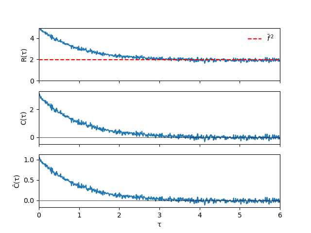

## Perché serve?

Molti dati non sono indipendenti

### Esempi

- traiettorie Monte Carlo  
- serie temporali  
- sistemi dinamici  
- segnali sperimentali  

### Problema

Quanto il passato influenza il futuro?

---

## Idea

Voglio misurare la **dipendenza temporale**

### Domanda

Quanto sono correlati

$$
f(t) \quad \text{e} \quad f(t+\tau) \, ?
$$

---

## Definizione

### Autocorrelazione

$$
R_f(\tau) = \overline{f(t+\tau)\,f(t)}
$$

### Interpretazione

- grande → memoria lunga  
- piccolo → memoria corta  

---

## Problema

Se $\bar f \neq 0$

$$
R_f(\tau) \not\to 0
$$

### Infatti

$$
R_f(\tau) \to \bar f^{\,2}
$$

### Quindi

Contiene anche la media

---

## Funzione connessa

### Definizione

$$
C_f(\tau) = R_f(\tau) - \bar f^{\,2}
$$

### Equivalente

$$
C_f(\tau) = \overline{(f(t+\tau)-\bar f)(f(t)-\bar f)}
$$

### Interpretazione

Correlazione delle **fluttuazioni**

---

## Normalizzazione

### Definizione

$$
\hat C_f(\tau) = \frac{C_f(\tau)}{C_f(0)}
$$

### Proprietà

$$
\hat C_f(0) = 1
$$

### Vantaggio

Quantità adimensionale

---

## Struttura dell'autocorrelazione

### Osservazioni

- $R(\tau) \to \bar f^{\,2}$  
- $C(\tau) \to 0$  
- $\hat C(\tau) \to 0$  

---

## Significato

### Interpretazione

Se $\hat C(\tau)$ è grande:

$\to$ il sistema "ricorda"  

Se è piccolo:

$\to$ il sistema ha dimenticato  

---

## Tempo di decorrelazione

### Caso tipico

$$
\hat C(\tau) \sim e^{-\tau/\tau_c}
$$

### $\tau_c$

Tempo caratteristico di memoria

---

## Significato pratico

### Se $\tau \ll \tau_c$

campioni correlati  

### Se $\tau \gg \tau_c$

campioni quasi indipendenti  

---

## Caso discreto

### Dati

$$
f_0, f_1, \dots, f_{N-1}
$$

### Autocorrelazione

$$
R(k) \approx \frac{1}{N-k}\sum_{i=0}^{N-k-1} f_i f_{i+k}
$$

---

## Versione connessa

$$
C(k) \approx \frac{1}{N-k}\sum (f_i-\bar f)(f_{i+k}-\bar f)
$$

### Media

$$
\bar f = \frac{1}{N}\sum f_i
$$

---

## Problema numerico

Per ritardi grandi:

- poche coppie disponibili  
- stima rumorosa  

### Quindi

La coda è poco affidabile

---

## Numero effettivo di campioni

### Idea

Campioni correlati $\neq$ indipendenti

$$
N_{\mathrm{eff}} < N
$$

### Conseguenza

Errore statistico più grande

---

## Monte Carlo

Nei metodi MCMC:

- campioni correlati  
- dipendenza dallo stato precedente  

### Quindi

Serve l'autocorrelazione per valutare l'efficienza

---

## Efficienza

### Catena buona

decorrelazione veloce  

### Catena cattiva

decorrelazione lenta  

---

## Costo computazionale

### Metodo diretto

$$
O(N^2)
$$

### Problema

Troppo lento per grandi $N$

---

## Idea chiave

Autocorrelazione $\approx$ correlazione/convoluzione

### Conseguenza

Nel dominio di Fourier → prodotto

---

## Metodo FFT

### Procedura

1. sottraggo la media  
2. FFT  
3. moltiplico per il coniugato  
4. trasformata inversa  

---

## Formula compatta

$$
C = \mathcal{F}^{-1}\!\left(|\mathcal{F}(f-\bar f)|^2\right)
$$

---

## Vantaggio

### Costo

$$
O(N \log N)
$$

### Risultato

Calcolo molto più veloce

---

## Messaggio finale

- separare media e fluttuazioni  
- misurare la memoria del sistema  
- stimare campioni indipendenti  
- valutare simulazioni  

---

## Take-home message

La correlazione vera è nelle **fluttuazioni**, non nella media

---