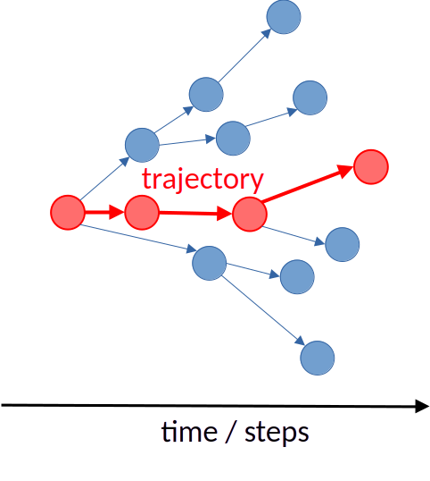

## Obiettivi della lezione

**Idea centrale:** passare da una dinamica microscopica fatta di **salti casuali tra stati discreti** a una dinamica deterministica della **distribuzione di probabilità**.

**Obiettivi:**

* distinguere traiettorie singole e probabilità di stato
* introdurre i tassi di transizione tra stati discreti
* derivare la master equation come bilancio di probabilità
* interpretarla come legge di conservazione
* scrivere la dinamica in forma matriciale
* introdurre il generatore e il propagatore $e^{tL}$
* collegare master equation e simulazione di Gillespie

---

## Da Gillespie alla pdf

:::: {.columns}
::: {.column width="50%"}

#### Lezione precedente

* simulazione evento per evento
* tempi di attesa casuali
* traiettorie a salti
* livello microscopico

:::
::: {.column width="50%"}

#### Oggi

* probabilità di stare in uno stato
* evoluzione della pdf
* legge chiusa per $p_i(t)$
* livello statistico

:::
::::

**Domanda guida:** come si passa da salti individuali a una equazione per le probabilità?

---

## Stati discreti e traiettorie

Consideriamo uno spazio degli stati discreto

$$
\mathcal S = {1,2,3,\dots}
$$

Il sistema evolve tramite salti casuali:

$$
i_0 \to i_1 \to i_2 \to \cdots
$$

#### Idea chiave

* lo stato cambia in istanti casuali
* la traiettoria osservata è irregolare
* il tempo resta continuo, gli stati sono discreti

---

## Esempi di processi di salto

:::: {.columns}
::: {.column width="50%"}

* chimica: numero di molecole
* epidemie: $S,I,R$
* code: numero di clienti
* popolazioni: nascita/morte

:::
::: {.column width="50%"}

* reti: nodo occupato/vuoto
* opinioni: cambio di stato
* affidabilità: componente attivo/guasto
* finanza: modelli a regime discreto

:::
::::

#### Punto comune

La dinamica è una sequenza di **transizioni casuali tra stati**.

---

## Traiettorie singole vs descrizione probabilistica

:::: {.columns}
::: {.column width="55%"}

#### Una singola realizzazione

* il sistema segue una traiettoria casuale
* i salti avvengono in tempi irregolari
* ogni realizzazione è diversa

#### Un insieme di realizzazioni

* ripetendo l'esperimento otteniamo molte traiettorie possibili
* ciò che evolve regolarmente non è una traiettoria singola
* è la distribuzione di probabilità sugli stati

**Idea chiave:** Gillespie genera una traiettoria; la master equation evolve l'ensemble delle probabilità.

:::
::: {.column width="45%"}

{width=100%}

:::
::::

---

## Probabilità di stato

Definiamo

$$
p_i(t) = P(X_t=i)
$$

dove $X_t$ è la variabile aleatoria che descrive lo stato del sistema al tempo $t$.

Il vettore

$$
p(t)=\bigl(p_1(t),p_2(t),\dots\bigr)
$$

soddisfa sempre

$$
p_i(t) \ge 0,
\qquad
\sum_i p_i(t)=1.
$$

---

## Tassi di transizione

Se il sistema si trova nello stato $i$, indichiamo con

$$
w_{i\to j}
$$

il **tasso di salto** verso lo stato $j$.

#### Significato operativo

In un intervallo piccolo $dt$:

$$
P(i\to j \text{ in } [t,t+dt]) = w_{i\to j}\,dt + o(dt).
$$

#### Attenzione

$w_{i\to j}$ non è una probabilità ma una **probabilità per unità di tempo**.

---

## Come cambia $p_i(t)$?

In un piccolo intervallo $dt$, la probabilità di essere nello stato $i$ cambia per due ragioni:

#### Ingressi

* il sistema arriva in $i$ da altri stati

#### Uscite

* il sistema lascia $i$ verso altri stati

#### Idea chiave

La master equation sarà un **bilancio entrate -- uscite**.

---

## Termine di ingresso

Per arrivare in $i$ al tempo $t+dt$, il sistema può essere in $j\neq i$ al tempo $t$ e saltare in $i$.

Il contributo è

$$
p_j(t)\,w_{j\to i}\,dt.
$$

Sommando su tutti gli stati di partenza:

$$
\sum_{j\ne i} p_j(t) w_{j\to i}\,dt.
$$

#### Interpretazione

Probabilità presente in altri stati che fluisce verso $i$.

---

## Termine di uscita

Se il sistema è in $i$ al tempo $t$, può saltare verso uno qualunque degli stati $j\neq i$.

Il contributo totale di uscita è

$$
\sum_{j\ne i} p_i(t) w_{i\to j}\,dt.
$$

#### Interpretazione

Probabilità che abbandona lo stato $i$.

---

## Bilancio completo

Mettendo insieme stato attuale, ingressi e uscite:

$$
p_i(t+dt)=p_i(t)
+\sum_{j\ne i} p_j(t) w_{j\to i}\,dt
-\sum_{j\ne i} p_i(t) w_{i\to j}\,dt.
$$

Sottraendo $p_i(t)$, dividendo per $dt$ e passando al limite:

$$
\frac{dp_i}{dt} = \sum_{j\ne i} \,[\, p_j(t) w_{j\to i} - p_i(t) w_{i\to j}\,]\;.
  $$

---

## La master equation

#### Forma generale

$$
\dot p_i(t) = \sum_{j\ne i} p_j(t) w_{j\to i}
- \sum_{j\ne i} p_i(t) w_{i\to j}.
  $$

:::: {.columns}
::: {.column width="50%"}

#### Primo termine

* flusso entrante
* guadagno di probabilità

:::
::: {.column width="50%"}

#### Secondo termine

* flusso uscente
* perdita di probabilità

:::
::::

---

## Lettura come legge di conservazione

* Sommando la master equation su tutti gli stati, otteniamo $\sum_i \dot p_i(t)=0$

* Quindi, se inizialmente $\sum_i p_i(0)=1$, allora per ogni tempo $\sum_i p_i(t)=1$.

### Messaggio

La probabilità totale non si crea né si distrugge: viene solo redistribuita tra stati.

---

## Caso a due stati

:::: {.columns}
::: {.column width="50%"}

### Transizioni

$$
1 \xrightarrow{\alpha} 2
$$
$$
2 \xrightarrow{\beta} 1
$$

:::
::: {.column width="50%"}

### Equazioni

$$
\dot p_1 = -\alpha p_1 + \beta p_2
$$

$$
\dot p_2 = \alpha p_1 - \beta p_2
$$

:::
::::

Con $p_1+p_2=1$ resta un solo grado di libertà.

---

## Stato stazionario nel caso a due stati

* La stazionarietà $\dot p_1 = \dot p_2 = 0$ 

* implica $\alpha p_1^* = \beta p_2^*$

* insieme alla normalizzazione $p_1^*+p_2^*=1$

Ne segue

$$
p_1^* = \frac{\beta}{\alpha+\beta},
\qquad
p_2^* = \frac{\alpha}{\alpha+\beta}.
$$

---

## Forma matriciale

Introduciamo il vettore colonna $p(t)=
\begin{pmatrix}
p_1(t) \\
p_2(t) \\
\vdots
\end{pmatrix}$ e definiamo il **generatore** $L$ 

$$
L_{ij}=w_{j\to i}
\qquad (i\ne j),
$$

$$
L_{ii}=-\sum_{j\ne i} w_{i\to j}.
$$

Allora

$$
\dot p(t)=Lp(t).
$$

---

## Proprietà del generatore

La matrice $L$ ha tre proprietà strutturali:

1. elementi fuori diagonale $\ge 0$
2. elementi diagonali $\le 0$
3. somma delle colonne uguale a zero

$$
\sum_i L_{ij}=0.
$$

#### Significato

* i fuori diagonale rappresentano flussi entranti
* i diagonali rappresentano perdite
* la somma a zero codifica la conservazione della probabilità

---

## Perché si chiama generatore?

La master equation ha la forma lineare

$$
\dot p(t)=Lp(t).
$$

Per analogia con le ODE lineari, $L$ **genera** l'evoluzione della pdf.

#### Conseguenza formale

$$
p(t)=e^{tL}p(0)
$$

con

$$
e^{tL}=\sum_{n=0}^{\infty}\frac{(tL)^n}{n!}.
$$

La matrice $e^{tL}$ è il **propagatore**.

---

## Soluzione formale: utile ma non sempre facile

:::: {.columns}
::: {.column width="50%"}

#### Teoricamente

* la dinamica è completamente nota
* lo spettro di $L$ controlla il rilassamento
* gli autovalori vicini a $0$ danno modi lenti

:::
::: {.column width="50%"}

#### Numericamente

* spazio degli stati spesso enorme
* matrice sparsa ma grande
* esponenziale di matrice non banale

:::
::::

#### Messaggio

La forma $e^{tL}$ chiarisce la struttura, ma non elimina le difficoltà computazionali.

---

## Master equation e Gillespie

:::: {.columns}
::: {.column width="50%"}

#### Master equation

* evolve la pdf
* descrizione d'ensemble
* deterministica

:::
::: {.column width="50%"}

#### Gillespie

* evolve una traiettoria
* descrizione microscopica
* stocastica

:::
::::

#### Relazione

Sono due descrizioni della **stessa dinamica markoviana a salti**.

---

## Quando usare quale descrizione?

:::: {.columns}
::: {.column width="50%"}

#### Pdf / master equation

* pochi stati
* interesse per medie e rilassamento
* analisi di stazionarietà

:::
::: {.column width="50%"}

#### Traiettorie / Gillespie

* molti stati
* interesse per realizzazioni singole
* simulazione numerica diretta

:::
::::

---

## Ponte verso il continuo

#### Idea concettuale

* qui: stati discreti, tempo continuo
* più avanti: stato continuo, tempo continuo

#### Analogia strutturale

* master equation: bilancio tra stati
* Fokker--Planck: continuità con drift e diffusione

#### Messaggio

La master equation è il prototipo discreto delle equazioni di evoluzione per le pdf.

---

## Take-home message

* una traiettoria a salti e una pdf sono due livelli della stessa dinamica
* i tassi $w_{i\to j}$ definiscono le transizioni microscopiche
* la master equation è un bilancio entrate -- uscite
* la probabilità totale si conserva
* la forma matriciale introduce il generatore $L$
* la soluzione formale è $p(t)=e^{tL}p(0)$
* Gillespie e master equation sono complementari

---

## Prossima lezione

* dallo spazio degli stati discreto a quello continuo
* equazione di continuità per ODE
* Fokker--Planck da drift e diffusione
* collegamento con le SDE

---

## Backup -- Caso a due stati in forma matriciale

$$
L=
\begin{pmatrix}
-\alpha & \beta \\
\alpha & -\beta
\end{pmatrix}
$$

$$
\dot p = Lp
$$

con

$$
p=
\begin{pmatrix}
p_1 \\
p_2
\end{pmatrix}.
$$

Gli autovalori sono

$$
\lambda_0=0,
\qquad
\lambda_1=-(\alpha+\beta).
$$

---

## Backup -- Catena di Markov discreta vs processo di salto continuo

:::: {.columns}
::: {.column width="50%"}

#### Tempo discreto

$$
p^{(n+1)} = P\,p^{(n)}
$$

$$
p^{(n)} = P^n p^{(0)}
$$

* aggiornamento a passi finiti
* $P$ matrice stocastica
* una probabilità di transizione per passo

:::
::: {.column width="50%"}

#### Tempo continuo

$$
\dot p(t)=L\,p(t)
$$

$$
p(t)=e^{tL}p(0)
$$

* salti in tempi arbitrari
* $L$ generatore infinitesimo
* tassi di salto per unità di tempo

:::
::::

#### Messaggio

$P$ evolve su un passo finito; $L$ descrive la variazione infinitesima.

---

## Backup -- Relazione tra tra matrice di transizione e generatore

Per un intervallo piccolo $\Delta t$:

$$
P(\Delta t) \approx I + \Delta t\,L.
$$

Interpretazione:

* $I$ = con alta probabilità non accade nulla
* $\Delta t\,L$ = probabilità di salto lineari in $\Delta t$

Dopo $n$ intervalli, con $t=n\Delta t$:

$$
p(t) \approx P(\Delta t)^n p(0) = 
\bigl(I+\Delta t\,L\bigr)^n p(0)\;.
$$

---

## Backup -- Dal limite discreto all'esponenziale

Ponendo

$$
\Delta t = \frac{t}{n},
$$

si ottiene

$$
\bigl(I+\Delta t\,L\bigr)^n = \left(I+\frac{t}{n}L\right)^n\;.
$$

Usiamo il limite

$$
\left(1+\frac{x}{n}\right)^n \to e^x
\qquad (n\to\infty).
$$

otteniamo che

$$
p(t)=e^{tL}p(0)
$$

è il limite continuo della dinamica discreta.

---

## Backup -- Gillespie e master equation: stessa dinamica, due livelli

:::: {.columns}
::: {.column width="50%"}

#### Gillespie

* genera una traiettoria
* sceglie il prossimo evento
* sceglie il tempo di attesa
* descrizione microscopica

:::
::: {.column width="50%"}

#### Master equation

* evolve la pdf
* bilancia entrate e uscite
* descrive medie e rilassamento
* descrizione d'ensemble

:::
::::

#### Collegamento

Partendo dagli stessi tassi di salto:

* Gillespie campiona realizzazioni singole
* la master equation evolve la probabilità di stato

---

## Backup -- Generatori: che cosa cambia davvero?

:::: {.columns}
::: {.column width="50%"}

#### Catena di Markov discreta

Generatore dell'evoluzione a un passo:

$$
P
$$

* matrice stocastica
* elementi $\ge 0$
* colonne o righe normalizzate a seconda della convenzione
* autovalore dominante $1$

:::
::: {.column width="50%"}

#### Processo continuo

Generatore infinitesimo:

$$
L = \lim_{\Delta t\to 0}\frac{P(\Delta t)-I}{\Delta t}
$$

* fuori diagonale $\ge 0$
* diagonale $\le 0$
* somme delle colonne nulle
* autovalore stazionario $0$

:::
::::

#### Messaggio

Nel caso discreto l'equilibrio è legato a $\lambda=1$; nel continuo a $\lambda=0$.

---

## Backup -- Bilancio dettagliato

Uno stato stazionario $p^*$ soddisfa

$$
0 = \sum_{j\ne i} \,\left[\, p_j^* w_{j\to i} - p_i^* w_{i\to j}\,\right]
  $$

Una condizione più forte è il **bilancio dettagliato**:

$$
p_i^* w_{i\to j} = p_j^* w_{j\to i}
$$

#### Significato

* ogni flusso elementare è bilanciato dal suo inverso
* non è necessario in generale
* quando vale, la struttura stazionaria è più semplice

---

## Backup -- Modi di rilassamento

Se $L$ è diagonalizzabile,

$$
p(t)=\sum_k c_k e^{\lambda_k t} v^{(k)}.
$$

#### Interpretazione

* $\lambda_0=0$ → modo stazionario
* $\mathrm{Re}(\lambda_k)<0$ → modi transienti
* gli autovalori vicini a $0$ controllano il rilassamento lento

#### Messaggio

Lo spettro del generatore controlla le scale temporali del problema.

