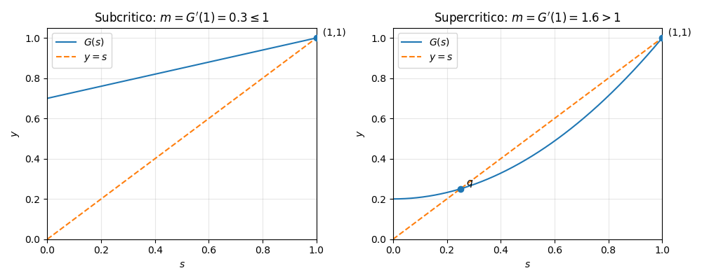

## Obiettivi della lezione

**Idea centrale:** nei processi di branching il punto non è soltanto come cresce la media, ma se una linea di discendenza **sopravvive** oppure si **estingue**.

**Obiettivi:**

* definire il processo di Galton--Watson
* introdurre il numero medio di discendenti $m$
* capire perché la media non basta a descrivere il processo
* usare la funzione generatrice $G(s)$
* derivare l'equazione di estinzione $q=G(q)$
* distinguere regimi subcritico, critico e supercritico
* discutere qualitativamente i tempi di estinzione
* collegare il branching a epidemie iniziali, genealogie e cascades

---

## Dal modello di crescita alla domanda giusta

:::: {.columns}
::: {.column width="50%"}

#### Modello deterministico

* una traiettoria media $N(t)$
* crescita o decadimento fissati dal segno del tasso
* soglia letta in termini di stabilità

:::
::: {.column width="50%"}

#### Processo di branching

* ogni individuo genera un numero casuale di figli
* realizzazioni diverse hanno esiti diversi
* la domanda centrale è: sopravvive o si estingue?

:::
::::

**Domanda guida:** un processo con crescita media positiva sopravvive davvero?

---

## Processo di Galton--Watson

* Il tempo è discreto e scandito in generazioni: $t=0,1,2,\dots$

* Se $N_t$ è il numero di individui alla generazione $t$, allora $N_{t+1}=\sum_{i=1}^{N_t} K_i$\
dove i $K_i$ sono indipendenti e identicamente distribuiti.

* La legge di offspring è $\qquad P(K=k)=p_k,\; \sum_{k=0}^{\infty} p_k = 1.$

$\quad$

### Punto chiave

Lo stato $N_t=0$ è assorbente: una volta estinto, il processo non riparte più.

---

## Primo momento e soglia media

* Definiamo il numero medio di discendenti per individuo: $m=\mathbb E[K]$

* Condizionando su $N_t$: $\mathbb E[N_{t+1}\mid N_t]=mN_t$.

* Quindi $\mathbb E[N_t]=N_0 m^t$.

$\quad$

### Prima classificazione

* **subcritico**: $m<1$
* **critico**: $m=1$
* **supercritico**: $m>1$

\
**Ma:** questa classificazione letta solo sulla media è insufficiente.

---

## Perché la media non basta

:::: {.columns}
::: {.column width="50%"}

#### Caso A

$$
P(K=1)=1
$$

* $m=1$
* nessuna fluttuazione
* $N_t=1$ per ogni $t$
* nessuna estinzione

:::
::: {.column width="50%"}

#### Caso B

$$
P(K=0)=\frac12,
\qquad
P(K=2)=\frac12
$$

* ancora $m=1$
* forti fluttuazioni
* estinzione possibile
* traiettorie molto diverse

:::
::::

$\quad$

**Idea chiave:** stesso primo momento, ma comportamento qualitativamente diverso.

---

## Funzione generatrice dell'offspring

Per descrivere la distribuzione del numero di figli di **un singolo individuo** introduciamo la funzione generatrice

$$
G(s)=\mathbb E[s^K]=\sum_{k=0}^{\infty} p_k s^k.
$$

#### Proprietà essenziali

$$
G(1)=1, \qquad G(0)=p_0, \qquad G'(1)=m.
$$

#### Perché è utile?

$G(s)$ codifica tutta la legge di offspring:

* $p_0$ = probabilità di non lasciare figli;
* $m=G'(1)$ = numero medio di figli;
* iterare $G$ descrive l'evoluzione generazione dopo generazione.

---

## Generatrice della popolazione totale

Per seguire la popolazione totale introduciamo, per ogni generazione $t$, la funzione generatrice di $N_t$:

$$
F_t(s)=\mathbb E[s^{N_t}].
$$

Questa quantità descrive la distribuzione del numero di individui presenti alla generazione $t$.

Partiamo dalla dinamica

$$
N_{t+1}=\sum_{i=1}^{N_t} K_i,
$$

dove i $K_i$ sono indipendenti e hanno tutti la stessa distribuzione di offspring.

---

## Passo 1: fissiamo $N_t=n$

Se condi\-zioniamo su $N_t=n$, allora

$$
N_{t+1}=K_1+\cdots+K_n.
$$

Perciò

$$
\mathbb E[s^{N_{t+1}}\mid N_t=n]
=
\mathbb E[s^{K_1+\cdots+K_n}\mid N_t=n].
$$

---

## Dalla somma al prodotto

Usiamo prima l'identità

$$
s^{K_1+\cdots+K_n}=s^{K_1}\cdots s^{K_n}.
$$

e poi usiamo l'indipendenza dei $K_i$:

$$
\mathbb E[s^{K_1}\cdots s^{K_n}\mid N_t=n]
= \prod_{i=1}^n \mathbb E[s^{K_i}].
$$

Poiché tutti i $K_i$ hanno la stessa generatrice $G(s)$, otteniamo

$$
\mathbb E[s^{N_{t+1}}\mid N_t=n]=[G(s)]^n.
$$

---

## Passo 2: togliamo il condizionamento

Adesso non fissiamo più $N_t=n$, ma mediamo su tutti i possibili valori di $N_t$:

$$
F_{t+1}(s)=\mathbb E[s^{N_{t+1}}]
=
\sum_{n=0}^{\infty}
\mathbb E[s^{N_{t+1}}\mid N_t=n]\,P(N_t=n).
$$

Sostituendo il risultato precedente,

$$
F_{t+1}(s)
=
\sum_{n=0}^{\infty}
[G(s)]^n\,P(N_t=n).
$$

---

## Composizione di $G$

Ma per definizione di $F_t$ vale

$$
F_t(u)=\mathbb E[u^{N_t}].
$$

Quindi, scegliendo $u=G(s)$,

$$
F_{t+1}(s)=F_t(G(s)).
$$

#### Messaggio

La distribuzione alla generazione successiva si ottiene applicando a $F_t$ la stessa legge di offspring.

---

## Caso particolare: un solo progenitore

* Se $N_0=1$, allora $F_0(s)=s$.

* Di conseguenza, $\quad F_1(s)=G(s), \quad
F_2(s)=G(G(s)), \quad \dots$

* In generale

$$
F_t(s)=G^{\circ t}(s).
$$

### Interpretazione

* $G$ descrive i **figli** di un individuo;
* $G\circ G$ descrive i **nipoti**;
* $G^{\circ t}$ descrive i **discendenti alla generazione $t$** di un singolo progenitore.

---

## Probabilità di estinzione

Partiamo da un solo progenitore e definiamo

$$
q = P(\exists t:\, N_t=0 \mid N_0=1).
$$

Questa è la probabilità che la linea di discendenza si estingua prima o poi.

$\quad$

* **Idea :** Per trovare $q$ usiamo la legge di offspring del primo individuo.

---

## Passo 1: fissiamo il numero di figli del progenitore

Supponiamo che il primo individuo abbia esattamente $k$ figli.

Perché l'intero processo si estingua, devono estinguersi tutte e $k$ le linee di discendenza generate da questi figli.

Se la probabilità di estinzione di una singola linea è $q$, allora

$$
P(\text{estinzione totale}\mid K=k)=q^k.
$$

#### Perché?

Perché le $k$ linee evolvono in modo indipendente.

---

## Passo 2: mediamo su tutti i possibili valori di $K$

Ora non fissiamo più $K=k$, ma sommiamo su tutti i possibili valori di $K$ pesandoli con la loro probabilità:

$$
q=\sum_{k=0}^{\infty} P(\text{estinzione totale}\mid K=k)\,P(K=k).
$$

Sostituendo il risultato precedente,

$$
q=\sum_{k=0}^{\infty} q^k\,p_k.
$$

Ma questa somma è proprio la funzione generatrice valutata in $q$:

$$
q=G(q).
$$

---

## Equazione ai punti fissi

La probabilità di estinzione soddisfa quindi l'equazione

$$
q=G(q).
$$

* **Lettura :** Non stiamo cercando una traiettoria, ma un **punto fisso** della funzione generatrice.

$\quad$

Poiché $G(1)=1$, il valore $q=1$ è sempre una soluzione.

$\quad$

La domanda è: esiste anche una soluzione con $0<q<1$?

---

## Interpretazione geometrica

:::: {.columns}
::: {.column width="50%"}

L'equazione

$$
q=G(q)
$$

si legge come intersezione tra:

* la curva $y=G(s)$;
* la retta $y=s$.

Il comportamento dipende dalla pendenza in $s=1$:

$$
G'(1)=m.
$$
:::
::: {.column width="50%"}

#### Quindi

* se $m\le 1$, l'unica soluzione in $[0,1]$ è tipicamente

$$
q=1;
$$

* se $m>1$, compare una seconda soluzione con

$$
0<q<1.
$$

:::
::::

---

## Visual explanation: convessità e punti fissi

**Proprietà chiave**

$$
G''(s)=\sum_{k=2}^{\infty} k(k-1)p_k s^{k-2}\ge 0,
$$

quindi $G$ è **convessa** in $[0,1]$. Inoltre $\quad G(1)=1, \quad G'(1)=m$.

{ height=50% }

---

## I tre regimi

La classificazione basata su

$$
m=\mathbb E[K]
$$

diventa ora una classificazione **probabilistica**.

Non basta sapere se la media cresce o decresce:
conta se il processo si estingue con probabilità uno oppure no.

---

## Regime subcritico: $m<1$

Quando ogni individuo produce, in media, meno di un discendente,

$$
\mathbb E[N_t]=N_0 m^t
$$

decresce esponenzialmente.

#### Conseguenze

* la popolazione tende a contrarsi;
* l'estinzione è certa:
  $$
  q=1;
  $$
* i tempi tipici di sopravvivenza restano relativamente brevi.

#### Lettura intuitiva

Ogni generazione è troppo piccola, in media, per rimpiazzare la precedente.

---

## Regime critico: $m=1$

Nel caso critico la media resta costante:

$$
\mathbb E[N_t]=N_0.
$$

Ma questo **non** significa equilibrio stabile.

#### In realtà

* l'estinzione è ancora certa: $q=1$ ;
* la varianza cresce;
* le fluttuazioni dominano il comportamento a lungo tempo;
* i tempi di estinzione possono essere molto lunghi.

#### Messaggio

Nel regime critico la media è particolarmente fuorviante:
molte realizzazioni si estinguono, poche diventano grandi.

---

## Regime supercritico: $m>1$

Nel regime supercritico la media cresce esponenzialmente:

$$
\mathbb E[N_t]=N_0 m^t.
$$

Tuttavia questo non implica sopravvivenza certa.

#### Conseguenze

* l'estinzione resta possibile;
* la probabilità di estinzione soddisfa $0<q<1$;
* una parte delle realizzazioni si spegne presto;
* un'altra parte sopravvive e può crescere rapidamente.

#### Messaggio

Sopra soglia la sopravvivenza diventa possibile, ma non garantita.

---

## Quadro riassuntivo

:::: {.columns}
::: {.column width="55%"}

| Regime | Media | Estinzione |
|---|---|---|
| $m<1$ | decade | certa |
| $m=1$ | costante | certa |
| $m>1$ | cresce | non certa |

:::
::: {.column width="45%"}

#### Idea chiave

La soglia in $m=1$ non separa soltanto crescita e decrescita della media.

Separa due regimi qualitativamente diversi:

* **estinzione certa**
* **sopravvivenza possibile**

:::
::::

---

## Caso semplice esatto

Se

$$
P(K=0)=1-p,
\qquad
P(K=1)=p,
$$

allora

$$
P(T_{\mathrm{ext}}=t)=p^{t-1}(1-p),
\qquad t=1,2,3,\dots
$$

e quindi

$$
\mathbb E[T_{\mathrm{ext}}]=\frac{1}{1-p}.
$$

---

## Esempio: zero o due figli

Consideriamo

$$
P(K=0)=1-p,
\qquad
P(K=2)=p.
$$

Allora

$$
G(s)=1-p+ps^2
$$

e la probabilità di estinzione soddisfa

$$
q = 1-p + pq^2.
$$

Le soluzioni sono:

$$
q=1,
\qquad
q=\frac{1-p}{p}.
$$

Poiché

$$
m=2p,
$$

segue che:

* se $p\le \frac12$, allora $q=1$
* se $p>\frac12$, allora compare una soluzione con $q<1$

---

## Applicazioni e take-home message

:::: {.columns}
::: {.column width="50%"}

#### Applicazioni

* genealogie
* epidemie nella fase iniziale
* cascades su reti
* diffusione di innovazioni

:::
::: {.column width="50%"}

#### Take-home message

* la media non basta
* conta la distribuzione completa di offspring
* la quantità nuova è la probabilità di estinzione
* sopra soglia la sopravvivenza è possibile, non garantita

:::
::::

**Messaggio finale:** nei processi di branching il comportamento d'ensemble e il comportamento di una singola realizzazione possono essere radicalmente diversi.
