# Serie stocastiche: cambiare prospettiva

## Dalla simulazione all'analisi dei dati

Finora spesso partivamo da un modello:

$$
\text{modello} \longrightarrow \text{traiettorie simulate}.
$$

Ora partiamo da una sequenza osservata:

$$
X_0,X_1,\dots,X_T,
$$

e chiediamo:

- quale struttura temporale contiene?
- quale classe di modelli è plausibile?
- quale likelihood potremo scrivere?

## 

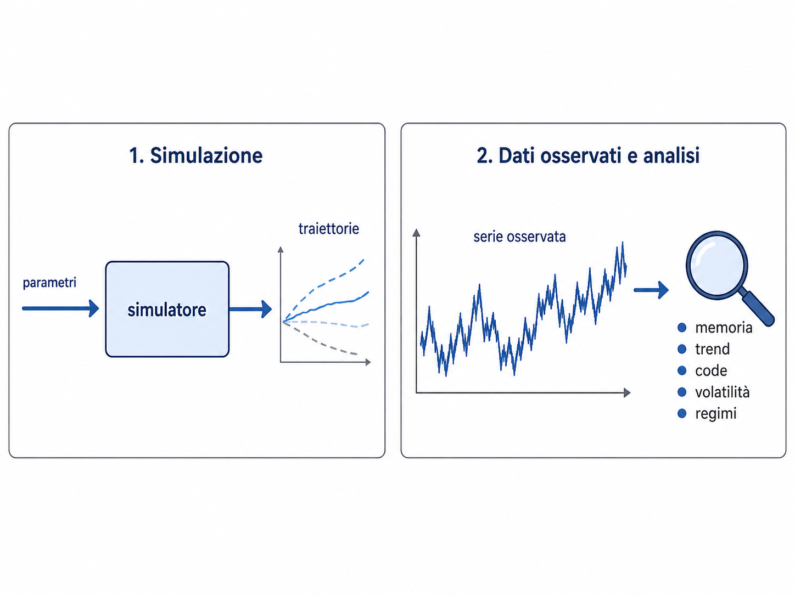{width=1.0\linewidth}

## Perché l'ordine temporale conta

Un campione indipendente può essere rimescolato:

$$
p(y_1,\dots,y_n)=\prod_{i=1}^n p(y_i).
$$

Una serie temporale no:

$$
p(x_0,\dots,x_T)
= p(x_0) \prod_{t=0}^{T-1} p(x_{t+1}\mid x_t,x_{t-1},\dots).
$$

L'informazione non è solo nei valori, ma anche nelle transizioni.

## 

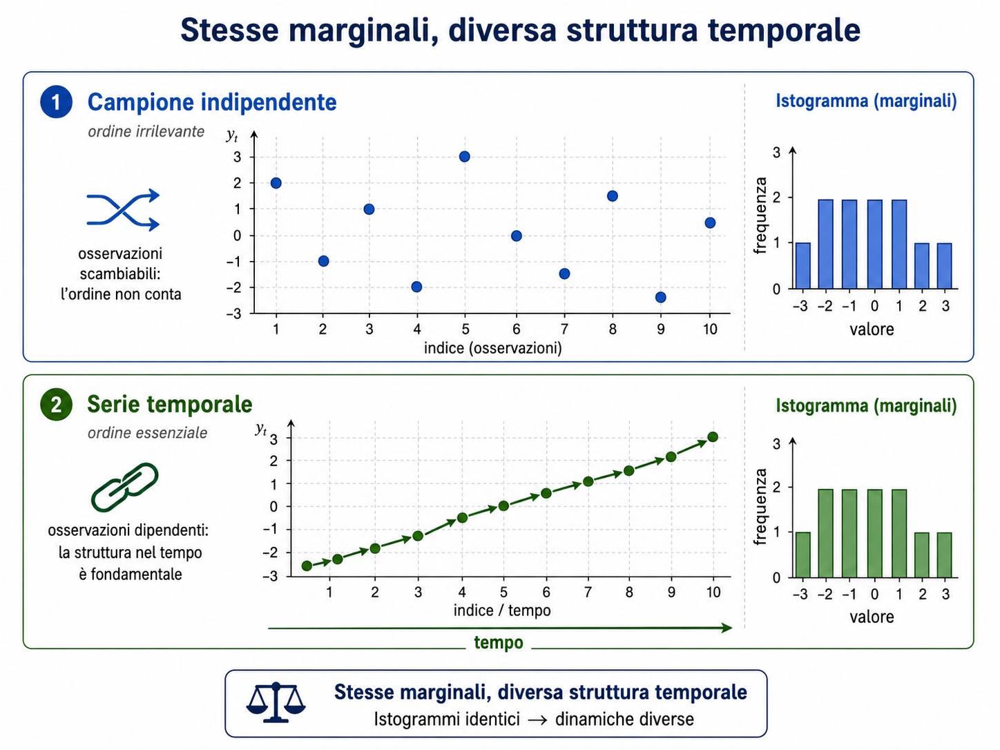{width=1.0\linewidth}

## Il caso Markoviano come primo modello

Una semplificazione frequente:

$$
p(x_{t+1}\mid x_t,x_{t-1},\dots,x_0)
= p(x_{t+1}\mid x_t).
$$

Allora:

$$
p(x_0,\dots,x_T)
= p(x_0) \prod_{t=0}^{T-1}p(x_{t+1}\mid x_t).
$$

Non vuol dire indipendenza: vuol dire dipendenza locale.

## 

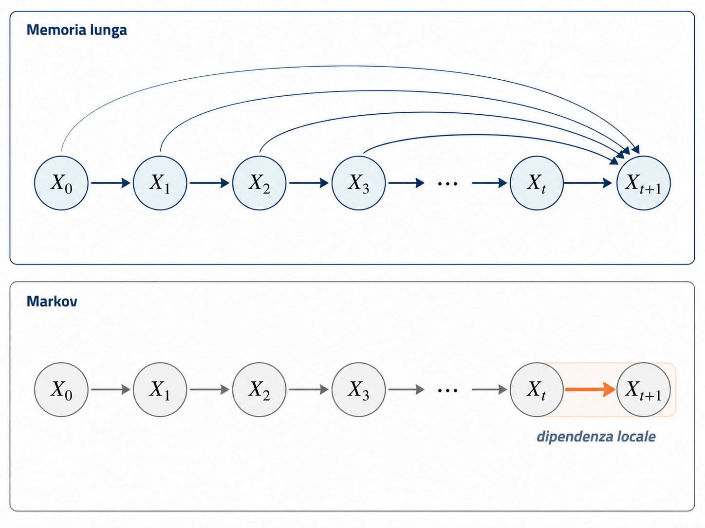{width=1.0\linewidth}

# Diagnostica iniziale

## Prima di scegliere un modello

Domande operative:

- la media è stabile?
- la varianza è stabile?
- ci sono trend?
- ci sono salti isolati?
- ci sono regimi diversi?
- conviene modellare $X_t$ o $\Delta X_t$?

## 

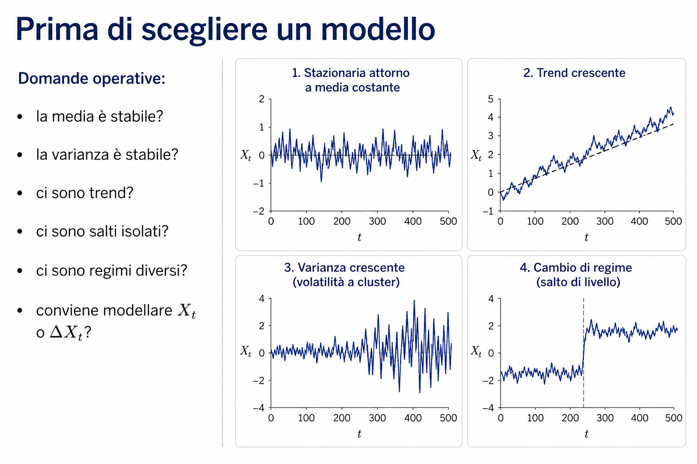{width=1.0\linewidth}

## Valori o incrementi?

:::::::::::::: {.columns}
::: {.column width="0.55"}
Per molte serie è più informativo guardare

$$
\Delta X_t=X_{t+1}-X_t.
$$

Per grandezze positive:

$$
r_t=\log X_{t+1}-\log X_t.
$$

Un random walk ha livelli non stazionari ma incrementi stazionari.
:::

::: {.column width="0.41"}
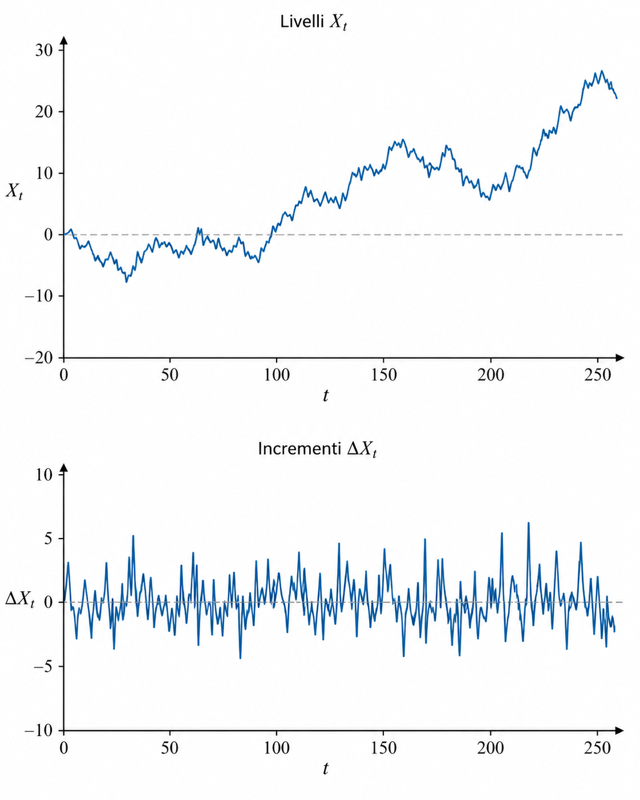{width=0.98\linewidth}
:::
::::

## Memoria lineare e non lineare

Memoria lineare:

$$
C(k)=\mathbb{E}[(X_{t+k}-\mu)(X_t-\mu)],
\qquad
\rho(k)=\frac{C(k)}{C(0)}.
$$

Memoria non lineare:

$$
|X_t|,\quad X_t^2,\quad |\Delta X_t|,\quad (\Delta X_t)^2.
$$

Una serie può avere $\rho(k)\simeq 0$ ma volatilità persistente.

## 

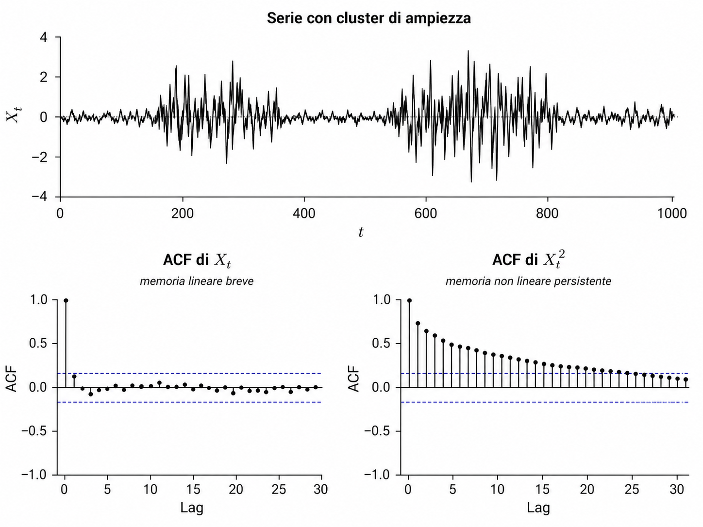{width=1.0\linewidth}

# Modelli lineari

## Rumore bianco e innovazioni

Il rumore bianco è il riferimento senza memoria:

$$
\mathbb{E}[\eta_t]=0,
\quad
\mathrm{Var}(\eta_t)=\sigma^2
$$

$$
\mathbb{E}[\eta_t\eta_s]=0,\; t\ne s
$$

$$\quad$$

Nei modelli per serie: 
$$
X_{t+1} = \text{parte prevedibile dal passato} + \text{innovazione}.
$$

## 

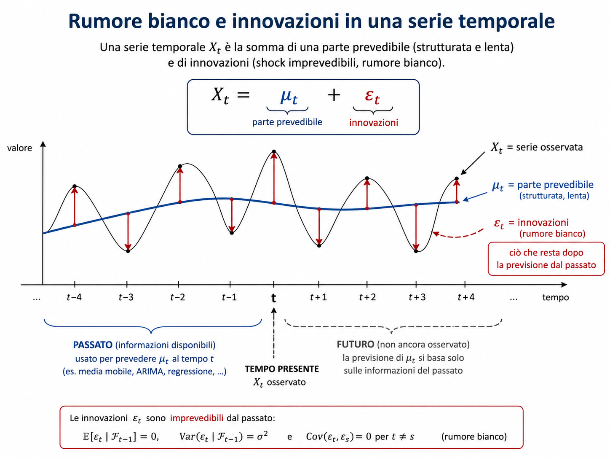{width=1.0\linewidth}

## Random walk: rumore accumulato

Modello:

$$
X_{t+1}=X_t+\eta_t.
$$

Quindi:

$$
X_t=\sum_{k=0}^{t-1}\eta_k.
$$

Se $\mathrm{Var}(\eta_t)=\sigma^2$,

$$
\mathrm{Var}(X_t)=t\sigma^2.
$$

Non stazionarietà nei livelli; stazionarietà negli incrementi.

## 

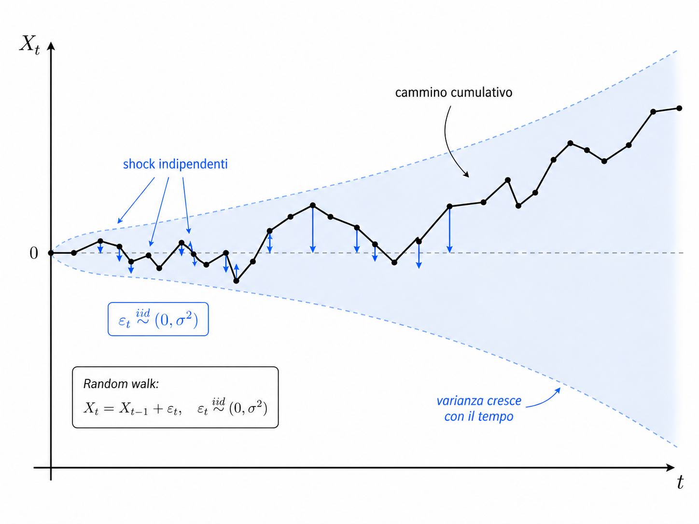{width=1.0\linewidth}

## Autoregressione: memoria dello stato

AR(1):

$$
X_{t+1}=c+aX_t+\eta_t.
$$

Se $|a|<1$:

$$
\mu=\frac{c}{1-a},
\qquad
X_{t+1}=\mu+a(X_t-\mu)+\eta_t.
$$

Per un AR(1) stazionario:

$$
\rho(k)=a^k.
$$

## 

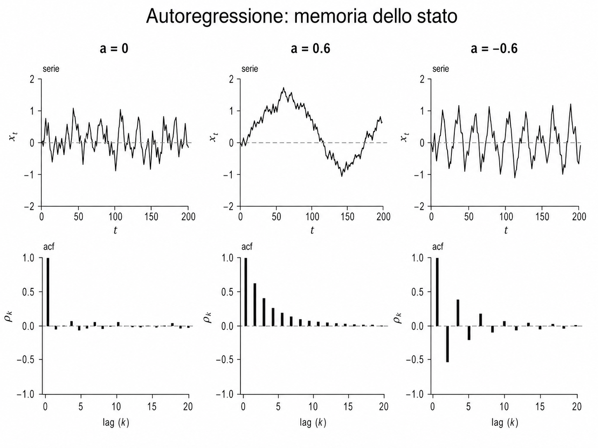{width=1.0\linewidth}

## AR(p): memoria distribuita

AR($p$):

$$
X_t=c+a_1X_{t-1}+a_2X_{t-2}+\dots+a_pX_{t-p}+\eta_t.
$$

Permette:

- oscillazioni smorzate;
- memoria su più ritardi;
- risposta più lenta agli shock;
- autocorrelazioni non puramente esponenziali.

## 

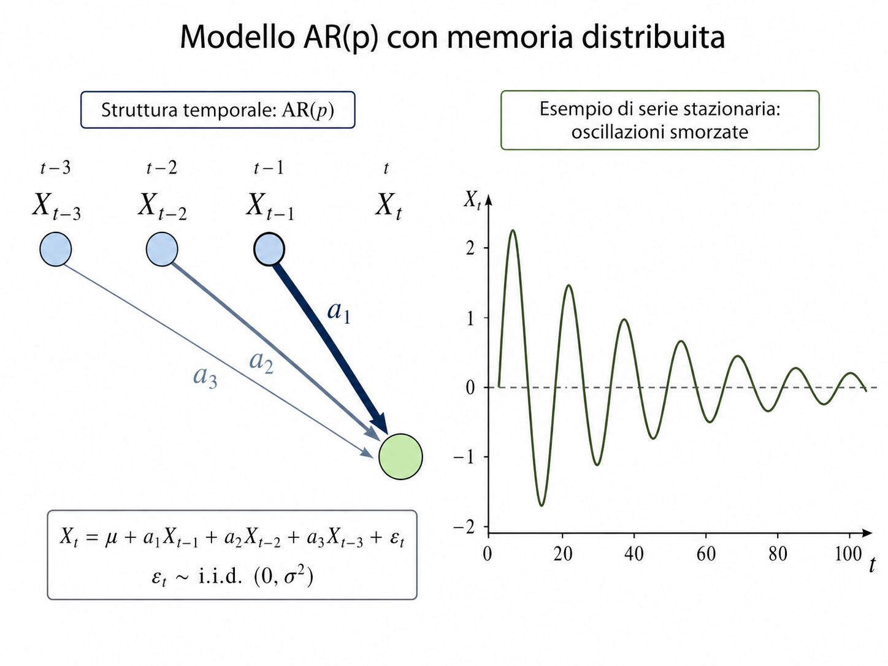{width=1.0\linewidth}

## MA: memoria degli shock

MA(1):

$$
X_t=\eta_t+b\eta_{t-1}.
$$

MA($q$):

$$
X_t=\eta_t+b_1\eta_{t-1}+\dots+b_q\eta_{t-q}.
$$

Differenza chiave: negli AR i valori passati sono osservati; nei MA gli shock passati sono latenti.

## 

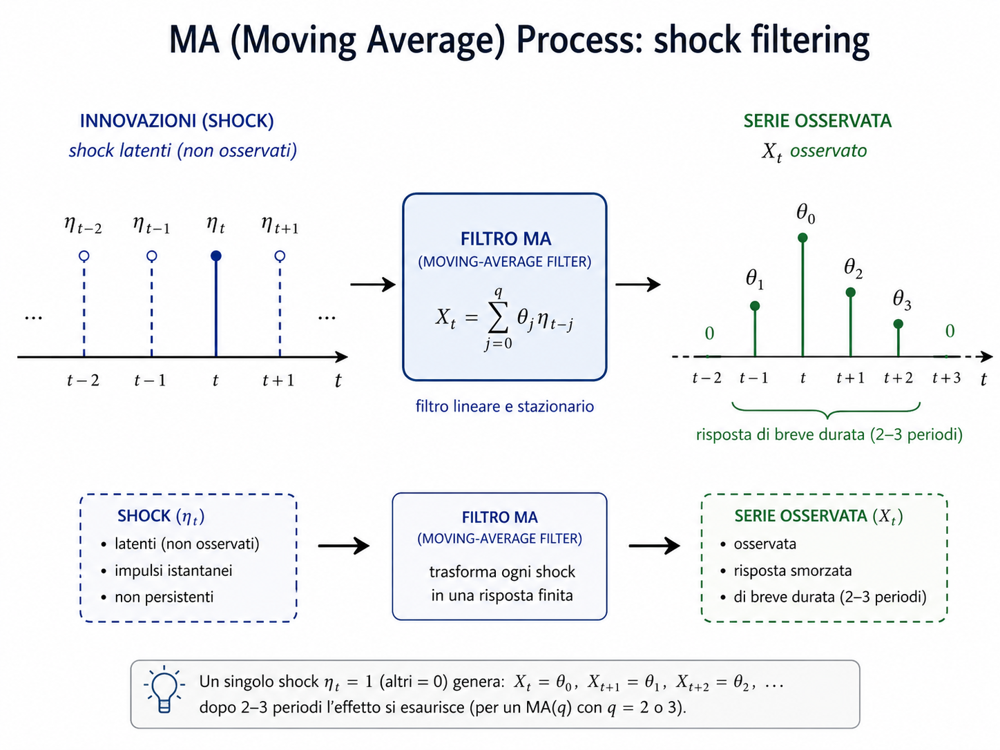{width=1.0\linewidth}

## ARMA: stato + shock persistenti

ARMA($p,q$):

$$
X_t=c+
\sum_{i=1}^p a_iX_{t-i}
+
\eta_t+
\sum_{j=1}^q b_j\eta_{t-j}.
$$

- AR: persistenza dello stato.
- MA: persistenza degli shock.
- ARMA: memoria lineare stazionaria più flessibile.

## 

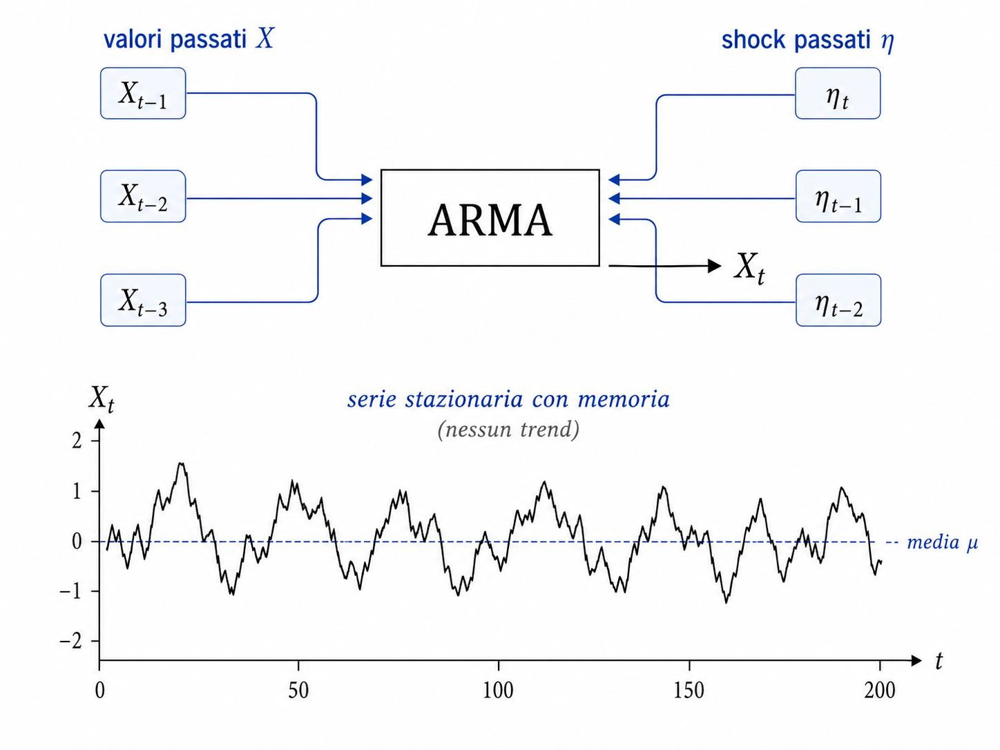{width=1.0\linewidth}

# Oltre la gaussiana

## Innovazioni non gaussiane

La parte dinamica può essere la stessa:

$$
X_t=c+aX_{t-1}+\eta_t.
$$

Ma la distribuzione di $\eta_t$ cambia il modello:

- gaussiana: riferimento semplice;
- Student-t: code pesanti;
- Laplace: picco centrale e code più pesanti;
- miscela: shock ordinari + shock rari.

Cambia direttamente la likelihood.

## 

{width=1.0\linewidth}

## Outlier e code pesanti

Segnali diagnostici:

- istogramma dei residui;
- QQ-plot contro gaussiana;
- frequenza di outlier normalizzati;
- stime instabili se si rimuovono pochi punti estremi.

Un modello gaussiano può essere fragile se pochi punti dominano la stima.

## 

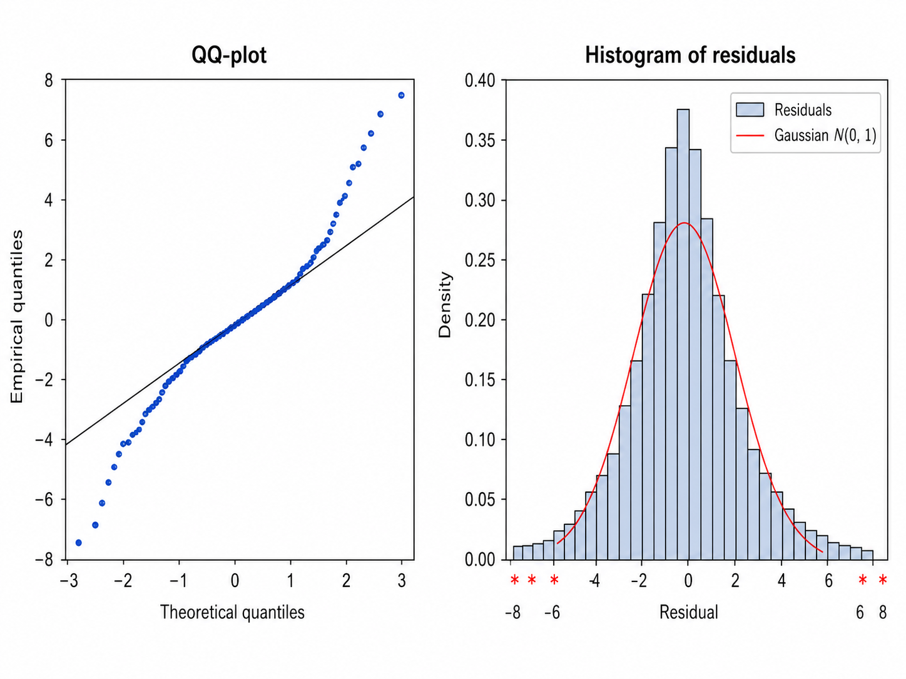{width=1.0\linewidth}

## Asimmetrie distributive

Shock positivi e negativi possono non essere simmetrici.

Esempi:

- collassi rari in popolazioni;
- burst positivi in segnali fisici;
- tempi di attesa con coda destra;
- conteggi con forte asimmetria.

La simmetria gaussiana è spesso un'assunzione troppo forte.

## 

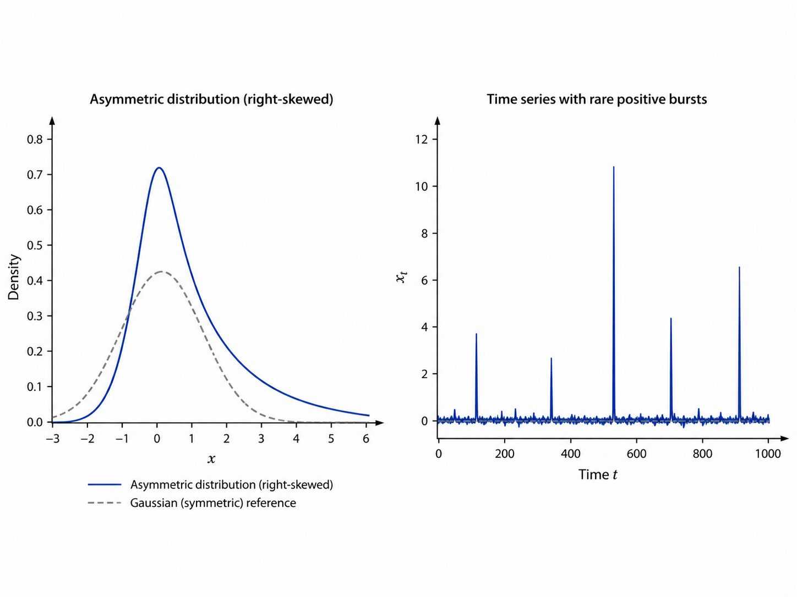{width=1.0\linewidth}

## Asimmetria dinamica

La risposta può cambiare sopra o sotto una soglia:

$$
X_{t+1}-\mu=
\begin{cases}
a_+(X_t-\mu)+\eta_t, \quad \text{se } X_t\ge \mu,\\
a_-(X_t-\mu)+\eta_t, \quad \text{se } X_t<\mu.
\end{cases}
$$

Se $a_+\ne a_-$, la dinamica è asimmetrica.

## 

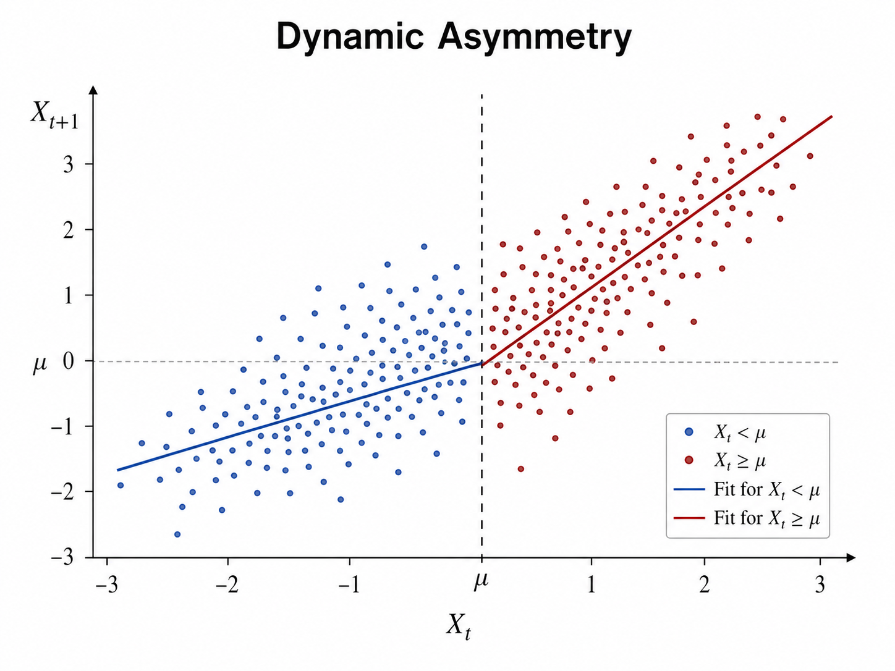{width=1.0\linewidth}

# Volatilità condizionata

## Quando la scala del rumore cambia

Possiamo non prevedere bene il segno:

$$
\mathbb{E}[X_{t+1}\mid\mathcal{F}_t]\approx 0,
$$

ma prevedere la scala:

$$
\mathrm{Var}(X_{t+1}\mid\mathcal{F}_t)=\sigma_t^2.
$$

Fenomeno: clustering della volatilità.

## 

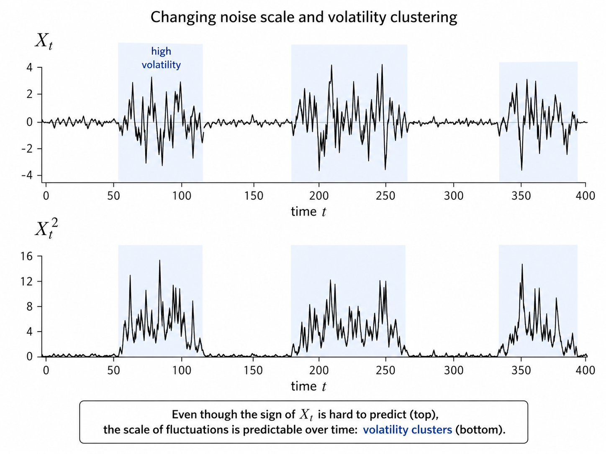{width=1.0\linewidth}

## ARCH: la varianza dipende dallo shock passato

ARCH(1):

$$
X_t=\sigma_t\eta_t,
\qquad
\sigma_t^2=\alpha_0+\alpha_1X_{t-1}^2.
$$

Se $X_{t-1}^2$ è grande, la varianza condizionata successiva aumenta.

La memoria non è necessariamente nella media, ma nella scala delle fluttuazioni.

## 

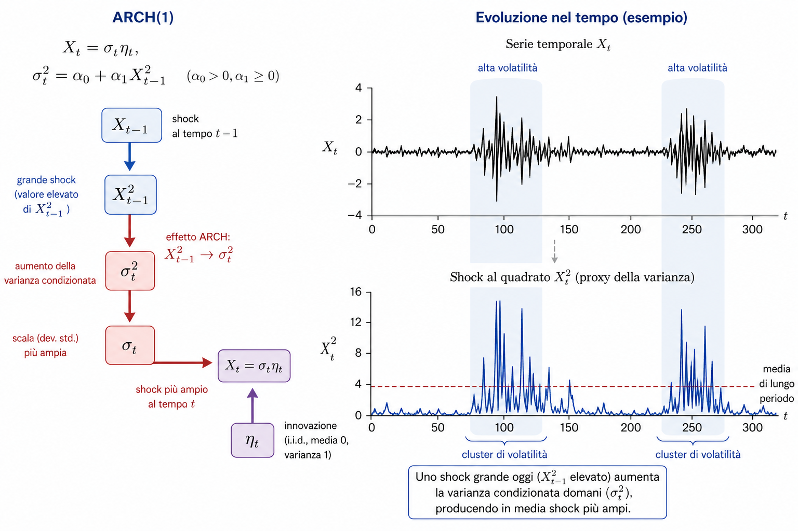{width=1.0\linewidth}

## GARCH: persistenza della volatilità

GARCH(1,1):

$$
X_t=\sigma_t\eta_t,
$$

$$
\sigma_t^2=
\alpha_0+
\alpha_1X_{t-1}^2+
\beta_1\sigma_{t-1}^2.
$$

La volatilità corrente dipende sia dallo shock passato sia dalla volatilità passata.

## 

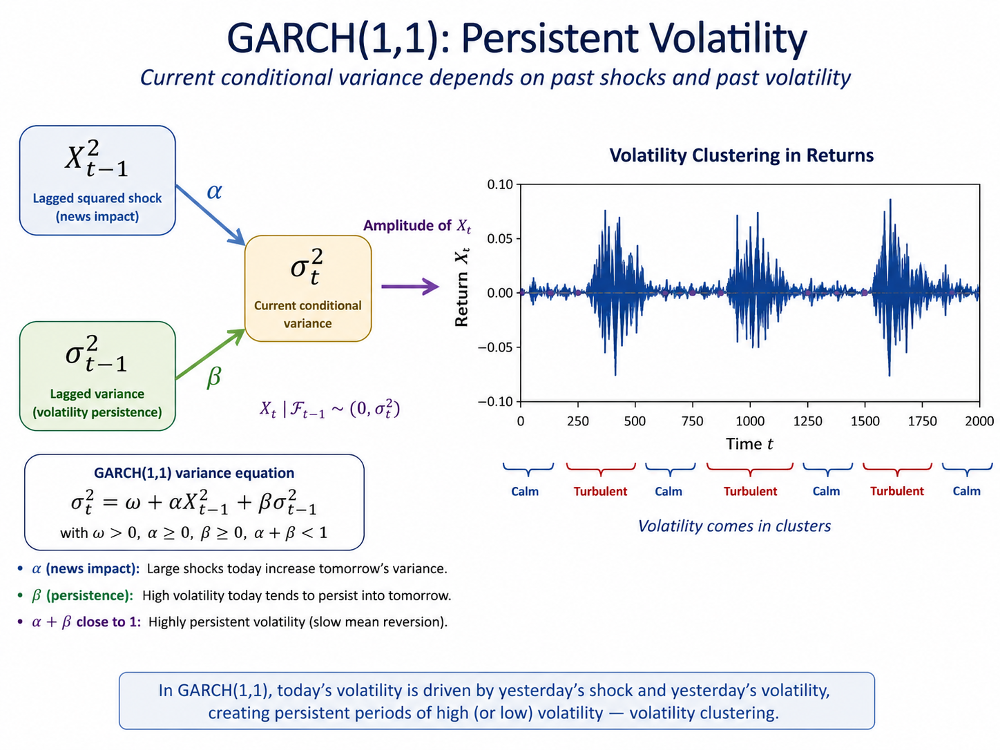{width=1.0\linewidth}

## Volatilità asimmetrica

Esempio schematico:

$$
\sigma_t^2 = \alpha_0 + \alpha_1X_{t-1}^2 +
\gamma X_{t-1}^2\,\mathbf{1}_{\{X_{t-1}<0\}} +
\beta_1\sigma_{t-1}^2.
$$

Se $X_{t-1}<0$, il coefficiente effettivo diventa $\alpha_1+\gamma$.

Se $\gamma>0$, shock negativi aumentano di più la volatilità futura.

## 

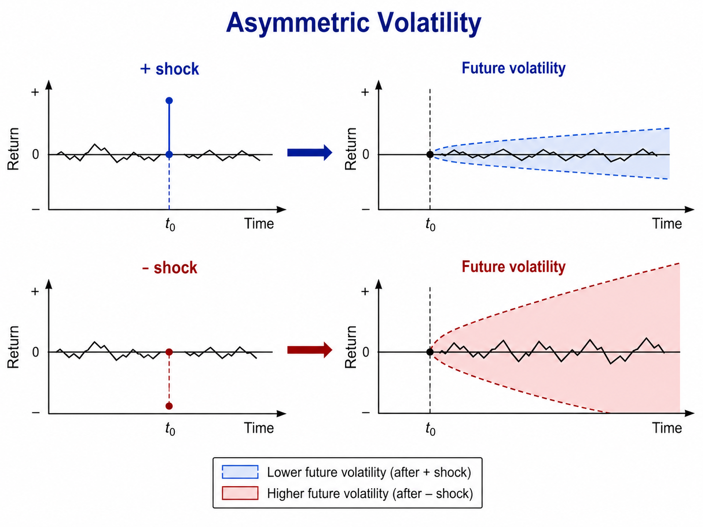{width=1.0\linewidth}

# Regimi, soglie, conteggi

## Modelli a soglia

Threshold AR:

$$
X_{t+1}=
\begin{cases}
c_1+a_1X_t+\eta_t, \quad \text{se } X_t\le r,\\
c_2+a_2X_t+\eta_t, \quad \text{se } X_t>r.
\end{cases}
$$

La dinamica cambia quando la serie attraversa una soglia.

## 

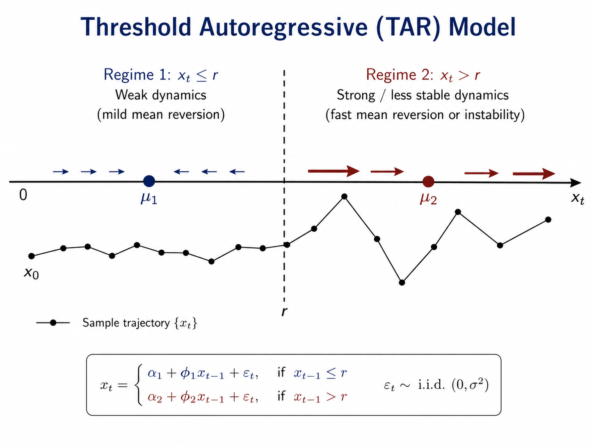{width=1.0\linewidth}

## Regimi latenti

Variabile nascosta:

$$
S_t\in\{1,2,\dots,K\}.
$$

Condizionatamente al regime:

$$
X_t=c_{S_t}+a_{S_t}X_{t-1}+\eta_t.
$$

Il regime $S_t$ può evolvere come una catena di Markov.

## 

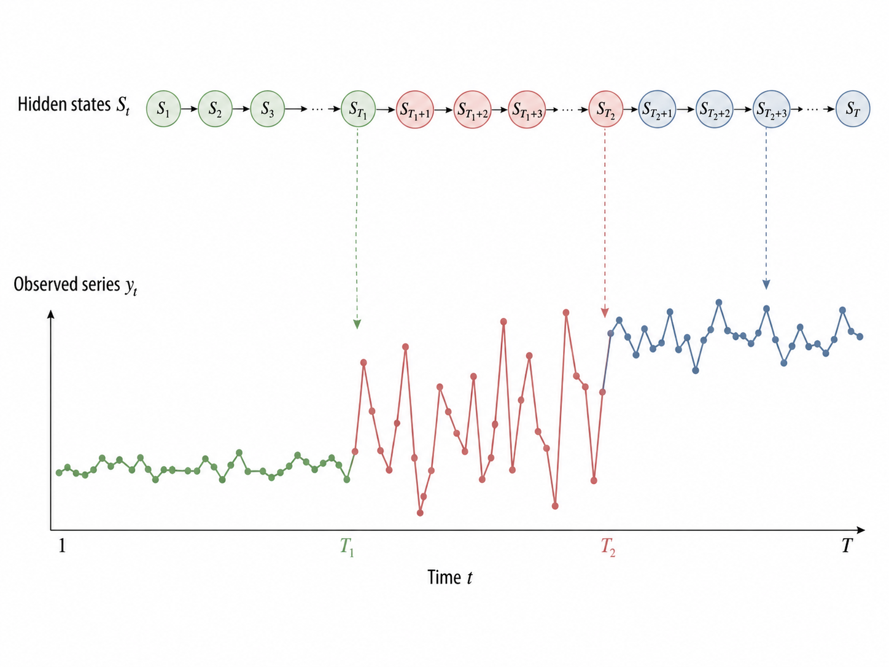{width=1.0\linewidth}

## Serie di conteggi

Per dati discreti non negativi:

$$
X_t\in\{0,1,2,\dots\}.
$$

Poisson condizionato:

$$
X_t\mid\mathcal{F}_{t-1}\sim\mathrm{Poisson}(\lambda_t),
$$

$$
\lambda_t=\omega+\alpha X_{t-1}+\beta\lambda_{t-1}.
$$

## 

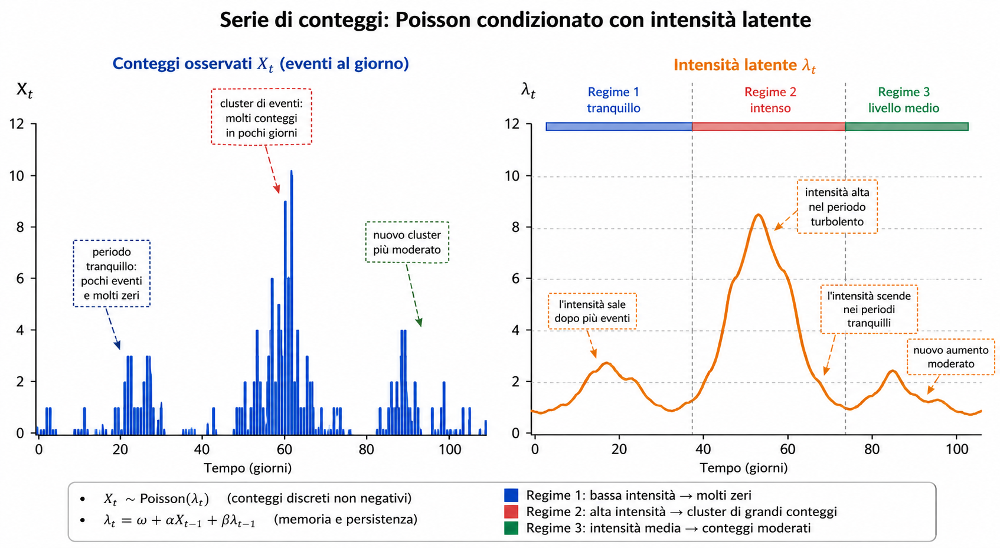{width=1.0\linewidth}

## Sovradispersione e binomiale negativa

Nel Poisson condizionato:

$$
\mathbb{E}[X_t\mid\mathcal{F}_{t-1}]
= \mathrm{Var}(X_t\mid\mathcal{F}_{t-1})
= \lambda_t.
$$

Se la varianza empirica supera la media: overdispersione.

Una scelta:

$$
X_t\mid\mathcal{F}_{t-1}\sim\mathrm{NegBin}(m_t,k),
$$

con

$$
\mathbb{E}[X]=m,
\qquad
\mathrm{Var}(X)=m+\frac{m^2}{k}.
$$

## 

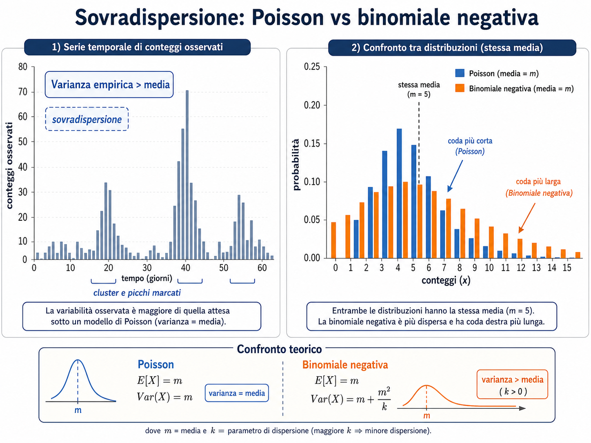{width=1.0\linewidth}

## Zeri in eccesso

Molte serie hanno più zeri di quanto previsto.

Idea zero-inflated:

- stato inattivo $\Rightarrow X_t=0$;
- stato attivo $\Rightarrow X_t$ segue Poisson o NegBin.

Utile quando attività e inattività sono parte della dinamica.

## 

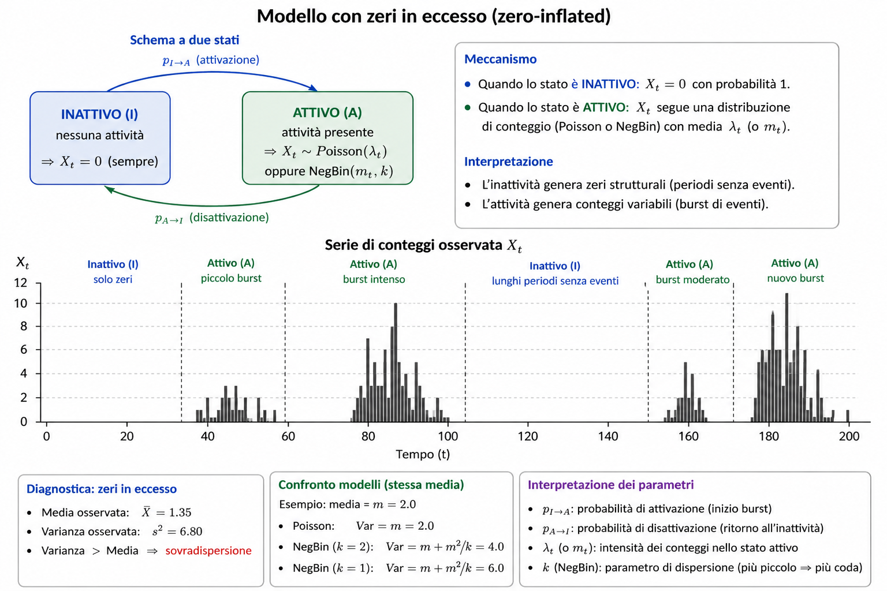{width=1.0\linewidth}

# Scegliere e validare un modello

## Mappa diagnostica

Domande:

1. Valori o incrementi?
2. Stazionario o non stazionario?
3. Memoria nei valori?
4. Memoria nei quadrati?
5. Code pesanti?
6. Asimmetria?
7. Soglie o regimi?
8. Conteggi o valori continui?

## 

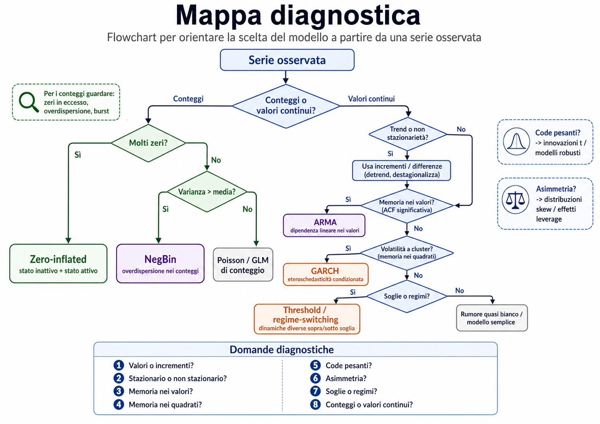{width=1.0\linewidth}

## Parsimonia e residui

Ciclo operativo:

$$
\text{modello}
\longrightarrow
\text{stima}
\longrightarrow
\text{residui}
\longrightarrow
\text{diagnostica}.
$$

Residuo grezzo:

$$
e_t=X_t-\widehat{\mathbb{E}}[X_t\mid\mathcal{F}_{t-1}].
$$

Residuo standardizzato:

$$
z_t=\frac{e_t}{\hat\sigma_t}.
$$

## 

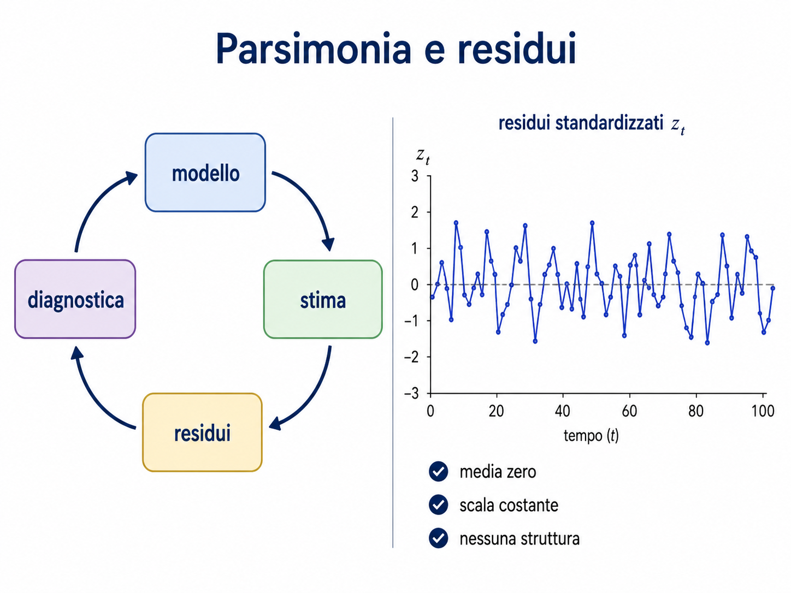{width=1.0\linewidth}

## Cosa deve sparire nei residui?

La diagnostica dei residui non si riduce a guardare se l’istogramma è gaussiano.
Un residuo può avere una distribuzione marginale quasi normale ma essere ancora temporalmente correlato.
Viceversa, una deviazione dall’istogramma gaussiano può indicare outlier, code pesanti o non stazionarietà, ma non identifica da sola una dipendenza temporale.

Per questo conviene controllare separatamente:
1. il segnale nel tempo;
2. la distribuzione dei valori;
3. l’autocorrelazione.

## 

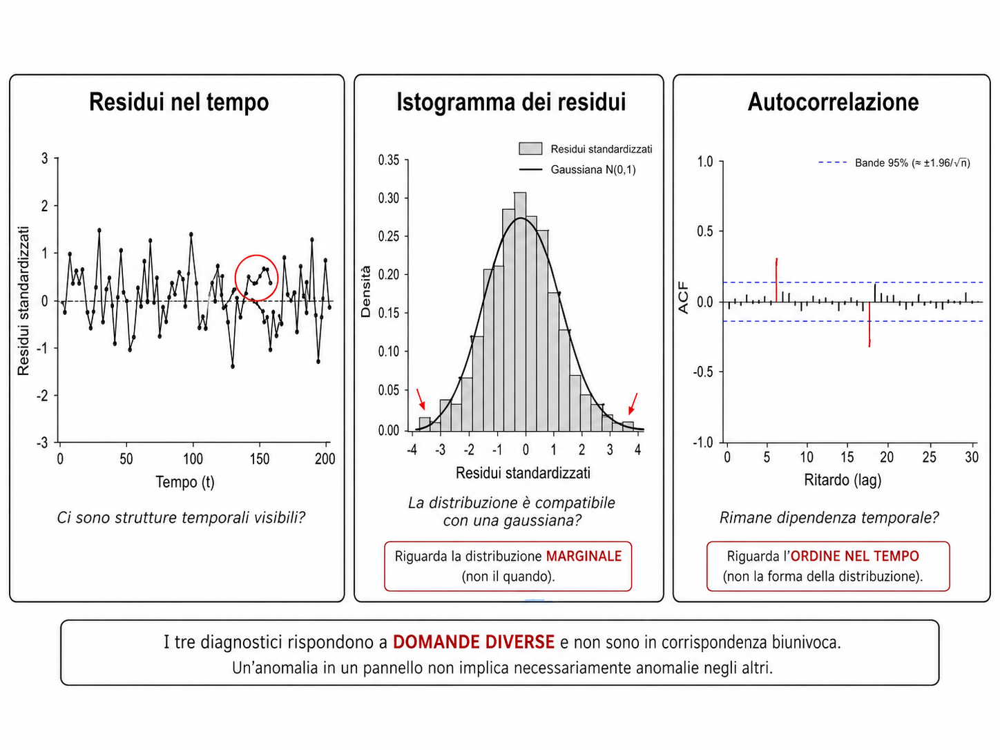{width=1.0\linewidth}

# Verso la likelihood

## La forma della likelihood dipende dal modello

Dati indipendenti:

$$
p(y_1,\dots,y_n\mid\theta)=\prod_i p(y_i\mid\theta).
$$
$$\quad$$

Serie temporale:

$$
p(x_0,\dots\mid\theta)
= p(x_0\mid\theta) \prod_{t=1}^T
p(x_t\mid x_{t-1},\dots;\theta).
$$

Ogni modello specifica una densità condizionata diversa.

## 

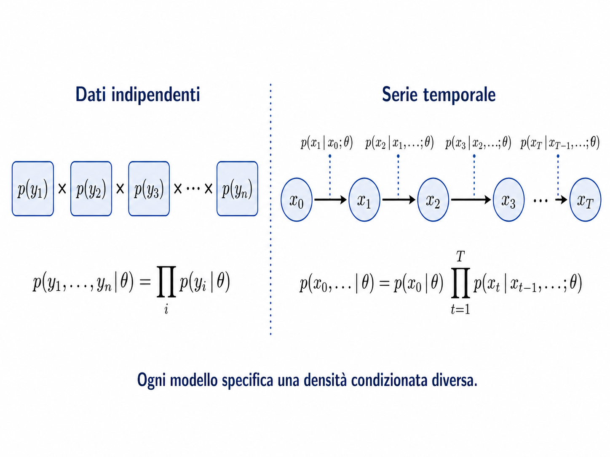{width=1.0\linewidth}

## Esempi di densità condizionate

AR(1) gaussiano:

$$
X_t\mid X_{t-1}\sim
\mathcal{N}(c+aX_{t-1},\sigma^2).
$$

GARCH:

$$
X_t\mid\mathcal{F}_{t-1}\sim
\mathcal{N}(0,\sigma_t^2).
$$

Conteggi:

$$
X_t\mid\mathcal{F}_{t-1}\sim\mathrm{Poisson}(\lambda_t).
$$

## 

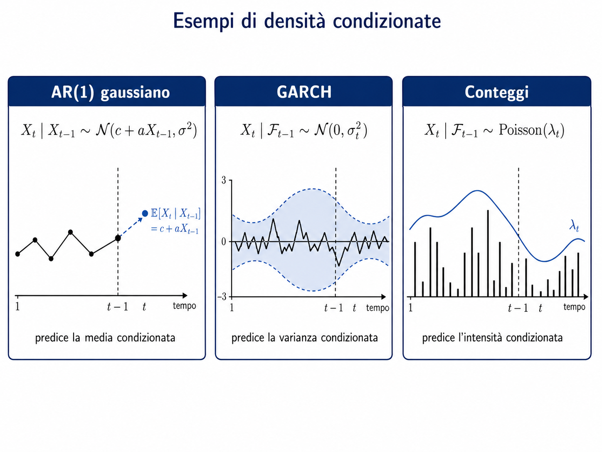{width=1.0\linewidth}

## Messaggio finale

La stima dei parametri non inizia dall'ottimizzazione numerica.

Inizia dalla scelta di una struttura probabilistica coerente con i dati.

Per una serie temporale dobbiamo decidere:

- cosa è prevedibile dal passato;
- cosa resta come innovazione;
- quale distribuzione hanno gli shock;
- se la varianza è costante o variabile;
- se esistono soglie, regimi o vincoli discreti.

## Chiusura

Una serie stocastica è una traiettoria osservata nel tempo.

La sua analisi richiede di modellare:

- dipendenza temporale;
- distribuzione degli shock;
- scala delle fluttuazioni;
- eventuali asimmetrie;
- soglie, regimi e conteggi.

Prossimo passo: stimare i parametri e criticare il modello.

## 

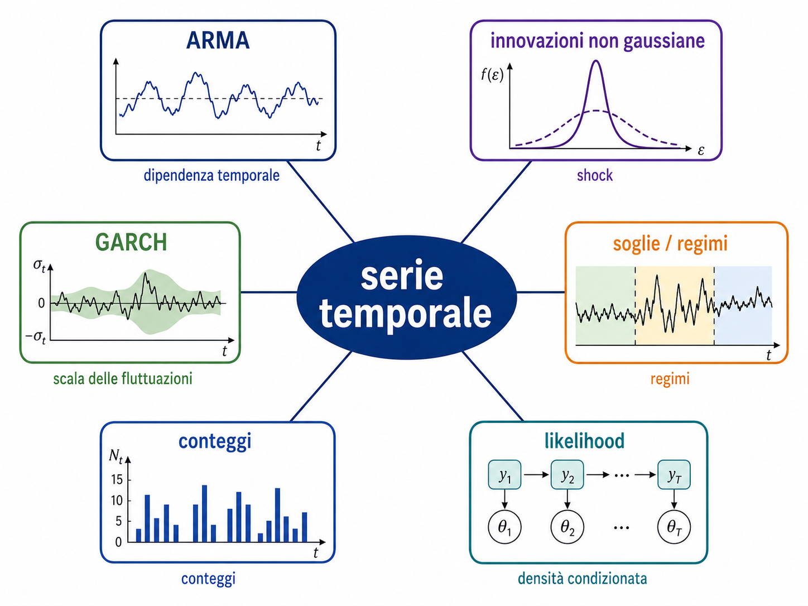{width=1.0\linewidth}
