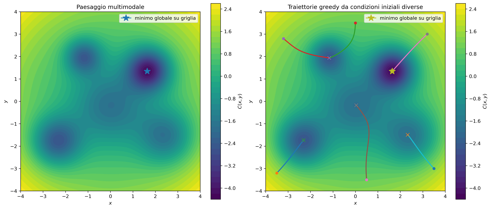
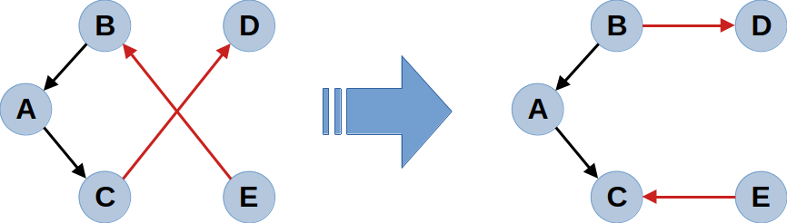
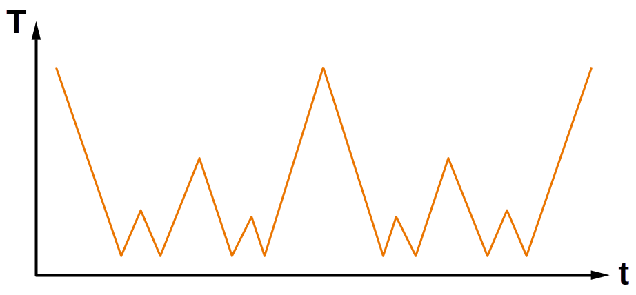
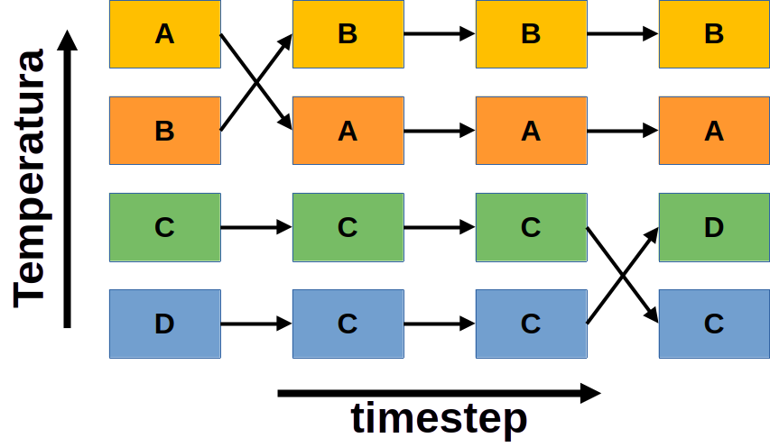
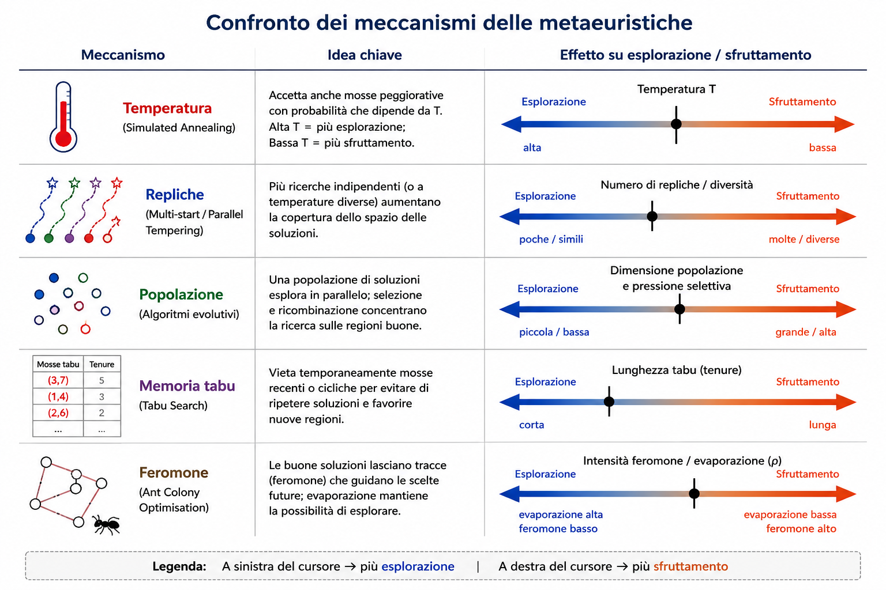

# Paesaggi complessi e metaeuristiche

## Obiettivo della lezione

Molti problemi computazionali possono essere scritti come

$$
x^\star = \arg\min_{x\in\mathcal{X}} C(x),
$$

ma lo spazio $\mathcal{X}$ può essere enorme, discreto, vincolato o irregolare.

**Domanda guida**

Come cerchiamo soluzioni buone quando non possiamo esplorare tutto lo spazio?

::: {.block}
Questa lezione introduce strategie per muoversi in paesaggi complessi: rumore, temperatura, repliche, popolazioni, memoria e tracce collettive.
:::

## Raccordo con le lezioni precedenti

- **Lec01**: paesaggi di potenziale, attrattori, barriere, bacini.
- **Lec03**: catene di Markov e Metropolis per campionare distribuzioni complesse.
- **Lec08**: log-likelihood e stima parametrica come problema di ottimizzazione.

Oggi mettiamo insieme questi fili:

$$
\text{paesaggio} + \text{rumore} + \text{ricerca} + \text{campionamento}.
$$

## Struttura della lezione

1. Perché servono metodi euristici e stocastici
2. Paesaggi complessi: dal continuo al combinatorio
3. Due esempi guida
4. Ricerca locale e limiti della discesa greedy
5. Metropolis a temperatura fissata
6. Simulated annealing
7. Parallel tempering
8. Genetic algorithms
9. Tabu search
10. Ant colony optimisation
11. Lettura unificante
12. Verso modelli probabilistici

# 1. Perché servono metodi euristici e stocastici

## Ricerca esaustiva e crescita combinatoria

Dato uno spazio finito

$$
\mathcal{X}=\{x_1,x_2,\dots,x_M\},
$$

la soluzione ideale sarebbe valutare $C(x)$ per ogni $x$.

Ma spesso $M$ cresce troppo rapidamente:

- configurazioni binarie: $2^N$;
- percorsi o permutazioni: $N!$;
- partizioni di una rete: numero enorme di possibilità;
- sottoinsiemi di variabili: $2^d$.

::: {.alertblock}
Non possiamo visitare tutto lo spazio. Dobbiamo scegliere dove guardare.
:::

## Il limite della logica greedy

Una discesa locale accetta solo mosse che migliorano il costo:

$$
C(y)<C(x).
$$

Funziona se il paesaggio è semplice, ma può bloccarsi in un minimo locale.

::: {.block}
In molti paesaggi complessi, per raggiungere una soluzione migliore bisogna attraversare configurazioni temporaneamente peggiori.
:::

**Problema**: una regola che migliora sempre localmente può impedire miglioramenti globali.

## Un lessico multidisciplinare

La stessa struttura appare con nomi diversi.

| Contesto | Quantità da minimizzare |
|---|---|
| Ricerca operativa | costo |
| Machine learning | loss |
| Statistica | negative log-likelihood |
| Fisica statistica | energia |
| Biologia computazionale | score negativo |
| Problemi inversi | distanza dai dati |

Nel seguito useremo $C(x)$ come nome neutro: costo, energia, loss o funzione obiettivo.

## Quando diventano utili le metaeuristiche

Le difficoltà emergono quando troviamo:

- molti minimi locali;
- vincoli di fattibilità;
- non convessità;
- gradienti assenti, costosi o poco informativi;
- valutazioni rumorose o basate su simulazioni;
- degenerazione: molte soluzioni quasi equivalenti;
- trade-off tra esplorazione e sfruttamento.

::: {.block}
Una metaeuristica non promette l'ottimo globale: offre una strategia adattabile per trovare soluzioni buone in tempi ragionevoli.
:::

# 2. Paesaggi complessi: dal continuo al combinatorio

## Dal potenziale al vicinato

In Lec01 un paesaggio continuo era descritto da $V(x)$ e dalla dinamica

$$
\dot x=-V'(x).
$$

Nel caso combinatorio non abbiamo derivate, ma possiamo definire un **vicinato**:

$$
\mathcal{N}(x)=\{\text{configurazioni raggiungibili con una mossa elementare}\}.
$$

Esempi:

- TSP: scambio o inversione di città;
- feature selection: aggiunta/rimozione di variabili;
- reti: aggiunta/rimozione di archi;
- clustering: spostamento di punti tra cluster.

## Minimi locali, barriere, bacini

Un minimo locale soddisfa

$$
C(x)\le C(y) \qquad \forall y\in\mathcal{N}(x).
$$

Un minimo globale soddisfa

$$
C(x^\star)\le C(x) \qquad \forall x\in\mathcal{X}.
$$

**Barriera**: regione di costo più alto che separa due regioni buone.

**Bacino di attrazione**: insieme delle condizioni iniziali che una certa dinamica porta nello stesso minimo locale.

::: {.alertblock}
Il bacino dipende dall'algoritmo, non solo dalla funzione $C(x)$.
:::

## Ruggedness e degenerazione

**Ruggedness**

- molti minimi locali;
- molte barriere;
- molte selle o altipiani;
- variazioni rapide della funzione obiettivo.

**Degenerazione**

- molte configurazioni diverse hanno costi simili;
- non c'è una sola soluzione chiaramente migliore;
- la famiglia delle soluzioni buone è parte del risultato.

::: {.block}
In inferenza, degenerazione e identificabilità debole sono spesso due facce dello stesso problema.
:::

## Esplorazione e sfruttamento

Ogni metodo bilancia due esigenze.

**Esplorazione**

- visitare regioni nuove;
- uscire dai bacini locali;
- scoprire alternative.

**Sfruttamento**

- raffinare soluzioni promettenti;
- migliorare localmente;
- concentrare il calcolo dove il costo è basso.

::: {.alertblock}
Troppa esplorazione disperde la ricerca. Troppo sfruttamento produce convergenza prematura.
:::

# 3. Due esempi guida

## Esempio A -- funzione 2D multimodale

Useremo una funzione visuale del tipo

$$
C(x,y)=a(x^2+y^2)-\sum_{k=1}^K A_k
\exp\!\left[-\frac{(x-x_k)^2+(y-y_k)^2}{2s_k^2}\right].
$$

Serve per mostrare:

- valli e barriere;
- minimi locali e globali;
- bacini di attrazione;
- traiettorie greedy;
- effetto della temperatura.

::: {.block}
È un esempio artificiale, ma molto utile per vedere la geometria del problema.
:::

## Esempio A -- funzione 2D multimodale

{width=92%}

## Esempio B -- TSP/routing

Dato un insieme di nodi, una configurazione è una permutazione

$$
\pi=(\pi_1,\dots,\pi_N),
$$

con costo

$$
C(\pi)=\sum_{i=1}^N d(\pi_i,\pi_{i+1}),\qquad \pi_{N+1}=\pi_1.
$$

Una mossa naturale è la **2-opt**: scambiare due archi, ad esempio naturale per:

- simulated annealing;
- tabu search;
- ant colony optimisation;
- genetic algorithms.

## Esempio B -- TSP/routing

{width=92%}

## Terzo richiamo -- likelihood multimodale

Useremo anche, come ponte concettuale, una negative log-likelihood

$$
C(\theta)=-\ell(\theta).
$$

Se $C(\theta)$ è multimodale, il problema non è solo trovare un massimo della likelihood.

Può diventare necessario esplorare:

- modi alternativi;
- regioni quasi equivalenti;
- incertezza sui parametri;
- non identificabilità.

::: {.block}
Questo prepara il passaggio da ottimizzazione a campionamento.
:::

# 4. Ricerca locale e limiti della discesa greedy

## Algoritmo greedy

```text
scegli x iniziale
ripeti:
    genera y nel vicinato di x
    se C(y) < C(x):
        x <- y
fino a quando nessuna mossa locale migliora C
```

Varianti:

- **first improvement**: accetta la prima mossa migliorativa;
- **best improvement**: valuta tutto il vicinato;
- **random local search**: propone mosse casuali;
- **steepest descent**: nel continuo, usa il gradiente.

## Quando funziona

La ricerca locale è spesso un ottimo primo passo.

- TSP: una 2-opt rimuove incroci inutili.
- Feature selection: togliere variabili irrilevanti può migliorare la generalizzazione.
- Scheduling: spostare attività può ridurre ritardi o conflitti.
- Fitting: piccoli aggiustamenti possono migliorare il fit.

::: {.block}
La ricerca locale non è il nemico: molte metaeuristiche la usano come componente interna.
:::

## Tre patologie

1. **Minimi locali**

   La ricerca si ferma anche se esistono soluzioni migliori lontane.

2. **Dipendenza dall'inizializzazione**

   Il risultato dipende dal bacino iniziale.

3. **Barriere**

   Per migliorare può essere necessario peggiorare temporaneamente.

::: {.alertblock}
La discesa greedy non attraversa barriere, perché rifiuta ogni peggioramento.
:::

## Cicli e oscillazioni

In varianti pratiche, soprattutto con costi rumorosi o soluzioni degeneri, si possono avere ritorni banali:

- una mossa viene annullata dalla successiva;
- una feature entra ed esce dal modello;
- un'attività torna nello slot precedente;
- un percorso TSP oscilla tra configurazioni simili.

Questo motiva i metodi con memoria, come **tabu search**.

# 5. Metropolis a temperatura fissata

## Regola di accettazione

Definiamo

$$
\Delta C=C(y)-C(x).
$$

La regola di Metropolis accetta la proposta $x\to y$ con probabilità

$$
p_{\mathrm{acc}}(x\to y)=\min\left(1,\exp\left[-\frac{\Delta C}{T}\right]\right).
$$

- se $\Delta C<0$, la mossa migliora: accetta sempre;
- se $\Delta C>0$, la mossa peggiora: accetta con probabilità positiva.

::: {.block}
Metropolis coincide con la ricerca greedy sulle mosse migliorative, ma può attraversare barriere.
:::

## Temperatura come parametro di esplorazione

Per una mossa peggiorativa:

$$
p_{\mathrm{acc}}=\exp[-\Delta C/T].
$$

- $T$ alta: esplorazione più libera;
- $T$ bassa: dinamica più selettiva;
- $T\to0$: limite quasi greedy;
- $T$ molto alta: camminata quasi casuale.

::: {.alertblock}
La temperatura è un parametro computazionale: controlla quanto siamo disposti a peggiorare per esplorare.
:::

## Metropolis come campionamento

A temperatura fissata, Metropolis campiona la distribuzione

$$
\pi_T(x)=\frac{1}{Z(T)}\exp\left[-\frac{C(x)}{T}\right].
$$

La normalizzazione

$$
Z(T)=\sum_x \exp[-C(x)/T]
$$

non serve nella regola di accettazione, perché si cancella nel rapporto.

::: {.block}
Metropolis non è ancora simulated annealing: a $T$ fissata è prima di tutto un metodo di campionamento.
:::

## Limiti pratici

Metropolis aiuta a uscire dai minimi locali, ma non risolve tutto.

- scelta delicata della temperatura;
- mixing lento se le barriere sono alte;
- dipendenza dalla proposta $q(y\mid x)$;
- campioni autocorrelati;
- possibili lunghi tempi di decorrelazione.

Questo prepara due sviluppi:

- **simulated annealing**: temperatura decrescente;
- **parallel tempering**: repliche a temperature diverse.

# 6. Simulated annealing

## Dal campionamento all'ottimizzazione

Simulated annealing usa Metropolis con temperatura variabile:

$$
T_0>T_1>\cdots>T_K.
$$

Idea:

- temperatura alta: esplorazione ampia;
- temperatura intermedia: attraversamento di barriere;
- temperatura bassa: raffinamento locale.

::: {.block}
Simulated annealing trasforma una dinamica di campionamento in una strategia di ottimizzazione approssimata.
:::

## Algoritmo

```text
scegli x iniziale
scegli T iniziale
ripeti:
    proponi una mossa x -> y
    calcola DeltaC = C(y) - C(x)
    accetta con probabilita min(1, exp(-DeltaC/T))
    aggiorna T secondo il cooling schedule
restituisci la migliore soluzione visitata
```

Nota pratica: spesso l'ultima configurazione non è la migliore. Si conserva $x_{\mathrm{best}}$.

## Cooling schedule

Uno schema comune è il raffreddamento geometrico:

$$
T_{n+1}=\alpha T_n,\qquad 0<\alpha<1.
$$

Altri schemi:

$$
T_n=\frac{T_0}{1+\beta n},
\qquad
T_n=\frac{T_0}{\log(n+n_0)}.
$$

::: {.alertblock}
Raffreddare troppo rapidamente produce una ricerca quasi greedy. Raffreddare troppo lentamente può essere computazionalmente proibitivo.
:::

## Tempering (W schedule)

{width=92%}

## Temperatura iniziale e finale

La temperatura iniziale deve essere confrontabile con la scala tipica dei peggioramenti.

Se un peggioramento tipico $\Delta C_{\mathrm{typ}}$ deve essere accettato con probabilità $p$, allora

$$
T_0\approx -\frac{\Delta C_{\mathrm{typ}}}{\log p}.
$$

La temperatura finale deve rendere rare le mosse peggiorative.

::: {.block}
La scelta delle temperature non è un dettaglio: determina la dinamica effettiva della ricerca.
:::

## Esempi naturali

Simulated annealing è naturale per:

- travelling salesman problem;
- scheduling;
- assegnamento;
- configurazioni di rete;
- ottimizzazione combinatoria;
- calibrazione grossolana di modelli.

Uso tipico nella calibrazione:

1. SA per esplorare globalmente;
2. ottimizzatore locale per rifinire;
3. diagnostiche statistiche per validare.

# 7. Parallel tempering

## Il limite di una singola traiettoria

Simulated annealing segue una sola traiettoria.

Se entra troppo presto in un bacino locale, può non uscirne più.

Parallel tempering usa una strategia diversa:

$$
T_1<T_2<\cdots<T_R.
$$

- repliche fredde: regioni a basso costo;
- repliche calde: attraversamento di barriere;
- scambi: comunicazione tra esplorazione e raffinamento.

::: {.block}
Non raffreddo una traiettoria: faccio cooperare più traiettorie a temperature diverse.
:::

## Repliche e distribuzioni temperate

La replica $r$ campiona

$$
\pi_{T_r}(x)\propto \exp[-C(x)/T_r].
$$

Le repliche calde appiattiscono il paesaggio e si muovono più facilmente tra modi.

Le repliche fredde sono selettive e campionano regioni di costo basso.

::: {.alertblock}
Il metodo è utile quando il problema centrale è la multimodalità.
:::

## Scambio tra repliche

Si propone uno scambio

$$
(x_i,x_j)\longrightarrow (x_j,x_i).
$$

La probabilità di accettazione è

$$
p_{\mathrm{swap}}=
\min\left(1,
\exp\left[
\left(\frac{1}{T_i}-\frac{1}{T_j}\right)
\left(C(x_i)-C(x_j)\right)
\right]
\right).
$$

Gli scambi permettono a configurazioni generate a temperatura alta di arrivare alle repliche fredde.

## Parallel Tempering

{width=92%}

## Diagnostiche

Controlli pratici:

- tasso di accettazione degli scambi;
- movimento delle configurazioni lungo la scala delle temperature;
- visita di modi differenti;
- autocorrelazione dei campioni;
- stabilità tra run indipendenti.

Una regola pratica è cercare scambi non rari tra repliche adiacenti; in molte applicazioni si mira a tassi dell'ordine del 20--40%, ma il valore ottimale dipende dal problema.

## Esempi

Parallel tempering è naturale per:

- posteriori bayesiane multimodali;
- fitting con parametri non identificabili;
- clustering con molte partizioni plausibili;
- modelli su reti;
- problemi biologici con molte configurazioni compatibili.

::: {.block}
Se serve una singola buona soluzione, SA può bastare. Se serve esplorare più modi, PT è più coerente.
:::

# 8. Genetic algorithms

## Dalla traiettoria alla popolazione

Un genetic algorithm mantiene una popolazione:

$$
\mathcal{P}^{(g)}=\{x_1^{(g)},\dots,x_N^{(g)}\}.
$$

Non segue una singola traiettoria, ma una dinamica collettiva:

$$
\mathcal{P}^{(0)}\to \mathcal{P}^{(1)}\to\cdots.
$$

Ingredienti:

- popolazione;
- fitness;
- selezione;
- crossover;
- mutazione;
- elitismo.

## Fitness e rappresentazione

Serve una codifica delle soluzioni.

Esempi:

- feature selection: stringa binaria;
- TSP: permutazione;
- portafoglio: pesi continui più vincoli;
- reti: matrice di adiacenza o lista di archi;
- modelli agent-based: parametri discreti e continui.

La fitness $F(x)$ misura quanto una soluzione è promettente. Per un problema di minimizzazione si può usare, ad esempio,

$$
F(x)=-C(x).
$$

## Schema generale

```text
inizializza una popolazione
valuta la fitness
ripeti:
    seleziona genitori
    applica crossover
    applica mutazione
    valuta i figli
    costruisci la nuova popolazione
    conserva eventualmente i migliori
restituisci la migliore soluzione trovata
```

::: {.block}
La diversità della popolazione è una risorsa computazionale.
:::

## Esplorazione e sfruttamento

Nei GA il compromesso non è controllato da un solo parametro.

- selezione: sfruttamento;
- elitismo: conservazione delle soluzioni buone;
- mutazione: esplorazione;
- crossover: ricombinazione di componenti promettenti;
- dimensione della popolazione: diversità e costo.

::: {.alertblock}
La flessibilità dei GA è anche il loro rischio: se codifica, crossover e mutazione non incorporano la struttura del problema, l'algoritmo può ridursi a una ricerca casuale costosa.
:::

## Quando sono naturali

- feature selection;
- design di reti;
- scelta di strategie;
- ottimizzazione di portafoglio;
- calibrazione di modelli agent-based;
- problemi misti discreto-continuo.

Patologia principale: **convergenza prematura**.

Segnali:

- individui quasi identici;
- fitness media vicina alla migliore;
- nessun miglioramento per molte generazioni.

# 9. Tabu search

## Memoria al posto del rumore

Tabu search resta vicina alla ricerca locale, ma aggiunge memoria.

Idea:

- eseguo una mossa;
- vieto temporaneamente di annullarla;
- continuo a muovermi anche se la migliore mossa ammissibile peggiora il costo.

::: {.block}
Non sempre serve più rumore: a volte serve ricordare dove siamo già stati.
:::

## Lista tabu e tabu tenure

La lista tabu contiene mosse, configurazioni o attributi temporaneamente proibiti.

Esempi:

- vietare la mossa inversa;
- vietare certi archi rimossi o aggiunti;
- vietare una riassegnazione recente;
- vietare una coppia compito-risorsa.

La durata della proibizione è la **tabu tenure**.

## Algoritmo

```text
scegli x iniziale
lista tabu vuota
x_best <- x
ripeti:
    genera il vicinato N(x)
    rimuovi o penalizza mosse tabu
    scegli la migliore mossa ammissibile x -> y
    x <- y
    aggiorna lista tabu
    se C(x) < C(x_best):
        x_best <- x
restituisci x_best
```

La mossa scelta può peggiorare il costo: la memoria forza la ricerca a non tornare subito indietro.

## Aspirazione, intensificazione, diversificazione

**Criterio di aspirazione**

Una mossa tabu può essere ammessa se produce una soluzione migliore della migliore trovata finora:

$$
C(y)<C(x_{\mathrm{best}}).
$$

**Intensificazione**

Concentrare la ricerca attorno ad attributi frequenti nelle buone soluzioni.

**Diversificazione**

Spingere la ricerca verso regioni poco visitate.

## Esempi

Tabu search è naturale per problemi combinatori con mosse locali chiare:

- scheduling;
- assegnamento;
- vehicle routing;
- TSP;
- ottimizzazione su grafi;
- allocazione di risorse.

::: {.alertblock}
La memoria modifica la dinamica: non cambia il costo, ma cambia quali mosse sono disponibili.
:::

# 10. Ant colony optimisation

## Memoria distribuita

Ant colony optimisation usa molti agenti che costruiscono soluzioni passo dopo passo.

Le soluzioni buone lasciano una traccia, il **feromone**, che orienta le scelte successive.

::: {.block}
La memoria non è una lista centrale: è distribuita nell'ambiente condiviso.
:::

Concetto chiave: **stigmergia**.

Gli agenti coordinano le proprie scelte modificando l'ambiente, non comunicando direttamente.

## Scelta probabilistica

Se un agente si trova nel nodo $i$, sceglie il nodo $j$ con probabilità

$$
P_{ij}=\frac{\tau_{ij}^{\alpha}\eta_{ij}^{\beta}}
{\sum_{k\in\mathcal{A}(i)}\tau_{ik}^{\alpha}\eta_{ik}^{\beta}}.
$$

Dove:

- $\tau_{ij}$: feromone sull'arco;
- $\eta_{ij}$: informazione euristica locale, ad esempio $1/d_{ij}$;
- $\alpha$: peso del feromone;
- $\beta$: peso dell'euristica.

I feromoni si inizializzano a un valore positivo, per evitare probabilità nulle premature.

## Evaporazione e rinforzo

Aggiornamento tipico:

$$
\tau_{ij}\leftarrow (1-\rho)\tau_{ij}+\Delta\tau_{ij}.
$$

- evaporazione: dimentica tracce vecchie;
- rinforzo: valorizza componenti di buone soluzioni.

Nel TSP:

$$
\Delta\tau_{ij}^{(a)}=
\begin{cases}
Q/L_a, & \text{se l'agente } a \text{ usa } (i,j),\\
0, & \text{altrimenti.}
\end{cases}
$$

## Schema generale

```text
inizializza il feromone
ripeti:
    per ogni agente:
        costruisci una soluzione passo dopo passo
    valuta le soluzioni
    evapora il feromone
    rinforza componenti delle soluzioni buone
    aggiorna la migliore soluzione trovata
restituisci la migliore soluzione
```

Patologia principale: **stagnazione**.

Tutti gli agenti seguono troppo presto le stesse componenti.

## Esempi

ACO è naturale per problemi costruiti come sequenze di scelte locali:

- shortest path;
- TSP;
- routing su reti;
- logistica;
- flussi;
- percorsi in infrastrutture;
- reti di comunicazione.

Confronto rapido:

- tabu search: memoria negativa, evita ritorni;
- ACO: memoria positiva, rinforza componenti promettenti.

# 11. Lettura unificante

## Tabella comparativa

| Metodo | Meccanismo | Oggetto mantenuto | Rischio |
|---|---|---|---|
| Metropolis | rumore a $T$ fissata | una catena | mixing lento |
| Simulated annealing | temperatura decrescente | una traiettoria | schedule mal calibrato |
| Parallel tempering | repliche a $T$ diverse | molte catene | scambi rari |
| Genetic algorithms | selezione/mutazione | popolazione | convergenza prematura |
| Tabu search | memoria esplicita | traiettoria + lista | memoria mal calibrata |
| Ant colony | feromone | agenti + tracce | stagnazione |

## Singola traiettoria, repliche, popolazioni

**Singola traiettoria**

- ricerca locale;
- Metropolis;
- simulated annealing;
- tabu search.

**Molte repliche**

- parallel tempering.

**Popolazione/agenti**

- genetic algorithms;
- ant colony optimisation.

::: {.block}
La differenza non è solo tecnica: cambia il modo in cui l'algoritmo conserva informazione sulla ricerca.
:::

## Rumore, temperatura, memoria

- Metropolis: rumore controllato.
- Simulated annealing: rumore che diminuisce nel tempo.
- Parallel tempering: rumore a scale diverse, con scambi.
- Genetic algorithms: memoria nella popolazione.
- Tabu search: memoria esplicita di mosse recenti.
- Ant colony: memoria distribuita nel feromone.

::: {.alertblock}
Gli algoritmi sono diversi modi di gestire lo stesso trade-off: esplorare senza disperdersi, sfruttare senza bloccarsi.
:::

## Ottimizzazione vs campionamento

**Ottimizzazione**

Cerco una soluzione buona:

$$
x^\star \approx \arg\min_x C(x).
$$

Naturale per SA, GA, tabu, ACO.

**Campionamento**

Voglio esplorare una distribuzione:

$$
\pi_T(x)\propto \exp[-C(x)/T].
$$

Naturale per Metropolis e parallel tempering.

::: {.block}
Trovare una buona soluzione non significa aver campionato bene; campionare bene non significa trovare rapidamente il minimo.
:::

## Quale metodo scegliere?

- **Percorsi su grafo**: ACO, tabu search, SA.
- **Combinatorio con mosse locali chiare**: tabu search, SA.
- **Variabili miste discreto-continuo**: GA, strategie ibride.
- **Distribuzioni multimodali**: parallel tempering.
- **Continuo black-box**: Metropolis, SA, PT.
- **Continuo con gradienti e alta dimensione**: HMC, nella lezione successiva.

::: {.alertblock}
Non chiedersi quale algoritmo è migliore in astratto. Chiedersi quale meccanismo di esplorazione è adatto alla struttura del problema.
:::

## Errori comuni

- usare un algoritmo sofisticato senza baseline semplice;
- confondere ottimizzazione e campionamento;
- interpretare una singola soluzione come unica;
- trascurare tuning e diagnostiche;
- non verificare stabilità tra run indipendenti;
- prendere troppo alla lettera metafore come temperatura, evoluzione o feromone.

Per il laboratorio: non proveremo tutto. Meglio confrontare poche strategie sullo stesso problema, osservando traiettorie, qualità delle soluzioni e sensibilità ai parametri.

## Confronto dei meccanismi

{width=96%}


