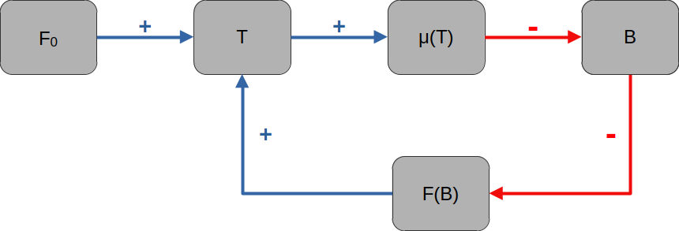

Questa nota costruisce un modello minimale accoppiato tra una variabile climatica scalare $T(t)$ (temperatura oppure *anomalia di temperatura* media globale rispetto a un riferimento) e una variabile biosferica scalare $B(t)$ (biomassa forestale o carbonio in biomassa), con due obiettivi:

1. rappresentare **non linearità e regimi multipli** (tipping) in entrambi i sottosistemi;
2. introdurre un accoppiamento bidirezionale $T \leftrightarrow B$ che consenta **transizioni a cascata** (cascading tipping).

Il modello è intenzionalmente fenomenologico: non è un modello climatico realistico, ma un *toy model* adatto ad analisi qualitativa, biforcazioni e confronto deterministico/stocastico.

# 1. Bilancio energetico e dinamica della temperatura

## 1.1 Punto di partenza: energia entrante meno energia uscente
Un modello molto semplificato della temperatura media globale parte dal bilancio energetico:
$$
C\,\frac{dT}{dt} = \mathcal{I}(T) - \mathcal{O}(T),
$$
dove $C>0$ è una capacità termica efficace, $\mathcal{I}$ è la potenza assorbita ("shortwave") e $\mathcal{O}$ è la potenza emessa ("longwave"). La dipendenza non lineare puo` emergere, ad esempio, da:

- feedback radiativi (vapore acqueo, nuvole),
- dipendenza dell'albedo dalla copertura di ghiaccio,
- saturazioni e vincoli fisici.

In un *toy model* non vogliamo ricostruire tutti i termini, ma catturare l'esistenza di piu` regimi stabili.

## 1.2 Espansione locale e forma di Landau
Vicino a un punto di riferimento e in presenza di simmetria (o quasi-simmetria) rispetto a $T=0$, una descrizione standard è una dinamica "alla Landau":
$$
\frac{dT}{dt} = aT - bT^3 + F,
$$
dove:

- $a$ rappresenta la parte lineare dei feedback (se $a>0$ l'origine è instabile),
- $b>0$ è un termine stabilizzante di saturazione,
- $F$ è un forcing esterno (radiazione efficace, CO$_2$, etc.) che inclina il paesaggio.

Questa forma ammette piu` equilibri e biforcazioni saddle--node al variare di $F$.

## 1.3 Interpretazione come dinamica di gradiente
La dinamica puo` essere scritta come gradiente di un potenziale:

$$
\frac{dT}{dt} = -\frac{dV}{dT},
\qquad
V(T) = -\frac{a}{2}T^2 + \frac{b}{4}T^4 - FT.
$$

- Per $F=0$ e $a>0$, $V$ ha tipicamente un **double well** (due minimi stabili).
- Per $F \ne 0$, il potenziale è inclinato (tilted double well).
- A valori critici di $F$ uno dei minimi scompare (tipping saddle--node).

# 2. Dinamica della biomassa: crescita con soglia (effetto *Allee*)

## 2.1 Idea di base: crescita limitata e rigenerazione sotto soglia
La biomassa $B(t)$ viene modellata con tre ingredienti:

1. crescita proporzionale a $B$ (approssimazione di crescita per capita);
2. saturazione per competizione/limiti di risorsa (fattore logistico);
3. **soglia di rigenerazione**: sotto una quantitá critica la biomassa non si auto-sostiene (effetto *Allee*).[^Allee]

Una forma minimale è:

$$
\frac{dB}{dt}
=
r\,B\Big(1-\frac{B}{K}\Big)\Big(\frac{B}{A}-1\Big) - \mu\,B,
$$

dove:

- $r>0$ è un tasso di crescita,
- $K>0$ è una capacità portante (limite di biomassa),
- $A \in (0,K)$ è la soglia Allee (rigenerazione sotto soglia),
- $\mu \ge 0$ rappresenta una perdita netta (mortalità, stress, disturbi mediati).

[^Allee]: L’effetto Allee descrive una situazione in cui la crescita di una popolazione o biomassa non è massima a basse densità, ma richiede una **densità minima critica** per essere positiva. Sotto questa soglia, il sistema non riesce a sostenersi e tende a collassare. Le cause biologiche tipiche includono:

- difficoltà di riproduzione a basse densità;
- cooperazione ecologica (impollinazione, dispersione semi);
- protezione collettiva o modifiche dell’habitat create dalla popolazione stessa.

## 2.2 Interpretazione dei termini
In assenza di mortalità:
- $B$ introduce un equilibrio $B_0=0$.
- $(1-B/K)$ introduce un equilibrio $B_K=K$ legato a saturazione e competizione.
- $(B/A - 1)$ introduce un **equilibrio instabile** $B_A=A$ (seleziona una soglia).

Il termine di mortalitá $-\mu B$ sposta il bilancio crescita--perdita e puo` distruggere l'equilibrio $B_K$ ad alta biomassa.

Questa equazione è un *toy model* che produce isteresi e tipping ecologico in modo molto controllato.

# 3. Accoppiamento bidirezionale $T \leftrightarrow B$

L'accoppiamento deve essere:

- semplice (pochi parametri),
- interpretabile,
- capace di generare feedback.

## 3.1 Effetto del clima sulla biomassa: $T \to B$
Il clima agisce come stress che aumenta le perdite o riduce la crescita. La scelta piu` semplice è rendere $\mu$ dipendente da $T$:

$$
\mu(T) = \mu_0 + \mu_1\,\phi(T),
\qquad \mu_0 \ge 0,\ \mu_1 \ge 0,
$$

dove $\phi(T)$ è crescente. In un modello minimale si puo` prendere:

- $\phi(T)=T$ se $T$ è un'anomalia centrata su ivalori medi della temperatura[^soglia_centr] e l'intervallo operativo è tale da mantenere $\mu(T)\ge 0$;
- oppure $\phi(T)=\max(T,0)$ per evitare perdite negative;
- oppure una forma "saturante" tipo sigmoide se si vuole una soglia fisiologica [^soglia_fisio].

Nel seguito useremo la forma lineare (con la nota pratica su $\mu(T)\ge 0$):
$$
\mu(T)=\mu_0+\mu_1 T.
$$
La dinamica della biomassa diventa:
$$
\frac{dB}{dt} = r\,B\Big(1-\frac{B}{K}\Big)\Big(\frac{B}{A}-1\Big) - (\mu_0+\mu_1 T)\,B.
$$
Interpretazione: temperature piu` alte aumentano mortalità/stress, spostando la biomassa verso il collasso sotto soglia.

## 3.2 Effetto della biomassa sul clima: $B \to T$
La foresta influenza il clima attraverso diversi meccanismi (carbon sink, albedo, evapotraspirazione). Nel toy model li riassumiamo come una correzione al forcing efficace:
$$
F(B)=F_0-\gamma\,\psi(B),
\qquad \gamma \ge 0,
$$
dove $\psi(B)$ è crescente e saturante. La scelta più semplice è una normalizzazione lineare (senza saturazione):
$$
\psi(B)=\frac{B}{K}.
$$
ovvero:
$$
F(B)=F_0-\gamma\frac{B}{K}.
$$
Interpretazione: piu` biomassa (maggiore assorbimento o raffreddamento biosferico) riduce il forcing efficace; perdita di biomassa aumenta il forcing e tende a scaldare.

# 4. Sistema accoppiato finale (versione minimale)

Combinando i due accoppiamenti otteniamo:
$$
\frac{dT}{dt} = aT - bT^3 + F_0 - \gamma\frac{B}{K},
$$
$$
\frac{dB}{dt} = r\,B\Big(1-\frac{B}{K}\Big)\Big(\frac{B}{A}-1\Big) - (\mu_0+\mu_1 T)\,B.
$$
Parametri:

- clima: $a$, $b>0$, $F_0$;
- feedback biosfera su clima: $\gamma \ge 0$;
- foresta: $r>0$, $K>0$, $A \in (0,K)$, $\mu_0 \ge 0$;
- stress climatico su foresta: $\mu_1 \ge 0$.

Nota di consistenza: se si vuole garantire $\mu(T)\ge 0$ per ogni traiettoria, si puo` usare $\mu(T)=\mu_0+\mu_1\max(T,0)$ oppure una saturazione $\phi(T)$.

# 5. Struttura qualitativa: regimi, tipping e cascate

## 5.1 Equilibri
Gli equilibri $(T^*,B^*)$ soddisfano il sistema algebrico:

$$
0 = aT^* - b(T^*)^3 + F_0 - \gamma\frac{B^*}{K},
$$
$$
0 = r\,B^*\Big(1-\frac{B^*}{K}\Big)\Big(\frac{B^*}{A}-1\Big) - (\mu_0+\mu_1 T^*)\,B^*.
$$
Osservazioni immediate:

- $B^*=0$ è sempre soluzione della seconda equazione.
- Con $B^*>0$, la seconda equazione si riduce a una condizione sul bilancio crescita--perdita:
  $$ 
  r\,\Big(1-\frac{B^*}{K}\Big)\Big(\frac{B^*}{A}-1\Big) = (\mu_0+\mu_1 T^*)
  $$

## 5.2 Feedback e transizioni a cascata
Il sistema contiene un feedback positivo potenziale:

1. l'aumento di $F_0$ tende ad aumentare $T$;
2. l'aumento di $T$ aumenta $\mu(T)$ e riduce $B$;
3. la riduzione di $B$ aumenta il forcing efficace $F(B)$;
4. l'aumento di $F(B)$ aumenta ulteriormente $T$.

Questo meccanismo puo` produrre:

- collasso della foresta indotto da cambiamento climatico;
- amplificazione del riscaldamento dovuta a perdita di biosfera;
- isteresi accoppiata: anche riducendo $F_0$, la foresta potrebbe non recuperare se $B$ è sceso sotto $A$.

# 6. Estensioni naturali (per confronto deterministico/stocastico)

## 6.1 Rumore climatico (SDE)
Una versione con fluttuazioni climatiche additive è:
$$
dT = (aT - bT^3 + F_0 - \gamma B/K)\,dt + \sigma_T\,dW_t.
$$

## 6.2 Disturbi impulsivi sulla foresta (jump process)
Eventi rari come incendi possono essere modellati come salti:
$$
B(t^+) = (1-\eta)\,B(t^-),
$$

a tempi di un processo di Poisson con intensità $\lambda(T)$ crescente in $T$, ad esempio:
$$
\lambda(T)=\lambda_0\,\exp(\beta T).
$$
Questa estensione permette un confronto netto tra:

- transizioni indotte da rumore continuo (escape diffusive);
- transizioni indotte da shock discreti (jump-driven).

# 7. Uso didattico

Questo toy model è adatto a:

- analisi di equilibri e stabilità (Jacobiano 2D);
- esplorazione di biforcazioni al variare di $F_0$ e $\gamma$;
- confronto deterministico/stocastico:
  - tempi di collasso e first passage time,
  - probabilità di collasso entro un orizzonte,
  - isteresi e sua "sfocatura" in presenza di rumore e salti.

La forza del modello è che, pur essendo minimale, contiene i concetti chiave del corso: struttura deterministica, non linearità, metastabilità, tipping, e simulazione numerica.

[^soglia_centr]: Per **anomalia centrata** si intende una variabile definita come **deviazione da uno stato di riferimento (equilibrio o media)**, in modo che quel riferimento corrisponda a **zero**. Formalmente, invece di usare la temperatura assoluta $T_{\mathrm{abs}}$, si introduce
$$ T=T_{abs}​−T_0$$​
dove:

* $T_{\mathrm{abs}}$ = temperatura fisica (per esempio temperatura media globale),
* $T_0$ = valore di riferimento (climatologia media, equilibrio radiativo, stato attuale),
* $T$ = **anomalia di temperatura**.

Ci sono tre motivi principali per usarla nei modelli:

1. **Semplificazione matematica**\
   Molti modelli vengono sviluppati tramite espansione vicino a un equilibrio. Scrivendo direttamente la dinamica in termini di anomalia,
   $$dT/dt​=aT−bT^3+F$$
   l’equilibrio di riferimento è automaticamente vicino a $T=0$ e la forma polinomiale è semplice. Se usassi $T_{\mathrm{abs}}$, l’equazione avrebbe molti termini costanti inutili.

2. **Interpretazione fisica**\
Molti feedback climatici dipendono **dalla deviazione rispetto allo stato attuale**, non dal valore assoluto. Per esempio:

    * feedback ghiaccio–albedo dipende da quanto la temperatura si discosta dalla soglia di fusione,
    * lo stress biologico dipende dall’anomalia rispetto al clima medio locale.

3. **Simmetria locale**\
   Vicino a un equilibrio spesso la dinamica è approssimativamente simmetrica:

* riscaldamento di $+1^\circ$ e raffreddamento di $-1^\circ$ hanno effetti simili al primo ordine. Questo giustifica un’espansione con termini dispari tipo $aT−bT^3$

Quindi nello scrivere
$$\mu(T)=\mu_0​+\mu_1 ​T$$
stiamo implicitamente assumendo che:

* $T=0$ rappresenti il clima "normale",
* $T>0$ significhi clima più caldo (più stress),
* $T<0$ significhi clima più freddo.

Se invece $T$ fosse la **temperatura assoluta**, la formula diventerebbe
$$\mu(T)=\mu_0​+\mu_1​(T−T0​)$$
cioè esattamente la stessa cosa, solo con una traslazione.

[^soglia_fisio]: Per **soglia fisiologica** si intende una temperatura oltre la quale la fisiologia dell’organismo (o dell’ecosistema) cambia regime e la risposta non è più approssimativamente lineare. Nel contesto del modello che abbiamo scritto, significa che **l’effetto della temperatura sulla mortalità o sullo stress della foresta non cresce linearmente per ogni valore di $T$**, ma resta piccolo fino a una certa temperatura e poi cresce rapidamente.

**Interpretazione biologica:** gli organismi hanno spesso intervalli di temperatura entro cui funzionano normalmente:

* sotto una certa temperatura → metabolismo rallentato ma ancora funzionante
* vicino alla temperatura ottimale → crescita massima
* oltre una temperatura critica → stress fisiologico

Superata la soglia:

* aumenta mortalità
* diminuisce fotosintesi
* aumenta evaporazione e stress idrico
* aumentano incendi e patogeni

