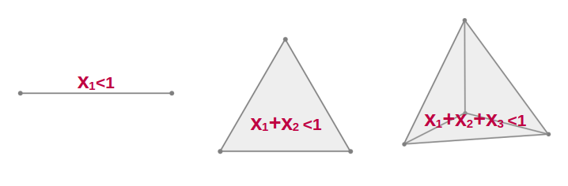

Questa nota raccoglie tre esempi classici o semi-classici di stima Monte Carlo di costanti matematiche notevoli, con difficolta' crescente:

1. $\pi$ come rapporto tra volumi geometrici;
2. $e$ tramite una somma di variabili uniformi e il volume di un simplesso;
3. $\pi/4$ tramite un tempo di arresto in una passeggiata aleatoria semplice.

Come estensione finale, menzioniamo il caso di $\ln 2$, che emerge da una variante naturale del terzo esempio.

L'obiettivo didattico non e' trovare il metodo piu' efficiente per stimare queste costanti, ma mostrare che:

- un problema di stima Monte Carlo puo' nascere da geometria, da volumi, da tempi di arresto;
- la stessa costante puo' apparire in contesti apparentemente molto diversi;
- la simulazione puo' suggerire una struttura matematica prima ancora della dimostrazione completa.

# 1. Monte Carlo e costanti matematiche

In un problema Monte Carlo costruiamo una variabile casuale $X$ tale che la sua media sia una quantita' di interesse:
$$
\mathbb{E}[X] = c.
$$
Ripetendo molte volte l'esperimento e facendo la media campionaria
$$
\bar X_M = \frac{1}{M}\sum_{m=1}^M X_m,
$$
otteniamo una stima numerica di $c$:
$$
\bar X_M \approx c
\qquad \text{per } M \text{ grande.}
$$

Nei tre esempi che seguono, la costante da stimare sara' rispettivamente $\pi$, $e$ e $\pi/4$.

# 2. Primo esempio: $\pi$ come rapporto tra volumi

Il metodo piu' classico per stimare $\pi$ con Monte Carlo si basa su un rapporto tra aree.

Consideriamo il quadrato unitario $[0,1]\times[0,1]$ e il quarto di disco di raggio $1$ centrato nell'origine:
$$
x^2+y^2 \le 1,
\qquad x\ge 0,\quad y\ge 0.
$$
L'area del quadrato e' $1$, mentre l'area del quarto di disco e' $\pi/4$. Se estraiamo un punto uniforme nel quadrato, la probabilita' che cada dentro il quarto di disco e'
$$
\mathbb{P}(x^2+y^2 \le 1) = \frac{\pi}{4}.
$$
Definendo la variabile indicatrice
$$
I =
\begin{cases}
1 & \text{se } x^2+y^2 \le 1, \\
0 & \text{altrimenti,}
\end{cases}
$$
si ha $\mathbb{E}[I] = \pi/4$, e quindi $\pi = 4\,\mathbb{E}[I]$.

Questo schema e' molto generale: si sceglie un insieme semplice da campionare uniformemente, si individua un sottoinsieme di interesse, e si stima il rapporto tra i loro volumi. In dimensione $d$ il volume e' la misura $d$-dimensionale. Nel seguito useremo ancora questa idea, ma in un contesto meno ovvio.

Dal punto di vista Monte Carlo, se generiamo $M$ punti indipendenti uniformi nel quadrato, lo stimatore e'
$$
\hat\pi_M = 4\,\frac{\#\{\text{punti nel quarto di disco}\}}{M}.
$$

# 3. Secondo esempio: $e$ da somme di variabili uniformi

## 3.1 L'esperimento e il risultato

Siano $U_1,U_2,\dots$ variabili indipendenti e uniformi in $(0,1)$. Consideriamo la somma parziale $S_n = U_1 + \cdots + U_n$ e definiamo il tempo di arresto
$$
N = \min\{n\ge 1 : S_n > 1\}.
$$
In altre parole, estraiamo numeri casuali uniformi in $(0,1)$ e ci fermiamo appena la loro somma supera $1$.

La quantita' sorprendente e':
$$
\mathbb{E}[N] = e.
$$
Questo risultato e' bello perche' e' semplice da simulare e completamente dimostrabile con strumenti elementari. Per una variabile intera positiva $N$ vale la formula (vedi Appendice A)
$$
\mathbb{E}[N] = \sum_{n\ge 0}\mathbb{P}(N>n).
$$
Nel nostro caso, l'evento $N>n$ significa che dopo $n$ estrazioni non abbiamo ancora superato $1$, cioe'
$$
N>n \iff U_1+\cdots+U_n \le 1,
$$
quindi il problema si riduce a calcolare $\mathbb{P}(U_1+\cdots+U_n \le 1)$, che e' una probabilita' geometrica.

## 3.2 Il simplesso standard e il suo volume

L'insieme dei punti $(x_1,\dots,x_n)\in\mathbb{R}^n$ con $x_i\ge 0$ e $\sum_{i=1}^n x_i \le 1$ si chiama simplesso standard di dimensione $n$ e si denota $\Delta_n$. E' la generalizzazione in dimensione arbitraria di un segmento ($n=1$), un triangolo ($n=2$) e un tetraedro ($n=3$).



Poiche' il vettore $(U_1,\dots,U_n)$ e' uniforme nel cubo $[0,1]^n$, che ha volume $1$, la probabilita' cercata coincide con il volume del simplesso:
$$
\mathbb{P}(U_1+\cdots+U_n \le 1) = \operatorname{Vol}(\Delta_n).
$$

Il risultato fondamentale e'
$$
\operatorname{Vol}(\Delta_n)=\frac{1}{n!},
$$
e si dimostra per ricorrenza tramite integrazione. Fissando $x_n=t$ con $0\le t\le 1$, le altre coordinate devono soddisfare $x_1+\cdots+x_{n-1}\le 1-t$, $x_i\ge 0$: questa sezione e' un simplesso di dimensione $n-1$ riscalato di $(1-t)$, con volume $(1-t)^{n-1}\operatorname{Vol}(\Delta_{n-1})$. Integrando:
$$
\operatorname{Vol}(\Delta_n) =
\operatorname{Vol}(\Delta_{n-1}) \int_0^1 (1-t)^{n-1}\,dt =
\frac{1}{n} \, \operatorname{Vol}(\Delta_{n-1}).
$$
Poiche' $\operatorname{Vol}(\Delta_1)=1$ (l'intervallo $[0,1]$), si ottiene $\operatorname{Vol}(\Delta_n)=1/n!$ per ricorrenza.

## 3.3 Comparsa di $e$ e lettura Monte Carlo

Abbiamo trovato $\mathbb{P}(N>n)=1/n!$, quindi
$$
\mathbb{E}[N] =
\sum_{n\ge 0}\mathbb{P}(N>n) =
\sum_{n\ge 0}\frac{1}{n!} = e.
$$

Questo e' uno dei modi piu' trasparenti per far apparire $e$ come media di un esperimento casuale. Dal punto di vista Monte Carlo, se ripetiamo molte volte l'esperimento e registriamo il numero di variabili uniformi necessarie per superare $1$, la media empirica converge a $e$. Da notare che il costo di ogni traiettoria e' esso stesso casuale: alcune si fermano dopo $2$ estrazioni, altre dopo $3$, $4$, $5$, eccetera. Questo esempio introduce in modo naturale l'idea di tempo di arresto.

# 4. Terzo esempio: $\pi/4$ da una passeggiata aleatoria e dai numeri di Catalan

## 4.1 L'esperimento e la variabile osservata

Lanciamo una moneta equa ripetutamente. Sia $H_n$ il numero di teste e $T_n$ il numero di croci dopo $n$ lanci, e definiamo il tempo di arresto
$$
\tau = \min\{n\ge 1 : H_n > T_n\}.
$$
Ci fermiamo al primo istante in cui le teste superano le croci, e registriamo la frazione di teste:
$$
X = \frac{H_\tau}{\tau}.
$$

Il risultato notevole e' $\mathbb{E}[X] = \pi/4$, che fornisce un nuovo stimatore Monte Carlo di $\pi$.

E' utile riformulare in termini di passeggiata aleatoria: posto $S_n = H_n - T_n$, ogni testa aumenta $S_n$ di $+1$ e ogni croce lo diminuisce di $-1$, quindi $S_n$ e' una passeggiata semplice simmetrica con $S_0=0$. Il tempo $\tau$ e' il primo istante in cui la passeggiata raggiunge $+1$. Se cio' avviene al tempo $\tau=2k+1$, allora necessariamente $H_\tau=k+1$ e $T_\tau=k$, quindi
$$
X = \frac{H_\tau}{\tau} = \frac{k+1}{2k+1}.
$$

## 4.2 Il risultato combinatorio chiave e il calcolo

Per calcolare $\mathbb{E}[X]$ occorre conoscere $\mathbb{P}(\tau=2k+1)$, dove entrano in gioco i numeri di Catalan
$$
C_k = \frac{1}{k+1}\binom{2k}{k}.
$$
Vale la formula
$$
\mathbb{P}(\tau=2k+1) =
\frac{C_k}{2\cdot 4^k}.
$$
La dimostrazione di questo fatto e' discussa nell'Appendice B.

Usando questa formula:
$$
\mathbb{E}[X] = \sum_{k\ge 0} \frac{C_k}{2\cdot 4^k}\cdot\frac{k+1}{2k+1}
= \frac{1}{2}\sum_{k\ge 0}\frac{1}{4^k}\frac{1}{2k+1}\binom{2k}{k}.
$$
Ora usiamo lo sviluppo in serie di $\arcsin x$:
$$
\arcsin x =
\sum_{k\ge 0} \frac{1}{4^k}\frac{1}{2k+1}\binom{2k}{k}x^{2k+1}.
$$
Ponendo $x=1$ si ha $\arcsin 1 = \pi/2 = \sum_{k\ge 0} \frac{1}{4^k}\frac{1}{2k+1}\binom{2k}{k}$, dunque
$$
\mathbb{E}[X] = \frac{1}{2}\cdot\frac{\pi}{2} = \frac{\pi}{4}.
$$

## 4.3 Commento didattico

Questo esempio e' particolarmente utile perche' il processo casuale e' semplice da descrivere, la quantita' osservata non e' banale, compare un tempo di arresto, e una costante geometrica come $\pi$ emerge da una passeggiata aleatoria discreta attraverso la famiglia combinatoria dei numeri di Catalan. Il punto matematicamente piu' delicato e' il conteggio delle traiettorie che danno $\tau=2k+1$: per un corso introduttivo si puo' accettare questo conteggio come fatto combinatorio, rinviando la dimostrazione all'appendice.

# 5. Estensione breve: una comparsa di $\ln 2$

L'esempio precedente si puo' modificare. Invece di fermarsi quando le teste superano le croci di $1$, ci si puo' fermare quando il vantaggio delle teste raggiunge $2$:
$$
\tau_2 = \min\{n\ge 1 : H_n - T_n = 2\}.
$$
Si puo' allora costruire una variabile analoga, basata sulla proporzione finale di teste al tempo di arresto. Il risultato atteso non porta piu' a $\pi/4$, ma a $\ln 2$.

Dal punto di vista didattico, questa variante e' interessante come sfida o progetto:

- il processo casuale e' quasi lo stesso;
- il tempo di arresto cambia di poco;
- la costante che emerge e' diversa;
- il calcolo combinatorio e' piu' ricco.

> **Esercizio:**
> cosa cambia, nelle traiettorie ammissibili, se invece di fermarci al primo vantaggio $+1$ ci fermiamo al primo vantaggio $+2$?

# 6. Riassunto

I tre esempi mostrano tre volti diversi del metodo Monte Carlo.

| Costante | Struttura dell'esperimento | Strumento chiave |
|---|---|---|
| $\pi$ | rapporto tra aree: $\pi/4 = \mathbb{P}(x^2+y^2\le 1)$ | probabilita' geometrica |
| $e$ | media di un tempo di arresto: $\mathbb{E}[N]=e$ | volume del simplesso $\operatorname{Vol}(\Delta_n)=1/n!$ |
| $\pi/4$ | valore atteso al primo passaggio: $\mathbb{E}[H_\tau/\tau]=\pi/4$ | numeri di Catalan |

# 7. Pseudocodice minimo per simulare

I dettagli implementativi non sono l'obiettivo principale della nota, ma puo' essere utile fissare uno schema logico.

**Stima di $e$:**
```text
function stima_e(M):
    somma = 0
    for m in 1,...,M:
        s = 0; n = 0
        while s <= 1:
            u = uniforme(0,1)
            s = s + u; n = n + 1
        somma = somma + n
    return somma / M
```

**Stima di $\pi/4$ con la moneta:**
```text
function stima_pi_quarti(M):
    somma = 0
    for m in 1,...,M:
        H = 0; T = 0
        while H <= T:
            lancio = moneta_equa()
            if lancio == testa: H = H + 1
            else: T = T + 1
        somma = somma + H / (H + T)
    return somma / M
```

Per ottenere una stima di $\pi$ nel secondo caso basta moltiplicare per $4$ il valore restituito.

# 8. Esercizi proposti

1. Simulare il metodo del quarto di disco per stimare $\pi$ e confrontare l'errore al crescere di $M$.
2. Simulare il processo per $e$ e verificare numericamente che la media empirica di $N$ si avvicina a $e$.
3. Calcolare esplicitamente il volume del simplesso in dimensione $2$ e in dimensione $3$.
4. Simulare il processo della moneta per stimare $\pi/4$ e poi $\pi$.
5. Elencare a mano tutte le traiettorie che danno $\tau=1$, $\tau=3$, $\tau=5$ e verificare che i conteggi corrispondono a $C_0,C_1,C_2$.
6. Discutere, senza dimostrazione completa, perche' una variante con soglia finale diversa puo' far apparire costanti diverse, come $\ln 2$.

# 9. Conclusione

Questi esempi mostrano che il metodo Monte Carlo non e' solo una tecnica numerica, ma anche un modo di pensare. Una costante matematica puo' apparire come rapporto tra aree, come media di un tempo di arresto, o come valore atteso associato a una traiettoria vincolata.

Da un punto di vista didattico, il passaggio da $\pi$ geometrico a $e$ tramite simplessi e poi a $\pi/4$ tramite Catalan e' particolarmente utile perche' allarga gradualmente il repertorio concettuale degli studenti: dal campionamento uniforme e indicatori, ai volumi in dimensione alta e tempi di arresto, fino ai cammini discreti, vincoli combinatori e primi passaggi. La simulazione numerica diventa cosi' non solo un modo di approssimare una quantita', ma anche una porta di accesso a strutture matematiche profonde.

---

# Appendice A. Formula per $\mathbb{E}[N]$

Partiamo dalla definizione discreta del valore atteso:
$$
\mathbb{E}[N]=\sum_{k\ge 0} k\,\mathbb{P}(N=k).
$$

Poiché $k=\sum_{n=0}^{k-1}1$, si ha

$$
\mathbb{E}[N] =
\sum_{k\ge 0}\sum_{n=0}^{k-1}\mathbb{P}(N=k)=\sum_{k\ge 0}\sum_{n=0} \mathbf{1}_{\{n<k\}} \mathbb{P}(N=k)
$$

Ora scambiamo l'ordine delle somme:

$$
\mathbb{E}[N] =
\sum_{n\ge 0}\sum_{k\ge 0}\mathbf{1}_{\{n<k\}}\mathbb{P}(N=k).
$$

(in pratica sto applicando Tonelli , ovvero $\mathbb{E}\left[\sum_{n\geq 0} X_n\right]=\sum_{n\geq 0} \mathbb{E}\left[X_n\right]$ valido per $X_n\ge 0$; siccome con termini non negativi non ci sono cancellazioni tra positivi e negativi, il passaggio è sempre lecito, anche se la serie diverge)

Fissato $n$, la condizione $n<k$ equivale a $k\ge n+1$, dunque
$$
\sum_{k\ge 0}\mathbf{1}_{\{n<k\}}\mathbb{P}(N=k) =
\sum_{k\ge n+1}\mathbb{P}(N=k) = 
\mathbb{P}(N>n).
$$

Pertanto
$$
\mathbb{E}[N]
= \sum_{n\ge 0}\mathbb{P}(N>n).
$$

In forma del tutto esplicita:
$$
\sum_{k\ge 0} k\,\mathbb{P}(N=k)
= \sum_{k\ge 0}\sum_{n=0}^{k-1}\mathbb{P}(N=k)
= \sum_{n\ge 0}\sum_{k\ge n+1}\mathbb{P}(N=k)
= \sum_{n\ge 0}\mathbb{P}(N>n).
$$

# Appendice B. Numeri di Catalan

## B.1 Definizione e prime proprieta'

I numeri di Catalan sono definiti da
$$
C_k = \frac{1}{k+1}\binom{2k}{k},
\qquad k=0,1,2,\dots
$$
I primi valori sono $C_0=1$, $C_1=1$, $C_2=2$, $C_3=5$, $C_4=14$. Soddisfano inoltre la ricorrenza

$$
C_{k+1}=\sum_{i=0}^k C_i\,C_{k-i},
\qquad
C_0=1
$$

che ne caratterizza la successione in modo equivalente alla formula esplicita. Compaiono in moltissimi problemi combinatori: numero di parentesizzazioni corrette, cammini aleatori che non scendono sotto un asse, alberi binari pieni, triangolazioni di un poligono convesso. Nel nostro caso compaiono perche' contano traiettorie di una passeggiata aleatoria con un vincolo di non attraversamento.

## B.2 Struttura delle traiettorie ammissibili
Sia
$$
X_i=
\begin{cases}
+1 & \text{se il }i\text{-esimo lancio \`e testa},\\
-1 & \text{se il }i\text{-esimo lancio \`e croce}.
\end{cases}
$$
Definiamo il saldo dopo $n$ lanci come
$$
S_n=\sum_{i=1}^n X_i,
\qquad S_0=0.
$$
Consideriamo quindi il tempo di primo passaggio al livello $+1$:
$$
\tau=\inf\{n\ge 0:\ S_n=1\}.
$$
Vogliamo contare le traiettorie tali che
$$
\tau=2k+1.
$$
Ciò significa che dopo $2k+1$ lanci il saldo vale $+1$, mentre prima dell'istante finale il saldo non è mai stato positivo:
$$
S_{2k+1}=1,
\qquad
S_j\le 0 \quad \text{per ogni } j<2k+1.
$$
Necessariamente l'ultimo passo deve essere una testa, poiché solo così il saldo può passare da $0$ a $+1$ all'ultimo istante. Dunque
$$
S_{2k}=0,
$$
e la condizione $S_j\le 0$ per $j<2k+1$ si restringe ai primi $2k$ passi:
$$
S_j\le 0 \quad \text{per ogni } j\in\{1,\dots,2k\}.
$$
Nei primi $2k$ passi la traiettoria parte da $0$, termina in $0$, e non supera mai il livello $0$.

Introduciamo allora $a_k$ uguale al numero di cammini di lunghezza $2k$ che partono da $0$, finiscono in $0$, e soddisfano $S_j\le 0$ per ogni $j\in\{1,\dots,2k\}$. Il numero di traiettorie con $\tau=2k+1$ coincide quindi con $a_k$.

Invertendo il segno del saldo, questi cammini sono in corrispondenza biunivoca con i cammini di lunghezza $2k$ che partono da $0$, finiscono in $0$, e non scendono mai sotto $0$. Questi sono i cammini di Dyck di semi-lunghezza $k$.

Per mostrare che $a_k$ è il numero di Catalan, basta osservare che ogni cammino di Dyck non banale ammette una decomposizione unica della forma
$$
U\,P\,D\,Q,
$$
dove $U$ è il primo passo verso l'alto (una testa), $D$ è il passo verso il basso che realizza il primo ritorno a quota $0$ (una croce), mentre $P$ e $Q$ sono a loro volta cammini di Dyck. La scelta di $D$ come primo ritorno a $0$ garantisce l'unicità della decomposizione.

Se il cammino totale ha semi-lunghezza $k+1$, esiste un unico indice $i\in\{0,\dots,k\}$ tale che $P$ abbia semi-lunghezza $i$ e $Q$ abbia semi-lunghezza $k-i$. Ne segue la ricorrenza
$$
a_{k+1}=\sum_{i=0}^k a_i\,a_{k-i},
\qquad
a_0=1.
$$
Questa è precisamente la ricorrenza dei numeri di Catalan. Pertanto
$$
a_k=C_k=\frac{1}{k+1}\binom{2k}{k}.
$$

## B.3 Dal conteggio alla probabilita'

Ogni sequenza di $2k+1$ lanci ha probabilita' $1/2^{2k+1}$. Il numero di sequenze che realizzano $\tau=2k+1$ e' $C_k$ (i primi $2k$ passi sono un cammino di Catalan; l'ultimo e' forzato ed e' una testa), quindi
$$
\mathbb{P}(\tau=2k+1) = \frac{C_k}{2^{2k+1}} = \frac{C_k}{2\cdot 4^k}.
$$
La comparsa dei numeri di Catalan non e' un artificio formale: nasce direttamente dalla struttura del tempo di primo passaggio. Per arrivare a $+1$ per la prima volta al tempo $2k+1$, bisogna restare sempre a quota non positiva fino all'istante precedente, e i cammini che soddisfano questo vincolo sono precisamente i cammini di Catalan.
