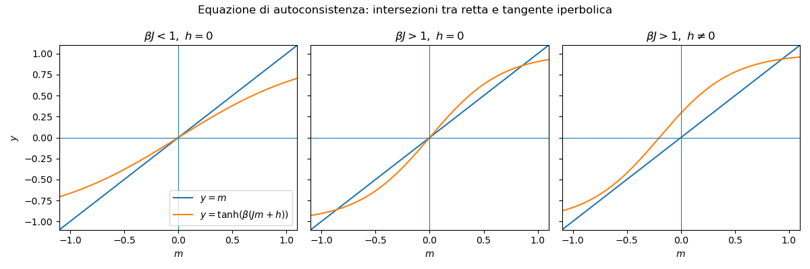

Questa nota costruisce un **toy model discreto di opinioni/voto** ispirato al modello di Ising e alla sua versione mean-field di Curie--Weiss. L'idea è rappresentare una popolazione di $N$ individui, ciascuno dei quali può trovarsi in uno di due stati:

$$
s_i \in \{-1,+1\},
$$

dove, ad esempio,

- $s_i=+1$ = favorevole al candidato A;
- $s_i=-1$ = favorevole al candidato B.

Il modello è intenzionalmente minimale. Non vuole descrivere realisticamente il comportamento elettorale individuale, ma catturare alcuni meccanismi collettivi molto generali:

1. **imitazione sociale** o pressione conformista;
2. **bias esterno** dovuto a media, campagna, leadership, eventi;
3. **rumore individuale** o eterogeneità delle scelte;
4. possibilità di **regimi multipli**, **isteresi** e **transizioni collettive**.

L'obiettivo didattico è triplice:

1. mostrare come un modello di interazione binaria porti naturalmente a una distribuzione di Boltzmann;
2. collegare il problema alle dinamiche di Metropolis e heat bath / Gibbs;
3. interpretare magnetizzazione, bistabilità e transizione di fase in termini di consenso, polarizzazione e voto.

# 1. Variabili, osservabili e interpretazione sociale

## 1.1 Configurazione microscopica

Lo stato completo del sistema è il vettore

$$
\mathbf s = (s_1,\dots,s_N),
\qquad s_i\in\{-1,+1\}.
$$

Una configurazione rappresenta dunque l'intera distribuzione delle opinioni nella popolazione.

## 1.2 Magnetizzazione come opinione media

L'osservabile collettiva più importante è la **magnetizzazione**

$$
m(\mathbf s)=\frac{1}{N}\sum_{i=1}^N s_i.
$$

Nel linguaggio sociale, $m$ misura l'opinione media o il vantaggio netto di un campo sull'altro:

- $m=1$ = consenso completo per A;
- $m=-1$ = consenso completo per B;
- $m=0$ = perfetto equilibrio tra i due schieramenti;
- $m>0$ = prevale A;
- $m<0$ = prevale B.

In termini di quote di voto, se $p_+$ è la frazione di individui con stato $+1$, allora

$$
p_+ = \frac{1+m}{2},
\qquad
p_- = \frac{1-m}{2}.
$$

Quindi la magnetizzazione è semplicemente una riscrittura lineare della quota di consenso.

# 2. Energia del modello

## 2.1 La forma mean-field

Nel modello di Curie--Weiss tutti interagiscono con tutti. Una forma naturale dell'energia è

$$
H(\mathbf s)
=
-\frac{J}{2N}\sum_{i\ne j} s_i s_j
-
h\sum_{i=1}^N s_i.
$$

I parametri hanno interpretazione chiara:

- $J>0$ misura la forza dell'imitazione sociale;
- $h$ è un campo esterno che favorisce una delle due opzioni;
- la temperatura $T$ o, equivalentemente, $\beta=1/T$, misura il rumore o la dispersione individuale.

L'energia è bassa quando molti individui sono allineati tra loro e con il campo esterno.

## 2.2 Perché compare il fattore $1/N$

Questa normalizzazione va giustificata con attenzione.

Se scrivessimo

$$
H(\mathbf s) = -\frac{J}{2}\sum_{i\ne j} s_i s_j - h\sum_i s_i,
$$

il termine di interazione crescerebbe come $N^2$, perché il numero di coppie è dell'ordine di $N(N-1)/2$.

Questo è problematico per almeno tre ragioni:

1. l'energia totale crescerebbe più rapidamente del numero di agenti;
2. il contributo energetico dominerebbe artificialmente il contributo entropico, che cresce come $N$;
3. al crescere di $N$, l'influenza sociale totale percepita da ciascun individuo diverrebbe irrealisticamente grande.

Introducendo il fattore $1/N$, il contributo di interazione diventa dell'ordine di $N$, cioè dello stesso ordine della dimensione della popolazione.

### Interpretazione sociale

La scelta corretta è leggere $J$ come **forza totale del campo sociale percepito dal singolo**, non come intensità di ogni singola coppia.

Se ogni individuo osserva tutti gli altri, è naturale che il peso di ciascun vicino sia dell'ordine di $1/N$, così che il campo complessivo resti finito quando la popolazione cresce.

In altre parole:

- senza normalizzazione, aumentare $N$ renderebbe la pressione conformista totalemente sproporzionata;
- con la normalizzazione $1/N$, ogni agente sente un campo medio di ordine uno.

Per questo motivo il fattore $J/N$ non è una semplice convenzione ereditata dalla termodinamica: è il modo naturale di costruire un modello sociale mean-field con un limite collettivo ben definito.

## 2.3 Riscrittura in termini di magnetizzazione

Poiché

$$
\sum_{i\ne j} s_i s_j = \left(\sum_i s_i\right)^2 - \sum_i s_i^2 = \left(\sum_i s_i\right)^2 - N,
$$

e siccome $s_i^2=1$, si ottiene

$$
\sum_{i\ne j} s_i s_j = N^2 m^2 - N.
$$

Dunque, a meno di una costante additiva irrilevante,

$$
H(\mathbf s)
=
-\frac{JN}{2}m^2 - hNm.
$$

Questa formula rende trasparente il significato macroscopico del modello:

- il termine $-\frac{JN}{2}m^2$ premia il consenso collettivo;
- il termine $-hNm$ inclina il sistema verso una delle due opzioni.

# 3. Distribuzione di equilibrio e interpretazione probabilistica

## 3.1 Peso di Boltzmann

Alla configurazione $\mathbf s$ associamo la probabilità

$$
\pi(\mathbf s)
=
\frac{1}{Z_N} e^{-\beta H(\mathbf s)},
$$

dove $Z_N$ è la costante di normalizzazione:

$$
Z_N = \sum_{\mathbf s} e^{-\beta H(\mathbf s)}.
$$

La distribuzione assegna probabilità maggiore alle configurazioni più coerenti con l'interazione sociale e con il bias esterno.

## 3.2 Interpretazione dei parametri

### Interazione $J$

- $J$ piccolo: gli individui si influenzano poco;
- $J$ grande: forte tendenza all'allineamento.

### Campo esterno $h$

- $h>0$: vantaggio per l'opzione A;
- $h<0$: vantaggio per l'opzione B;
- $h=0$: assenza di bias sistematico esterno.

### Temperatura $T$

- $T$ alta (cioè $\beta$ bassa): scelte più rumorose, meno allineamento;
- $T$ bassa (cioè $\beta$ alta): le interazioni sociali pesano di più, il sistema tende all'ordine.

Nel linguaggio sociale, si può pensare a $T$ come misura aggregata di eterogeneità, imprevedibilità individuale o indipendenza dal contesto.

# 4. Teoria mean-field

## 4.1 Campo medio percepito dal singolo

Nel modello mean-field ogni individuo interagisce con la media del sistema. Se la magnetizzazione è $m$, il campo locale efficace visto da un agente è

$$
h_{\mathrm{eff}} = Jm + h.
$$

Questo dice che il singolo è influenzato da:

- una pressione conformista proporzionale all'opinione media;
- un bias esterno costante.

## 4.2 Equazione di autoconsistenza

Nel limite mean-field la magnetizzazione soddisfa l'equazione

$$
m = \tanh\!\bigl(\beta(Jm+h)\bigr).
$$

Questa è l'equazione fondamentale del modello.

Essa ammette interpretazione immediata:

- il lato destro è la risposta media di un individuo sottoposto al campo efficace $Jm+h$;
- il lato sinistro è la media collettiva che deve coincidere con tale risposta.

## 4.3 Regimi possibili

### Caso $h=0$

Se non c'è bias esterno:

- per $\beta J < 1$ c'è un unico equilibrio stabile vicino a $m=0$;
- per $\beta J > 1$ compaiono due stati simmetrici stabili con $m\ne 0$.

Questo è il corrispettivo matematico di una **transizione collettiva**:

- sopra una soglia di rumore, il sistema resta mediamente bilanciato;
- sotto una soglia di rumore, il sistema può polarizzarsi spontaneamente in uno dei due campi.

### Caso $h\ne 0$

Il campo esterno rompe la simmetria e favorisce uno dei due stati.

Vicino alla soglia critica, piccoli cambiamenti di $h$ possono produrre grandi variazioni in $m$. Questo è rilevante per interpretare campagne, shock informativi o eventi esogeni.

## 4.4 Interpretazione sociale della transizione

Nel regime con un solo equilibrio:

- la società risponde in modo relativamente lineare e regolare ai bias esterni.

Nel regime bistabile:

- possono esistere due configurazioni collettive molto diverse, entrambe stabili;
- la storia iniziale o una fluttuazione casuale possono selezionare uno dei due esiti;
- piccoli shock esterni possono innescare cambiamenti collettivi molto grandi.

# 5. Dinamiche stocastiche sul modello

Il modello può essere simulato con diverse dinamiche che lasciano invariata la distribuzione di equilibrio.

## 5.1 Flip di un singolo agente

Una mossa elementare consiste nel selezionare un individuo $i$ e proporre il flip

$$
s_i \to -s_i.
$$

Poiché il modello dipende solo dalla magnetizzazione, la variazione di energia può essere calcolata in modo esplicito.

Se

$$
M=\sum_{j=1}^N s_j,
\qquad m=\frac{M}{N},
$$

allora il flip di $s_i$ cambia la magnetizzazione di

$$
\Delta m = -\frac{2s_i}{N}.
$$

La variazione di energia è

$$
\Delta H = H(\mathbf s^{(i)}) - H(\mathbf s),
$$

dove $\mathbf s^{(i)}$ è la configurazione ottenuta invertendo lo spin $i$.

Calcolando esplicitamente, si ottiene

$$
\Delta H = 2 s_i \left(Jm + h\right) + O\!\left(\frac{1}{N}\right).
$$

Più precisamente, usando la formula completa con $M=\sum_i s_i$,

$$
\Delta H = \frac{2J}{N}s_i(M-s_i)+2hs_i.
$$

Per $N$ grande, il termine dominante è appunto $2s_i(Jm+h)$.

## 5.2 Dinamica di Metropolis

Nel metodo di Metropolis:

1. si sceglie un individuo $i$ a caso;
2. si propone il flip $s_i\to -s_i$;
3. si accetta con probabilità

$$
A = \min\!\left(1,e^{-\beta\Delta H}\right).
$$

Interpretazione:

- se il flip abbassa l'energia, viene sempre accettato;
- se la aumenta, può essere comunque accettato con probabilità positiva.

Questo permette al sistema di esplorare le configurazioni e non restare rigidamente bloccato in un minimo locale.

## 5.3 Dinamica heat bath / Gibbs

Un'alternativa molto naturale è l'aggiornamento heat bath.

Dato il valore medio degli altri individui, la probabilità condizionata che $s_i=+1$ è

$$
P(s_i=+1 \mid \text{resto}) = \frac{1}{1+e^{-2\beta h_i^{\mathrm{loc}}}},
$$

dove il campo locale è

$$
h_i^{\mathrm{loc}} = Jm_{-i}+h,
$$

e

$$
m_{-i}=\frac{1}{N-1}\sum_{j\ne i} s_j.
$$

In mean-field, per $N$ grande, si può approssimare

$$
h_i^{\mathrm{loc}} \approx Jm+h.
$$

Questa dinamica aggiorna direttamente lo stato dell'agente secondo la sua distribuzione condizionata e non richiede passo di rifiuto.

## 5.4 Confronto tra le due dinamiche

- **Metropolis** è più generale e si appoggia a $\Delta H$;
- **heat bath / Gibbs** usa direttamente le probabilità locali condizionate;
- entrambe sono naturali per questo modello e si collegano direttamente alla lezione su MCMC.

# 6. Esperimenti numerici suggeriti

## 6.1 Curva di risposta $m$ vs $h$

Fissare $J$ e $\beta$, poi variare lentamente il campo esterno $h$ e misurare la magnetizzazione media.

Obiettivo:

- visualizzare la risposta del sistema al bias esterno;
- confrontare regime lineare e regime bistabile.

## 6.2 Istogramma della magnetizzazione

Simulare il sistema a campo nullo $h=0$ per vari valori di $\beta J$.

Misurare l'istogramma empirico di $m$:

- unimodale per $\beta J < 1$;
- bimodale per $\beta J > 1$.

Interpretazione:

- regime non polarizzato vs regime polarizzato.

## 6.3 Tempo di switching

Nel regime bistabile e con campo piccolo, osservare i tempi di passaggio spontaneo da $m>0$ a $m<0$ e viceversa.

Questo introduce un primo esempio di **metastabilità** in un sistema sociale discreto.

## 6.4 Isteresi

Far variare lentamente $h$ da valori negativi a positivi e poi tornare indietro. Se il rumore è abbastanza basso, il sistema può mostrare isteresi:

- lo stato collettivo dipende non solo dal parametro attuale, ma anche dalla storia del sistema.

In un'interpretazione politica, questo suggerisce che l'esito collettivo può dipendere da effetti di memoria e inerzia sociale.

# 7. Interpretazione come modello di voto

## 7.1 Cosa rappresenta bene

Questo toy model rappresenta in modo molto semplice:

- tendenza all'imitazione;
- ruolo di un bias esterno comune;
- possibilità di transizioni collettive;
- sensibilità ai parametri in prossimità di soglie critiche.

## 7.2 Cosa non rappresenta bene

Il modello non distingue:

- differenze socio-demografiche;
- reti reali di interazione;
- agenti indecisi o neutrali;
- strategie adattive o apprendimento;
- contenuti informativi complessi.

È quindi un modello di **interazione collettiva minima**, non un modello realistico di comportamento elettorale.

## 7.3 Lettura sostantiva

Nonostante la sua semplicità, il modello suggerisce tre idee interessanti:

1. una società può essere bilanciata o polarizzata a seconda della forza dell'interazione sociale e del rumore;
2. piccoli bias esterni possono produrre effetti molto grandi vicino a una soglia critica;
3. in certi regimi l'esito collettivo può dipendere più dalle fluttuazioni e dalla storia che dal bias medio istantaneo.

# 8. Varianti naturali

## 8.1 Due comunità

Si può dividere la popolazione in due gruppi con interazioni interne forti e interazioni esterne più deboli. Questo permette di studiare polarizzazione, modularità e conflitto tra gruppi.

## 8.2 Agenti ostinati

Una piccola frazione di individui può essere resa fissa in stato $+1$ o $-1$. Questo permette di modellare minoranze molto stabili, elettorati fedeli o leadership fortemente allineate.

## 8.3 Rete invece di mean-field

Il termine di interazione può essere sostituito da

$$
H(\mathbf s) = -J\sum_{(i,j)\in E} s_i s_j - h\sum_i s_i,
$$

dove $E$ è l'insieme degli archi di una rete sociale. In questo caso la pressione conformista è locale e dipende dalla struttura della rete.

Questa variante è più realistica, ma anche più complessa da analizzare teoricamente.

# 9. Pseudocodice minimo

## 9.1 Metropolis

```text
function metropolis_step(s, beta, J, h):
    scegli i a caso
    calcola DeltaH per il flip s_i -> -s_i
    u = uniforme(0,1)

    if u < min(1, exp(-beta * DeltaH)):
        s_i = -s_i

    return s
```

## 9.2 Heat bath / Gibbs

```text
function heat_bath_step(s, beta, J, h):
    scegli i a caso
    calcola il campo locale h_loc
    p_plus = 1 / (1 + exp(-2 * beta * h_loc))
    u = uniforme(0,1)

    if u < p_plus:
        s_i = +1
    else:
        s_i = -1

    return s
```

# 10. Esercizi proposti

1. Mostrare che, a meno di una costante additiva, l'energia può essere scritta come
   $$
   H(\mathbf s) = -\frac{JN}{2}m^2 - hNm.
   $$

2. Spiegare perché, senza la normalizzazione $1/N$, il termine di interazione crescerebbe come $N^2$.

3. Derivare l'equazione di autoconsistenza
   $$
   m = \tanh\!\bigl(\beta(Jm+h)\bigr).
   $$

4. Discutere qualitativamente i casi:

   * $\beta J < 1$,
   * $\beta J = 1$,
   * $\beta J > 1$.

5. Implementare una dinamica di Metropolis e misurare la magnetizzazione media al variare di $h$.

6. Confrontare Metropolis e heat bath sullo stesso sistema.

7. Disegnare l'istogramma di $m$ a campo nullo per valori diversi di $\beta J$.

8. Discutere in quali condizioni il modello mostra polarizzazione e in quali condizioni resta bilanciato.

# 11. Conclusione

Il modello di Ising mean-field fornisce un esempio estremamente semplice ma concettualmente ricco di sistema sociale binario con interazione.

La sua forza didattica sta nel fatto che collega in modo diretto:

* una variabile microscopica semplice ($s_i=\pm 1$),
* una distribuzione di equilibrio di tipo Boltzmann,
* una teoria macroscopica in termini di magnetizzazione,
* dinamiche MCMC come Metropolis e heat bath,
* interpretazioni sociali di consenso, polarizzazione, soglie e isteresi.

Per questo motivo è un ottimo ponte tra fisica statistica, modelli di opinione e tecniche di simulazione.

---

# Miniappendice -- Derivazione della formula $m = \tanh\!\bigl(\beta(Jm+h)\bigr)$

Vogliamo derivare, nel modello mean-field, la relazione di autoconsistenza

$$
m = \tanh\!\bigl(\beta(Jm+h)\bigr).
$$

L'idea è molto semplice: in approssimazione di campo medio, ogni agente non "vede" tutti i singoli vicini separatamente, ma soltanto il loro effetto medio, riassunto dalla magnetizzazione $m$.

## a1. Punto di partenza: il campo efficace

Nel modello mean-field, il singolo spin $s_i \in \{-1,+1\}$ sente un campo efficace

$$
h_{\mathrm{eff}} = Jm + h,
$$

dove:

- $Jm$ rappresenta la pressione conformista dovuta all'opinione media della popolazione;
- $h$ rappresenta un bias esterno.

Se $m>0$, il campo medio spinge verso $+1$; se $m<0$, spinge verso $-1$.

## a2. Energia del singolo spin nel campo medio

Se fissiamo il valore del campo efficace, l'energia associata al singolo spin $s_i$ è

$$
E_i(s_i) = - s_i (Jm+h).
$$

Quindi i due possibili valori hanno energia:

### Se $s_i=+1$

$$
E_i(+1) = -(Jm+h).
$$

### Se $s_i=-1$

$$
E_i(-1) = +(Jm+h).
$$

Dunque, se il campo efficace è positivo, lo stato $+1$ ha energia più bassa ed è favorito.

## a3. Probabilità di Boltzmann dei due stati

La probabilità del singolo spin è proporzionale a

$$
P(s_i) \propto e^{-\beta E_i(s_i)}.
$$

Sostituendo i due valori di energia:

### Probabilità di $+1$

$$
P(+1) \propto e^{-\beta E_i(+1)} = e^{\beta(Jm+h)}.
$$

### Probabilità di $-1$

$$
P(-1) \propto e^{-\beta E_i(-1)} = e^{-\beta(Jm+h)}.
$$

Per normalizzare, sommiamo i due pesi:

$$
Z_i = e^{\beta(Jm+h)} + e^{-\beta(Jm+h)}.
$$

Quindi

$$
P(+1)=\frac{e^{\beta(Jm+h)}}{e^{\beta(Jm+h)}+e^{-\beta(Jm+h)}},
$$

$$
P(-1)=\frac{e^{-\beta(Jm+h)}}{e^{\beta(Jm+h)}+e^{-\beta(Jm+h)}}.
$$

## a4. Valore medio del singolo spin

Per definizione,

$$
\langle s_i \rangle = (+1)P(+1) + (-1)P(-1) = P(+1)-P(-1).
$$

Sostituiamo le espressioni trovate:

$$
\langle s_i \rangle = \frac{e^{\beta(Jm+h)} - e^{-\beta(Jm+h)}}
     {e^{\beta(Jm+h)} + e^{-\beta(Jm+h)}}.
$$

Ma questa è precisamente la definizione della tangente iperbolica:

$$
\tanh x = \frac{e^x - e^{-x}}{e^x + e^{-x}}.
$$

Quindi

$$
\langle s_i \rangle = \tanh\!\bigl(\beta(Jm+h)\bigr).
$$

## a5. Passaggio finale: autoconsistenza

Nel modello mean-field, tutti gli spin sono statisticamente equivalenti, quindi il valor medio del singolo spin coincide con la magnetizzazione media del sistema:

$$
m = \langle s_i \rangle.
$$

Sostituendo il risultato precedente otteniamo la relazione cercata:

$$
m = \tanh\!\bigl(\beta(Jm+h)\bigr).
$$

Questa è l'equazione di autoconsistenza del modello.

Si chiama così perché il valore di $m$ compare sia a sinistra sia a destra: il campo medio dipende dalla magnetizzazione, ma la magnetizzazione stessa è la risposta al campo medio.

## a6. Interpretazione grafica

L'equazione

$$
m = \tanh\!\bigl(\beta(Jm+h)\bigr)
$$

si può leggere come intersezione tra due curve:

1. la retta
   $$
   y = m;
   $$
2. la curva
   $$
   y = \tanh\!\bigl(\beta(Jm+h)\bigr).
   $$

A seconda dei parametri, le intersezioni possono essere:

- una sola;
- tre, di cui in genere due stabili e una instabile.

Questo spiega la comparsa di regimi multipli e bistabilità.

{width=100%}

## a7. Caso particolare $h=0$

Se non c'è bias esterno, l'equazione diventa

$$
m = \tanh(\beta J m).
$$

### Se $\beta J < 1$

La tangente della curva nel punto $m=0$ è minore di 1, quindi l'unica soluzione è

$$
m=0.
$$

### Se $\beta J > 1$

La tangente iniziale supera 1, e compaiono due soluzioni non nulle simmetriche:

$$
m>0,
\qquad
m<0.
$$

Questa è la forma più semplice della transizione collettiva nel modello.

## a8. Riassunto in una riga

La formula

$$
m = \tanh\!\bigl(\beta(Jm+h)\bigr)
$$

si ottiene così:

1. si sostituisce l'interazione collettiva con un campo medio $Jm$;
2. si scrivono le probabilità di Boltzmann dei due stati $s_i=\pm1$;
3. si calcola il valor medio del singolo spin;
4. si impone che questo valor medio coincida con la magnetizzazione del sistema.
